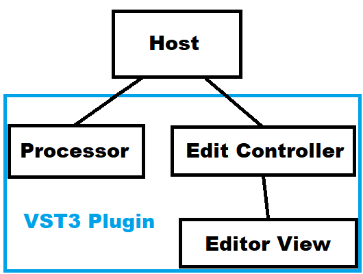

<!-- 何かあれば issue を作ってもらえれば対応します。特に DAW ごとの問題やワークアラウンドについては追加情報を歓迎します。 -->

# VST3 の開発
VST3の開発についてまとめました。使ったバージョンは VST3 SDK 3.6.13 と VSTGUI 4.8 です。

この文章では `my_plugins` から始まるパスは開発中のプラグイン内のパスを表しています。それ以外のパスは特に断りがないときは `VST3_SDK` 以下の部分だけを書いています。

最新版の SDK は Steinberg のページからダウンロードできます。

- [Developers | Steinberg](https://www.steinberg.net/en/company/developers.html)

GitHub のリポジトリからクローンすることもできます。

- [GitHub - steinbergmedia/vst3sdk: VST 3 Plug-In SDK](https://github.com/steinbergmedia/vst3sdk)

## ライセンス
`VST3_SDK` 以下の各ディレクトリのライセンスです。

|ディレクトリ|ライセンス|
|--|--|
|base|BSD 3-Clause License|
|cmake|Proprietary Steinberg VST3 License あるいは GPLv3|
|doc|Proprietary Steinberg VST3 License あるいは GPLv3|
|pluginterfaces|Proprietary Steinberg VST3 License あるいは GPLv3|
|public.sdk|BSD 3-Clause License|
|vstgui4|BSD 3-Clause License|

ソースコードを公開するときは GPLv3 で配布することができます。利用したライブラリのライセンスはバイナリの配布時に同梱する必要があります。ユーザマニュアルやGUIのクレジット画面でも利用したライセンスを参照できるようにすることが推奨されています。

ソースコードを公開しないときは Proprietary Steinberg VST3 License と BSD 3-Clause License に従って配布することになります。 Proprietary Steinberg VST3 License の詳細は `VST3_License_Agreement.pdf` に書いてあります。

選択したライセンスに関わらず VST compatible logo の表示が義務付けられています。 VST compatible logo は `doc/artwork` に入っています。また VST compatible logo の正しい表示方法が `VST3_Usage_Guidelines.pdf` に書いてあります。

- [VST 3 SDK Licensing FAQ - sdk.steinberg.net](https://sdk.steinberg.net/viewtopic.php?f=4&t=286&sid=5da7b39b81a3259e03063b18bce97010)
- [The GNU General Public License v3.0 - GNU Project - Free Software Foundation](https://www.gnu.org/licenses/gpl-3.0.en.html)
- [The 3-Clause BSD License | Open Source Initiative](https://opensource.org/licenses/BSD-3-Clause)
- [binaries - BSD 3-Clause: where to place license for binary installation? - Open Source Stack Exchange](https://opensource.stackexchange.com/questions/7575/bsd-3-clause-where-to-place-license-for-binary-installation)

## リソース
VST3 SDK の主な学習リソースは同梱されているサンプルプラグインのコードになります。サンプルプラグインは `public.sdk/samples/vst` に入っています。とりあえず `again` と `note_expression_synth` を押さえておけば何とかなります。

VST3 SDK に付属してくるドキュメンテーションはダウンロードしたディレクトリの `doc/index.html` から開けます。次のリンクは GitHub でホストされているドキュメンテーションです。

- [Steinberg Plug-in Interfaces Documentation](https://steinbergmedia.github.io/vst3_doc/)

VSTGUI4 のドキュメンテーションが404なので、この文章ではドキュメンテーションを参照するときには `VST3_SDK` からのパスを書いています。

ドキュメンテーション内をまとめて検索する方法が提供されていません。検索窓からクラスなどを探すときはトップページからのリンク先ごとに検索結果が異なるので注意してください。

開発者フォーラムもあります。

- [sdk.steinberg.net - Index page](https://sdk.steinberg.net/index.php)

外部のリソースとしてはうつぼかずらさんによる[C++でVST作り](http://vstcpp.wpblog.jp/)がとても参考になります。

- [C++でVST作り](http://vstcpp.wpblog.jp/)

## プラグインホストについて
VST3 はホストによっては実装が中途半端なようです。 FL Studio 20.5 と Reaper 5.980 で動作確認をしているときにいくつか不具合を見つけたのでまとめておきます。

### FL Studio 20.5 での不具合
- GUI のない VST3 プラグインは何も表示されない。
- VST3 プラグインのウィンドウを開いてから別のウィンドウを選択すると、プラグインのウィンドウが真っ黒になる。

あと不具合というより仕様ですが、プラグインの GUI ウィンドウの大きさを変更できないので VST3Editor の UI エディタで編集をするときにワークアラウンドが必要です。

- TODO ワークアラウンドへの参照。

### Reaper 5.980 での不具合
- VST3Editor の UI エディタを開こうとするとクラッシュする。

## 開発環境の構築
VST3 SDK を編集してビルドできるように開発環境を構築します。

ここでは Windows 10 で CMake + VS Code + PowerShell を使っています。 Visual Studio の IDE は使っていません。

### 開発用ソフトウェアのインストール
次のソフトウェアをインストールします。

- [Visual Studio Community 2019](https://visualstudio.microsoft.com/vs/community/)
- [CMake](https://cmake.org/)
- [VS Code](https://code.visualstudio.com/)

Visual Studio Community 2019 のインストール時には「C++ によるデスクトップ開発」にチェックが入っていることを確認して、あとはデフォルトにしておきました。

次の VS Code のエクステンションをインストールしました。

- C/C++ (by Microsoft)
- CMake (by twxs)
- PowerShell (by Microsoft)
- XML (by Red Hat)
- Bookmarks (by Alessandro Fragnani)

XML と Bookmarks は無くても何とかなります。

XML のプラグインは GUI が記述された uidesc というファイルが XML だったのでフォーマットするためにインストールしました。 Red Hat のプラグインにしたのは要素の属性ごとに改行するフォーマットオプションがあったからです。 [OpenJDK](https://jdk.java.net/12/) が必要なのでインストールには手間がかかります。

Bookmarks はパラメータ追加で複数のファイルを行ったり来たりするときに便利です。

### ripgrep
ドキュメンテーションなどの検索ツールとして [ripgrep](https://github.com/BurntSushi/ripgrep) をインストールしました。まず [Rust](https://www.rust-lang.org/) をインストールしてから PowerShell で次のコマンドを実行します。

```powershell
cargo install ripgrep
```

検索コマンドの例です。

```powershell
rg "How to use cmake"
```

ファイル名だけを表示するときは `-l` オプションが使えます。

```powershell
rg -l "ParamID"
```

特定のファイルを除外したいときは glob オプションの `-g` が使えます。

```powershell
rg -g "!*.html" -g "!*.js" "EditController"
```

今回はこれだけでなんとかなりました。他のオプションは `-h` で確認できます。

```powershell
rg -h
```

### ビルド
`doc/vstinterfaces/cmakeUse.html` と `doc/vstinterfaces/addownplugs.html` に CMake でのビルド方法が書いてあります。

`my_plugins/helloworld` にテンプレートが入っているのでコピーして適当に名前を付けることでプロジェクトを作成します。 `my_plugins` は `VST3_SDK` の1階層上のディレクトリに入っています。

プロジェクト作成後のディレクトリ構造の例です。関係ないディレクトリは省略しています。

```powershell
VST_SDK
+---my_plugins
|   +---helloworld
|   +---helloworld_with_VSTGUI
|   \---SomeFX # 追加したプロジェクト。 my_plugins/helloworld のコピー。
\---VST3_SDK
    +---base
    +---bin
    +---cmake
    +---doc
    +---pluginterfaces
    +---public.sdk
    \---vstgui4
```

`my_plugins/CMakeLists.txt` に `SomeFX` を追加します。

```cmake
add_subdirectory(helloworld)
add_subdirectory(helloworld_with_VSTGUI)
add_subdirectory(SomeFX)
```

`VST3_SDK` で次のコマンドを実行します。 cmake のオプションで `SMTG_MYPLUGINS_SRC_PATH` を指定することでプロジェクトのパスを追加できます。

```powershell
mkdir build
cd build
cmake -G"Visual Studio 16 2019" -DSMTG_MYPLUGINS_SRC_PATH="../../my_plugins" ..
cmake --build .
```

これでデバッグビルドが始まります。コードを変更したときは `build` ディレクトリに入って `cmake --build .` だけでリビルドできます。

ビルドのコンフィグを変更するときは `cmake-gui` が使えます。

```powershell
cmake-gui # build ディレクトリ内で実行する。
```

#### リリースビルド
`--config Release` を追加します。

```powershell
cmake --build . --config Release
```

#### 32bit (x86) ビルド
32bit (x86) でビルドするときは一つ目の cmake のコマンドに `-A Win32` を追加します。

```powershell
mkdir build32 # 64bit 版と同じディレクトリを使わない。
cd build32
cmake -G"Visual Studio 16 2019" -A Win32 -DSMTG_MYPLUGINS_SRC_PATH="../../my_plugins" ..
cmake --build .
```

ビルドターゲットを 64bit から 32bit に変更するとビルドに失敗するときがあります。ビルドが失敗するときは `build` ディレクトリを消して作り直してみてください。

- [c++ - What's the cmake generator for Visual Studio 2019 - Stack Overflow](https://stackoverflow.com/questions/55708600/whats-the-cmake-generator-for-visual-studio-2019)
- [Visual Studio 16 2019 — CMake 3.15.0-rc4 Documentation](https://cmake.org/cmake/help/v3.15/generator/Visual%20Studio%2016%202019.html)

#### デプロイ
VST3 プラグインのデバッグビルドは `build\VST3\Debug` 、リリースビルドは `build\VST3\Release` に配置されます。ビルドされたプラグインは `*.vst3` という名前のディレクトリにパッケージされています。

VST3 プラグインは OS ごとにインストールする場所が決まっています。詳細は `doc/vstinterfaces/vst3loc.html` に書いてあります。

Windows では `C:\Program Files\Common Files\VST3` に配置すれば使えるようになります。

PowerShell で関数を作って任意のプラグインをコマンド一つでデプロイできるようにします。

`$PROFILE` を開きます。 `$PROFILE` は bash の `.bashrc` に相当します。

```powershell
code $PROFILE # VS Code で開く。パスの通ったエディタが無いときは notepad が使える。
```

次のコードを `$PROFILE` に追加します。

```powershell
function cpvst($name, [switch] $release) {
  $target_dir = if ($release) { "Release" } else { "Debug" }
  $vst_path = ".\VST3\$target_dir\$name.vst3"
  attrib.exe -S $vst_path /D # FL Studio 20.5 にプラグインを読み込ませるために必要。
  Copy-Item $vst_path -Destination "C:\Program Files\Common Files\VST3" -Force -Recurse
}
```

`$PROFILE` を読み込んで更新します。 bash の `source` と同じような操作です。

```powershell
.$PROFILE
```

`C:\Program Files\Common Files\VST3` にファイルをコピーするには管理者権限が必要ですが、手間を省くために開発を行っているユーザに書き込み権限を与えます。エクスプローラーで `VST3` を右クリックしてプロパティを開きます。タブからセキュリティを選んで「アクセス許可を変更するには\[編集\]をクリックします。」というテキストの横にある編集ボタンをクリックします。上のほうにあるグループ名またはユーザ名のリストから開発を行っているユーザを選択します。私の環境では Users (DESKTOP-****) のような名前がついていました。ユーザを選択したら下のほうにあるアクセス許可のリストの書き込みにチェックを入れて OK で `VST3` への書き込みができるようになります。

これで `cpvst` が使えるようになりました。

```powershell
cpvst helloworld      # build/VST3/Debug/helloworld.vst3 をデプロイ。
cpvst SomeFX -release # build/VST3/Release/SomeFX.vst3 をデプロイ。
```

#### サンプルプロジェクトのビルドを無効にする
サンプルプロジェクトのビルドを無効にするときは `SMTG_ADD_VST3_HOSTING_SAMPLES` と `SMTG_ADD_VST3_PLUGINS_SAMPLES` に `FALSE` を指定します。

```powershell
# ` (backtick) は powershell で次の行に続くという意味。 bash の \ と同じ。
cmake -G"Visual Studio 16 2019" `
  -DSMTG_MYPLUGINS_SRC_PATH="../../Plugins" `
  -DSMTG_ADD_VST3_HOSTING_SAMPLES=FALSE `
  -DSMTG_ADD_VST3_PLUGINS_SAMPLES=FALSE `
  ..
```

#### コンパイラオプションの変更
`cmake/modules/PlatformToolset.cmake` でコンパイラオプションを指定できます。

## VST3 プラグインの大まかな仕組み
VST3 プラグインは大きく次の3つの部品に分けることができます。

- Edit Controller (コントローラ)
- Processor (プロセッサ)
- Editor View (エディタ)

コントローラはパラメータとユーザインタフェースの橋渡し役です。

プロセッサでは信号処理を行います。

コントローラからプロセッサ、あるいはプロセッサからコントローラへとパラメータを直接を伝えることはありません。コントローラとプロセッサの間でのパラメータの伝達は、DAWなどの VST3 ホストの仕事です。

エディタでは GUI に関する処理を行います。エディタはコントローラの下にぶら下がるような関係になっています。



コントローラとプロセッサをファクトリに登録することで VST3 プラグインが使えるようになります。ファクトリのコードはテンプレートが用意されているのでほとんど書くことはありません。

## デバッグ
- TODO: テスト

ここに書いてある内容は動作確認していないので間違いがあるかもしれません。 noteexpressionsynth のコードから辿って見つけました。

### ブレークポイント
`FDebugBreak` が使えます。

`FDebugPrint` の引数は `printf` と同じです。

- 未検証: Windows では `build/WIN_PDB64` に入っている `プラグイン名.pdb` ファイルを `build/VST3/Debug/プラグイン名.vst3/Contents/x86_64-win` にコピーしておけば、 `FDebugBreak` が呼ばれたときにデバッガが起動するはず。

```cpp
#include "base/source/fdebug.h"

// ...
void somewhere(float value)
{
#if DEVELOPMENT // 必ず DEVELOPMENT で囲むこと。
  FDebugBreak("Start debugging at somewhere.\n");
#endif
}
// ...
```

- [Set symbol (.pdb) and source files in the debugger - Visual Studio | Microsoft Docs](https://docs.microsoft.com/en-us/visualstudio/debugger/specify-symbol-dot-pdb-and-source-files-in-the-visual-studio-debugger?view=vs-2019)

### プリント
`FDebugPrint` が使えます。

出力を見るには DAW がデバッグ出力をサポートしている必要があります。 FL Studio 20.5 では左上のメニューから OPTIONS -> Debugging log でデバッグ出力を表示できます。

`FDebugPrint` の引数は `printf` と同じです。

```cpp
#include "base/source/fdebug.h"

// ...
void somewhere(float value)
{
#if DEVELOPMENT // 必ず DEVELOPMENT で囲むこと。
  FDebugPrint("somewhere, value: %g\n", value);
#endif
}
// ...
```

`base/source/fdebug.h` のコメントによると `FDebugPrint` を直接使わずに、 `FDebugPrint` をラップしたマクロを使うことが推奨されています。

```cpp
// base/source/fdebug.h

/** Send "comment" string to the debugger for display. */
#define SMTG_WARNING(comment) FDebugPrint ("%s(%d) : %s\n", __FILE__, __LINE__, comment);

/** @name Shortcut macros for sending strings to the debugger for display.
	First parameter is always the format string (printf like).
*/

///@{
#define SMTG_DBPRT0(a) FDebugPrint (a);
#define SMTG_DBPRT1(a, b) FDebugPrint (a, b);
#define SMTG_DBPRT2(a, b, c) FDebugPrint (a, b, c);
#define SMTG_DBPRT3(a, b, c, d) FDebugPrint (a, b, c, d);
#define SMTG_DBPRT4(a, b, c, d, e) FDebugPrint (a, b, c, d, e);
#define SMTG_DBPRT5(a, b, c, d, e, f) FDebugPrint (a, b, c, d, e, f);
///@}
```

- `base/source/fdebug.h`
- [Variadic functions - cppreference.com](https://en.cppreference.com/w/cpp/utility/variadic)

## helloworld プラグインを何とかする
テンプレートとして用意されている `my_plugins/helloworld` をリファクタリングしつつ、パラメータ追加のワークフローを作っていきます。

ビルドの節で `my_plugins/helloworld` をコピーして作成した `my_plugins/SomeFX` に変更を加えていきます。 `my_plugins/SomeFX/**` に該当するパスは `my_plugins` を省略して `SomeFX/**` のように書いています。

### ファイルの配置の変更
コードが書いてあるファイルが7個しかないので、ディレクトリ移動の煩雑さを減らすために一つのディレクトリにまとめてしまいます。

```powershell
+---CMakeLists.txt
+---resource
|   +---Info.plist
|   \---plug.rc
\---source
    +---plugcontroller.cpp
    +---plugcontroller.hpp
    +---plugfactory.cpp
    +---plugids.hpp
    +---plugprocessor.cpp
    +---plugprocessor.hpp
    \---version.hpp
```

ここではヘッダの拡張子に ".hpp" を使っています。

`SomeFX/CMakeList.txt` を変更します。

```cmake
set(plug_sources
    source/plugcontroller.hpp
    source/plugids.hpp
    source/plugprocessor.hpp
    source/version.hpp
    source/plugfactory.cpp
    source/plugcontroller.cpp
    source/plugprocessor.cpp
)
```

`SomeFX/resource/plug.rc` の `version.h` のインクルードパスを `version.hpp` に変更します。

```
#include "../source/version.hpp"
```

### 名前やFUIDの設定
この項の内容は `doc/vstinterfaces/addownplugs.html` に書いてあることと同じなので、あわせて参照することをお勧めします。

`SomeFX/CMakeLists.txt` を変更します。

```cmake
set(target SomeFX)
```

`SomeFX/source/plugids.hpp` にある 2 つの `FUID` を変更します。コメントにあるように [Online GUID Generator](https://www.guidgenerator.com/) を使って生成できます。

次のコードの ID をコピーして使わないでください。 ID が競合すると DAW で予期しないプラグインがロードされる不具合につながります。

```cpp
static const FUID MyProcessorUID(0x00000000, 0x00000000, 0x00000000, 0x00000000);
static const FUID MyControllerUID(0x11111111, 0x11111111, 0x11111111, 0x11111111);
```

プラグインの名前などは `SomeFX/source/version.hpp` で変更できます。

```cpp
#define stringPluginName "Hello World"

#define stringOriginalFilename "SomeFX.vst3"
#if SMTG_PLATFORM_64
#define stringFileDescription stringPluginName " VST3-SDK (64Bit)"
#else
#define stringFileDescription stringPluginName " VST3-SDK"
#endif
#define stringCompanyName "Some Company\0"
#define stringCompanyWeb "https://example.com"
#define stringCompanyEmail "mailto:someaddress@example.com"

#define stringLegalCopyright "(c) 2019 Someone"
#define stringLegalTrademarks "VST is a trademark of Steinberg Media Technologies GmbH"
```

プラグインの名前を変えるときは `Info.plist` の `SomeFX` の部分を変更します。

- 10行目: `<string>SomeFX</string>`
- 14行目: `<string>com.steinberg.vst3.SomeFX</string>`

あとは各ファイルで定義されている名前空間 `HelloWorld` を適当に変更します。

### 音を出す
`SomeFX` を変更して音が出るようにします。

`SomeFX/source/plugprocessor.cpp` の `PlugProcessor::process` で音のデータをバッファに書き込みます。

```cpp
//--- Process Audio---------------------
//--- ----------------------------------
if (data.numInputs == 0) return kResultOk;
if (data.numOutputs == 0) return kResultOk;
if (data.numSamples <= 0) return kResultOk;

// double は処理しない。
if (data.symbolicSampleSize == Vst::kSample64) return kResultOk;

// この条件を追加しないと out of bounds へのアクセスでクラッシュする。
if (data.inputs[0].numChannels != 2) return kResultOk;
if (data.outputs[0].numChannels != 2) return kResultOk;

float *in0 = data.inputs[0].channelBuffers32[0];
float *in1 = data.inputs[0].channelBuffers32[1];
float *out0 = data.outputs[0].channelBuffers32[0];
float *out1 = data.outputs[0].channelBuffers32[1];

// バイパス。
for (int32_t i = 0; i < data.numSamples; ++i) {
  out0[i] = in0[i];
  out1[i] = in1[i];
}
```

このコードは入力と出力のチャンネル数が同じであることを仮定しています。入出力のチャンネル数は `PlugProcessor::initialize` で指定できます。

`kResultOk` は 0 で `kResultFalse` は 1 なので if の条件で出てくるときは注意してください。 VST3 SDK では `if (isIt() == kResultFalse) doIt();` のように `==` でチェックしている箇所があります。

### パラメータの追加
このままだとパラメータの管理が手間になるのでリファクタリングします。

#### VST3 のパラメータ
VST3 では1つのパラメータをコントローラとプロセッサの2か所で保持させることになります。

- TODO 図の追加

#### パラメータ用のヘッダとソースの作成

TODO 変更

- `SomeFX/source/plugid.hpp`
- `SomeFX/source/plugcontroller.cpp`
- `SomeFX/source/plugprocessor.hpp`
- `SomeFX/source/plugprocessor.cpp`

### Hello GUI
VSTGUI 4.8 ではコードで直接 GUI を書く方法と、 VST3 inline UI editor を使って GUI を作る方法があります。ここでは VST3 inline UI editor という名前を短くして UI エディタと呼ぶことにします。

本格的な開発をするならコードで直接 GUI を書く方法をお勧めします。私が試した限りでは FL Studio 20.5 と Reaper 5.980 では UI エディタを使う方法に不具合がありました。不具合については GUI -> VST3 inline UI editor を使った GUI の作成 -> ワークアラウンド にまとめています。

ここでは例として手軽でコードが少ない UI エディタを使う方法で GUI を作ります。

`SomeFX/source/plugcontroller.hpp` を変更します。

- `vst3editor.h` をインクルード。
- `createView` を追加。

```cpp
#include "vstgui/plugin-bindings/vst3editor.h"

class PlugController : public Vst::EditController {
public:

  // ...

  IPlugView *PLUGIN_API createView(const char *name) SMTG_OVERRIDE
  {
    if (name && strcmp(name, "editor") == 0)
      return new VSTGUI::VST3Editor(this, "view", "plug.uidesc");
    return 0;
  }
};
```

`SomeFX/CMakeLists.txt` を変更します。

```cmake
# ...

smtg_add_vst3plugin(${target} ${plug_sources})
set_target_properties(${target} PROPERTIES ${SDK_IDE_MYPLUGINS_FOLDER})
target_include_directories(${target} PUBLIC ${VSTGUI_ROOT}/vstgui4) # 追加。
target_link_libraries(${target} PRIVATE base sdk vstgui_support)    # vstgui_support を追加。

# ...
```

ビルドしたプラグインを開くと真っ黒の画面が表示されます。黒い部分を右クリックするとコンテクストメニューが開いて UI エディタでの編集が選択できます。

UI エディタの使い方は `vstgui4/vstgui/Documentation/html/page_uidescription_editor.html` に書いてあります。

- TODO 画像
- TODO tag の設定。

UI エディタでの編集が終わったらの左上にあるメニューから File -> Save As を選んで `plug.uidesc` を保存します。保存した `plug.uidesc` を適当なディレクトリにおいて `SomeFX/CMakeLists.txt` の `smtg_add_vst3_resource` でパスを指定することでリソースに追加できます。

```
# ...
target_link_libraries(${target} PRIVATE base sdk vstgui_support) # 上で変更した行。

# リソースの追加。
# 初回作成時など UI エディタで作った uidesc ファイルがないときはコメントアウトしておく。
smtg_add_vst3_resource(${target} "resource/plug.uidesc")

# ...
```

画像ファイルを使うときも `smtg_add_vst3_resource` でリソースに追加できます。

### リファクタリング
- TODO

## GUI
主にカスタムビューの作成についてまとめています。

### VST3 inline UI editor を使った GUI の作成
#### オプションメニュー (コンボボックス) の追加
オプションメニューのアイテムは `StringListParameter` を使うことで設定できます。

オプションメニューとリンクするパラメータを `SomeFX/source/plugcontroller.cpp` の `initialize` に追加します。

```cpp
#include "public.sdk/source/vst/vstparameters.h"

// ...

tresult PLUGIN_API PlugController::initialize(FUnknown *context)
{
  // ...

  auto parameterType = new Vst::StringListParameter(USTRING("Type"), ParameterID::type);
  parameterType->appendString(USTRING("uhhyou"));
  parameterType->appendString(USTRING("yey"));
  parameters.addParameter(parameterType);
}
```

あとは UI エディタで `StringListParameter` として追加したパラメータのIDをオプションメニューの control-tag として指定すれば設定完了です。

- `public.sdk/samples/vst/note_expression_synth/source/note_expression_synth_controller.cpp`
- `public.sdk/source/vst/vstparameters.*`

#### ワークアラウンド
FL Studio 20.5 ではプラグインのウィンドウの大きさを変更できないので編集が困難です。ワークアラウンドとして `plug.uidesc` を直接編集して編集画面の大きさを変更することができます。

いったん UI エディタを開いて何も編集せずにメニューの Save as で `plug.uidesc` を保存します。 `plug.uidesc` をテキストエディタで開いて custom -> attributes -> EditorSize を変更することでGUI エディタのウィンドウの大きさを設定できます。 EditorSize のフォーマットは `"x, y, width, height"` となっています。変更した `plug.uidesc` をリソースとしてプラグインに追加すると次回から UI エディタのウィンドウが設定した大きさになります。

Reaper v5.980 では UI エディタを開こうとするとクラッシュするので使えません。

#### カスタムビューの追加
カスタムビューの概要については コードでGUI -> カスタムビューの実装と関連するコントロールの表示の変更 を参照してください。

サイン波を表示するカスタムビューを作ります。

次の3つのファイルを作成します。

- `SomeFX/source/gui/waveview.hpp`
- `SomeFX/source/gui/waveview.cpp`
- `SomeFX/source/gui/waveviewcreator.cpp`

`SomeFX/source/gui/waveview.hpp` の内容です。

```cpp
#pragma once

#include "vstgui4/vstgui/vstgui.h"

namespace VSTGUI {

class WaveView : public CControl {
public:
  WaveView(const CRect &size);

  void draw(CDrawContext *pContext) override;

  CLASS_METHODS(WaveView, CControl);

  double lfo(double phase);

  double gain = 0.9;
  double shape = 0.0;
  double phase = 0.0;

protected:
  CLineStyle lineStyle{CLineStyle::kLineCapRound, CLineStyle::kLineJoinRound};
  CDrawContext::PointList points;
};

} // namespace VSTGUI
```

`SomeFX/source/gui/waveview.cpp` の内容です。

```cpp
#include "waveview.hpp"
#include <cmath>

namespace VSTGUI {

WaveView::WaveView(const CRect &size) : CControl(size) {}

void WaveView::draw(CDrawContext *pContext)
{
  pContext->setDrawMode(CDrawMode(CDrawModeFlags::kAntiAliasing));
  CDrawContext::Transform t(
    *pContext, CGraphicsTransform().translate(getViewSize().getTopLeft()));

  const auto width = getWidth();
  const auto height = getHeight();
  const double borderWidth = 2.0;
  const double halfBorderWidth = borderWidth / 2.0;

  // Background.
  const auto bgColor = CColor(255, 255, 255, 255);
  pContext->setLineWidth(borderWidth);
  pContext->setFillColor(bgColor);
  pContext->drawRect(CRect(0.0, 0.0, width, height), kDrawFilled);

  // Waveform.
  pContext->setLineWidth(2.0);
  pContext->setLineStyle(lineStyle);
  pContext->setFrameColor(CColor(19, 193, 54, 255));
  const size_t size = (size_t)(width + 1.0);
  if (points.size() != size) points.resize(size);
  for (size_t x = 0; x < points.size(); ++x)
    points[x] = CPoint((CCoord)x, height * lfo(x / width));
  pContext->drawPolygon(points);

  // Always draw border at last. Otherwise, inner object will be drawn over border.
  const auto borderColor = CColor(0, 0, 0, 255);
  pContext->setFrameColor(borderColor);
  pContext->drawRect(
    CRect(halfBorderWidth, halfBorderWidth, width, height), kDrawStroked);

  setDirty(false);
}

double WaveView::lfo(double phase)
{
  const double twopi = 6.283185307179586;

  phase = this->phase + phase * twopi;
  if (phase > twopi) phase -= twopi;
  auto sign = (pi < phase) - (phase < pi);
  auto wave = gain * sign * pow(abs(sin(phase)), shape);
  return (wave + 1.0) * 0.5;
}

} // namespace VSTGUI
```

`SomeFX/source/gui/waveviewcreator.cpp` の内容です。

```cpp
#pragma once

#include "waveview.hpp"

#include "vstgui4/vstgui/uidescription/detail/uiviewcreatorattributes.h"
#include "vstgui4/vstgui/uidescription/iviewcreator.h"
#include "vstgui4/vstgui/uidescription/uiattributes.h"
#include "vstgui4/vstgui/uidescription/uiviewfactory.h"
#include "vstgui4/vstgui/vstgui.h"

namespace VSTGUI {
namespace UIViewCreator {

class WaveViewCreator : public ViewCreatorAdapter {
public:
  WaveViewCreator()
  {
    UIViewFactory::registerViewCreator(*this);
  }

  IdStringPtr getViewName() const
  {
    return "WaveView"; // カスタムビューの名前。
  }

  IdStringPtr getBaseViewName() const
  {
    return "CControl"; // カスタムビューの親クラスの名前。
  }

  CView *create(const UIAttributes &attributes, const IUIDescription *description) const
  {
    // UI エディタの右下からドラッグ & ドロップしたときに作成されるインスタンスを設定。
    return new WaveView(CRect(0, 0, 50, 50));
  }

  bool apply(
    CView *view, const UIAttributes &attributes, const IUIDescription *description) const
  {
    // uidesc から読み込んだパラメータを適用。
    // ここでは位置、大きさ、 sub-controller だけを設定。
    // vstgui4/vstgui/uidescription/uiviewcreator.cpp の CViewCreator からコピーしてきた。

    auto waveView = dynamic_cast<WaveView *>(view);
    if (waveView == 0) return false;

    CPoint point;
    CRect size;
    if (attributes.getPointAttribute(kAttrOrigin, point)) {
      auto viewSize = waveView->getViewSize();
      size.setTopLeft(point);
      size.setWidth(viewSize.getWidth());
      size.setHeight(viewSize.getHeight());
      waveView->setViewSize(size, false);
      waveView->setMouseableArea(size);
    }
    if (attributes.getPointAttribute(kAttrSize, point)) {
      size = waveView->getViewSize();
      size.setSize(point);
      waveView->setViewSize(size, false);
      waveView->setMouseableArea(size);
    }

    const auto subControllerAttr = attributes.getAttributeValue(kAttrSubController);
    if (subControllerAttr) {
      view->setAttribute(
        'uisc',
        static_cast<uint32_t>(subControllerAttr->size() + 1),
        subControllerAttr->c_str());
    }

    return true;
  }

  bool getAttributeNames(std::list<std::string> &attributeNames) const
  {
    // uidesc に書き込まれる属性の名前を設定。
    // kAttr* は vstgui4\vstgui\uidescription\detail\uiviewcreatorattributes.h を参照。

    attributeNames.emplace_back(kAttrOrigin);
    attributeNames.emplace_back(kAttrSize);
    attributeNames.emplace_back(kAttrSubController);
    return true;
  }

  IViewCreator::AttrType getAttributeType(const std::string &attributeName) const
  {
    // uidesc の属性を C++ で受け取るときの型を設定。

    if (attributeName == kAttrOrigin)
      return kPointType;
    else if (attributeName == kAttrSize)
      return kPointType;
    else if (attributeName == kAttrSubController)
      return kStringType;
    return kUnknownType;
  }

  bool getAttributeValue(
    CView *view,
    const std::string &attributeName,
    std::string &stringValue,
    const IUIDescription *desc) const
  {
    // UI エディタで設定された属性を uidesc に書き込む文字列に変換。

    if (attributeName == kAttrOrigin) {
      stringValue = UIAttributes::pointToString(view->getViewSize().getTopLeft());
      return true;
    } else if (attributeName == kAttrSize) {
      stringValue = UIAttributes::pointToString(view->getViewSize().getSize());
      return true;
    } else if (attributeName == kAttrSubController) {
      return getViewAttributeString(view, 'uisc', stringValue);
    }
    return false;
  }

protected:
  static bool
  getViewAttributeString(CView *view, const CViewAttributeID attrID, std::string &value)
  {
    uint32_t attrSize = 0;
    if (view->getAttributeSize(attrID, attrSize)) {
      char *cstr = new char[attrSize + 1];
      if (view->getAttribute(attrID, attrSize, cstr, attrSize))
        value = cstr;
      else
        value = "";
      delete[] cstr;
      return true;
    }
    return false;
  }
};

WaveViewCreator __gWaveViewCreator;

} // namespace UIViewCreator
} // namespace VSTGUI
```

```cmake

`SomeFX/CMakeLists.txt` にファイルを追加します。

```cmake
set(plug_sources
    source/plugcontroller.hpp
    source/plugids.hpp
    source/plugprocessor.hpp
    source/version.hpp
    source/plugfactory.cpp
    source/plugcontroller.cpp
    source/plugprocessor.cpp
    source/gui/waveview.hpp        # 追加
    source/gui/waveview.cpp        # 追加
    source/gui/waveviewcreator.cpp # 追加
)
```

- `vstgui4/vstgui/Documentation/html/md_page_create_your_own_ui_view.html`
- `vstgui4/vstgui/Documentation/html/class_v_s_t_g_u_i_1_1_i_view_creator.html`
- `vstgui4/vstgui/uidescription/uiattributes.h`
- `vstgui4/vstgui/uidescription/detail/uiviewcreatorattributes.h`

#### パラメータの連動
- TODO 検証

ここに書いてある内容は手持ちの DAW では動かなかったので検証できていません。同じ仕組みを使っている noteexpressionsynth のキーボード UI もうまく動いていなかったので、 DAW 側で実装されていない可能性が高いと判断して掲載しています。

UI エディタで、パラメータを受け取る側のビューの sub-controller に適当な文字列を設定します。ここでは  `WaveViewController` としています。

コントロールクラスに `VST3EditorDelegate` を継承させて `createSubController` を実装します。 `SomeFX/source/plugcontroller.hpp` でメソッドを追加します。

```cpp
class PlugController : public Vst::EditController, public VSTGUI::VST3EditorDelegate {
public:
  // ...

  VSTGUI::IController *createSubController(
    VSTGUI::UTF8StringPtr name,
    const VSTGUI::IUIDescription *description,
    VSTGUI::VST3Editor *editor) SMTG_OVERRIDE;
};
```

`SomeFX/source/plugcontroller.cpp` に実装を追加します。

```cpp
class WaveViewController : public DelegationController {
public:
  WaveViewController(IController *controller) : DelegationController(controller) {}

  ~WaveViewController()
  {
    if (waveview != nullptr) waveview->forget();
  }

  CView *
  verifyView(CView *view, const UIAttributes &attributes, IUIDescription *description)
  {
    auto control = dynamic_cast<WaveView *>(view);
    if (control != nullptr) { // 必要に応じてタグのチェックを追加する。
      waveview = control;
      waveview->remember();
    }
    return controller->verifyView(view, attributes, description);
  }

  void valueChanged(CControl *pControl) override
  {
    // 多分 DAW がこのメソッドの呼び出しを実装していない。
    // Reaper 5.980 と FL Studio 20.5 では動かなかった。

    Vst::ParamID tag = pControl->getTag();

    if (waveview == nullptr) return;

    if (tag == ParameterID::volume) {
      waveview->gain = pControl->getValueNormalized();
      waveview->setDirty(true);
    }
  }

protected:
  WaveView *waveview = nullptr;
};

IController *PlugController::createSubController(
  UTF8StringPtr name, const IUIDescription *description, VST3Editor *editor)
{
  if (name == "WaveViewController") {
    return new WaveViewController(editor);
  }
  return nullptr;
}
```

これで動くはずですが、コメントで書いたように `DelegationController` の `valueChanged` がホストから呼び出されていないようです。ドキュメンテーションの `vstgui4/vstgui/Documentation/html/page_uidescription_editor.html` では `DelegationController` の `notify` を使っていますが、 `CControl::kMessageValueChanged` は VSTGUI 4.8 で廃止されたので動きません。

- `vstgui4/vstgui/Documentation/html/page_uidescription_editor.html`
- `vstgui4/vstgui/Documentation/html/page_news_and_changes.html`

### コードでGUI
`VSTGUIEditor` をベースにしてコードでGUIを作ります。

`VSTGUIEditor` を使った GUI の作成についてはうつぼかずらさんによる[C++でVST作り](http://vstcpp.wpblog.jp/)が参考になります。ここではC++でVST作りで紹介されていない内容について扱っています。

- [C++でVST作り](http://vstcpp.wpblog.jp/)

#### リフレッシュレートの設定
`VSTGUIEditor` の `setIdleRate` でリフレッシュレートを変更できます。指定する値の単位は ms (ミリ秒) で、デフォルト値は 100ms (10Hz) です。カスタムビューの更新が遅く感じるときなどに変更してみてください。

```cpp
bool PlugEditor::open(void *parent, const PlatformType &platformType)
{
  setIdleRate(1000 / 60);

  // ...
}
```

- `public.sdk/source/vst/vstguieditor.cpp`
- `vstgui4/vstgui/lib/cvstguitimer.h`

#### カスタムビューの実装と関連するコントロールの表示の変更
あるコントロールの値を変更したときに、連動して別のコントロールの値や表示を変更したい時があります。ここでは例としてコントロールの値に応じてカスタムビューで波形を表示するようにします。

カスタムビューは `CView` を継承したクラスならどれを継承しても作ることができます。例えばスライダーの見た目を変更したいなら `CSlider` を継承する、テキストを表示するカスタムビューを作りたいときは `CParamDisplay` を継承するといった形で実装の手間を減らせるときがあります。継承して使えるクラスを探すときは `vstgui4/vstgui/lib` と `vstgui4/vstgui/lib/controls` を覗いてみてください。

ここでは波形を表示するだけなので `CControl` を継承して `draw` をオーバーライドしただけの `WaveView` というカスタムビューを作ります。 `waveview.hpp` の内容です。

```cpp
#pragma once

#include "vstgui/vstgui.h"

namespace VSTGUI {

class WaveView : public CControl {
public:
  WaveView(const CRect &size);

  void draw(CDrawContext *pContext) override;

  CLASS_METHODS(WaveView, CControl);

  double lfo(double phase);

  double amount = 0.9;
  double shape = 0.0;
  double phase = 0.0;

protected:
  CLineStyle lineStyle{CLineStyle::kLineCapRound, CLineStyle::kLineJoinRound};
  CDrawContext::PointList points;
};

} // namespace VSTGUI
```

`waveview.cpp` の内容です。ここでは描画する波形が簡単なので `WaveView::lfo` として GUI 側で実装しています。コードがより複雑になるときは GUI 側に波形を生成するコードを書かずに、プロセッサクラスから信号処理の部分をヘッダにまとめてインクルードすることをお勧めします。

- TODO

```cpp
#include "waveview.hpp"

#include <cmath>

namespace VSTGUI {

WaveView::WaveView(const CRect &size) : CControl(size) {}

void WaveView::draw(CDrawContext *pContext)
{
  // アンチエイリアスを有効にする。
  pContext->setDrawMode(CDrawMode(CDrawModeFlags::kAntiAliasing));

  // 座標変換して (x, y) = (0, 0) がビューの左上となるようにする。
  // 座標変換しないときの (0, 0) はプラグインウィンドウの左上になる。
  CDrawContext::Transform t(
    *pContext, CGraphicsTransform().translate(getViewSize().getTopLeft()));

  const auto width = getWidth();
  const auto height = getHeight();
  const double borderWidth = 2.0;
  const double halfBorderWidth = borderWidth / 2.0;

  // Background.
  const auto bgColor = CColor(255, 255, 255, 255);
  pContext->setLineWidth(borderWidth);
  pContext->setFillColor(bgColor);
  pContext->drawRect(CRect(0.0, 0.0, width, height), kDrawFilled);

  // Waveform.
  pContext->setLineWidth(2.0);
  pContext->setLineStyle(lineStyle);
  pContext->setFrameColor(CColor(19, 193, 54, 255));
  const size_t size = (size_t)(width + 1.0);
  if (points.size() != size) points.resize(size);
  for (size_t x = 0; x < points.size(); ++x)
    points[x] = CPoint((CCoord)x, height * lfo(x / width));
  pContext->drawPolygon(points);

  // Always draw border at last. Otherwise, inner object will be drawn over border.
  const auto borderColor = CColor(0, 0, 0, 255);
  pContext->setFrameColor(borderColor);
  pContext->drawRect(
    CRect(halfBorderWidth, halfBorderWidth, width, height), kDrawStroked);

  setDirty(false);
}

double WaveView::lfo(double phase)
{
  const double pi = 3.14159265358979323846;

  phase = this->phase + phase * 2 * pi;
  if (phase > 2 * pi) phase -= 2 * pi;
  auto sign = (pi < phase) - (phase < pi);
  auto wave = amount * sign * pow(abs(sin(phase)), shape);
  return (wave + 1.0) * 0.5;
}

} // namespace VSTGUI
```

エディタクラスに関数を追加します。

```cpp
class PlugEditor : public VSTGUIEditor, public IControlListener {
// ...

  void addWaveView(const CRect &size);

protected:
  ParamValue getPlainValue(ParamID tag);

  const CRect WaveViewSize{100.0, 100.0, 200.0, 200.0};

  // getViewAt が反応するように 1 ピクセル内側を指定する。
  const CPoint WaveViewPos{WaveViewSize.left + 1.0, WaveViewSize.top + 1.0};

// ...
};
```

`addWaveView` の実装です。 `parameter.hpp` で定義したパラメータIDを使ってコントローラから初期値を取得しています。

```cpp
#include "parameter.hpp"

void PlugEditor::addWaveView(const CRect &size)
{
  auto view = new WaveView(size);
  view->shape = getPlainValue(SomePlugin::ParameterID::lfoShape);
  view->phase = getPlainValue(SomePlugin::ParameterID::lfoInitialPhase);
  frame->addView(view);
}

ParamValue PlugEditor::getPlainValue(ParamID tag)
{
  auto normalized = controller->getParamNormalized(tag);
  return controller->normalizedParamToPlain(tag, normalized);
};
```

`open` で `WaveView` を作成します。

```cpp
bool PlugEditor::open(void *parent, const PlatformType &platformType)
{
  // ...

  addWaveView(WaveViewSize);

  // ...
}
```

エディタクラスの `valueChanged` で関連するコントロールの変更を検知して `WaveView` を更新します。ここでは `VSTGUIEditor::open` で作成したコントロールを取得するために `getViewAt` を使っています。 `getViewAt` に渡している `WaveViewPos` はエディタクラスのメンバとして定義した `WaveView` の位置です。

```cpp
void PlugEditor::valueChanged(CControl *pControl)
{
  ParamID tag = pControl->getTag();
  ParamValue value = pControl->getValueNormalized();
  controller->setParamNormalized(tag, value);
  controller->performEdit(tag, value);

  if (tag == SevenDelay::ParameterID::lfoShape) {
    auto some = dynamic_cast<WaveView *>(frame->getViewAt(WaveViewPos));
    if (some == nullptr) return;
    some->shape = getPlainValue(tag);
    some->setDirty(true);
  } else if (tag == SevenDelay::ParameterID::lfoInitialPhase) {
    auto some = dynamic_cast<WaveView *>(frame->getViewAt(WaveViewPos));
    if (some == nullptr) return;
    some->phase = getPlainValue(tag);
    some->setDirty(true);
  }
}
```

コントロールを取得する別の方法としては `frame->getView` があります。引数の `index` がどういう値なのかドキュメンテーションに書いていなかったのでここでは使っていません。興味のある方は `vstgui4/vstgui/lib/cviewcontainer.*` を読んでみてください。

#### スプラッシュスクリーンの追加
`CSplashScreen` でスプラッシュスクリーンを作成できます。

エディタクラスにスプラッシュスクリーンを追加する関数を作ります。

```cpp
class PlugEditor : public VSTGUIEditor, public IControlListener {
  // ...

  void addSplashScreen(CRect &buttonRect, CRect splashRect);

  // ...
};
```

`addSplashScreen` の実装です。ここではスプラッシュスクリーンとしてカスタムビューの `CreditView` が表示されるようにしています。開いたスプラッシュスクリーンをクリックしたときに閉じるようにするにはカスタムビュー側の `setListener` に `CSplashScreen` を渡しておく必要があります。 `setListener` は `CControl` で実装されています。

```cpp
void PlugEditor::addSplashScreen(CRect &buttonRect, CRect splashRect)
{
  auto credit = new CreditView(splashRect, nullptr);
  auto splash = new CSplashScreen(buttonRect, this, -666, credit);
  credit->setListener(splash);
  frame->addView(splash);
}
```

`open` でスプラッシュスクリーンを追加します。

```cpp
bool PlugEditor::open(void *parent, const PlatformType &platformType)
{
  // ...

  // viewRect はウィンドウの大きさ。
  addSplashScreen(
    CRect(30.0, 340.0, 190.0, 380.0),
    CRect(
      viewRect.left + 200.0,
      viewRect.top + 20.0,
      viewRect.right - 200.0,
      viewRect.bottom - 20.0));

  // ...
}
```

`source/gui/splash.hpp` を作って `CreditView` を実装します。

```cpp
#pragma once

#include "vstgui/vstgui.h"

namespace Steinberg {
namespace Vst {

using namespace VSTGUI;

class CreditView : public CControl {
public:
  CreditView(const CRect &size, IControlListener *listener) : CControl(size, listener) {}

  void draw(CDrawContext *pContext) override;

  CMouseEventResult onMouseDown(CPoint &where, const CButtonState &buttons) override
  {
    if (buttons.isLeftButton()) {
      valueChanged();
      return kMouseDownEventHandledButDontNeedMovedOrUpEvents;
    }
    return kMouseEventNotHandled;
  }

  CLASS_METHODS(CreditView, CControl)

private:
  UTF8String fontName{"DejaVu Sans Mono"};
  CCoord fontSize = 18.0;
  CCoord fontSizeTitle = 24.0;
};

} // namespace Vst
} // namespace Steinberg
```

`source/gui/splash.cpp` を作ります。

```cpp
#include "splash.hpp"

namespace Steinberg {
namespace Vst {

using namespace VSTGUI;

void CreditView::draw(CDrawContext *pContext)
{
  pContext->setDrawMode(CDrawMode(CDrawModeFlags::kAntiAliasing));
  CDrawContext::Transform t(
    *pContext, CGraphicsTransform().translate(getViewSize().getTopLeft()));

  const auto width = getWidth();
  const auto height = getHeight();
  const double borderWidth = 8.0;
  const double halfBorderWidth = borderWidth / 2.0;

  // Background.
  const auto bgColor = CColor(255, 255, 255, 255);
  pContext->setLineWidth(borderWidth);
  pContext->setFillColor(bgColor);
  pContext->drawRect(CRect(0.0, 0.0, width, height), kDrawFilled);

  pContext->setFont(
    new CFontDesc(fontName, fontSizeTitle, CTxtFace::kBoldFace | CTxtFace::kItalicFace));
  pContext->setFontColor(CColor(0, 0, 0, 255));
  pContext->drawString(
    UTF8String("🐸🍻🐨🍻🐰").getPlatformString(), CPoint(20.0, 50.0));

  // Border.
  const auto borderColor = CColor(0, 0, 0, 255);
  pContext->setFrameColor(borderColor);
  pContext->drawRect(
    CRect(
      halfBorderWidth,
      halfBorderWidth,
      width - halfBorderWidth,
      height - halfBorderWidth),
    kDrawStroked);

  setDirty(false);
}

} // namespace Vst
} // namespace Steinberg
```

`SomeFX/CMakeLists.txt` にファイルを追加します。

```cmake
set(plug_sources
    //...
    source/gui/splash.hpp # 追加
    source/gui/splash.cpp # 追加
)
```

#### ホストが提供するコンテキストメニューの追加
エディタクラスに `IMouseObserver` を継承させます。

```cpp
class PlugEditor : public VSTGUIEditor, public IControlListener, public IMouseObserver {
// ...

  // IMouseObserver の実装。
  void onMouseEntered(CView *view, CFrame *frame) override {}
  void onMouseExited(CView *view, CFrame *frame) override {}
  CMouseEventResult
  onMouseMoved(CFrame *frame, const CPoint &where, const CButtonState &buttons) override
  {
    return kMouseEventNotHandled;
  }
  CMouseEventResult
  onMouseDown(CFrame *frame, const CPoint &where, const CButtonState &buttons) override;

// ...
};
```

エディタクラスの `open` メソッド内で `frame` からマウスイベントを伝えるように指定します。

```cpp
bool PlugEditor::open(void *parent, const PlatformType &platformType)
{
  // ...

  frame->registerMouseObserver(this);

  // ...
}
```

`onMouseDown` を実装します。

```cpp
CMouseEventResult
PlugEditor::onMouseDown(CFrame *frame, const CPoint &where, const CButtonState &buttons)
{
  if (!buttons.isRightButton()) return kMouseEventNotHandled;

  auto componentHandler = controller->getComponentHandler();
  if (componentHandler == nullptr) return kMouseEventNotHandled;

  FUnknownPtr<IComponentHandler3> handler(componentHandler);
  if (handler == nullptr) return kMouseEventNotHandled;

  auto control = dynamic_cast<CControl *>(frame->getViewAt(where));
  if (control == nullptr) return kMouseEventNotHandled;

  ParamID id = control->getTag();
  if (id < 1 || id >= LONG_MAX) return kMouseEventNotHandled;

  IContextMenu *menu = handler->createContextMenu(this, &id);
  if (menu == nullptr) return kMouseEventNotHandled;
  menu->popup(where.x, where.y);
  menu->release();
  return kMouseEventHandled;
}
```

0 あるいは負の tag が指定されたコントロールではコンテキストメニューを表示したくないので、 `id` の条件を `id < 1 || id >= LONG_MAX` としています。 `LONG_MAX` を使っているのは `ParamID` が `unsigned long` の typedef だからです。

コンテキストメニューが開かないときは `kMouseEventNotHandled` を返して、他のコントロールにマウスイベントが伝わるようにしています。

#### コンテキストメニューにズーム機能を追加
この項の内容は実装をあきらめたので中途半端です。次の問題が解決されていないので注意してください。

- コンテキストメニューはコントロールの上でしか表示されない。
- 入れ子になったメニューの登録がうまくできない。

FL Studio 20.5 でズーム後にプラグインのウィンドウがリサイズされなかったことが、あきらめた理由です。

---

ズーム機能は GUI を任意の倍率で拡大する機能です。 VSTGUI4 で高解像度ディスプレイへ対応するときに使えます。

まずはエディタクラスに `CommandMenuItemTargetAdapter` を継承させて、ユーザがコンテキストメニューのアイテムを選択したときに通知されるようにします。

```cpp
class PlugEditor : public VSTGUIEditor,
                   public IControlListener,
                   public IMouseObserver,
                   public CommandMenuItemTargetAdapter {
// ...

  // CommandMenuItemTargetAdapter の実装。
  bool validateCommandMenuItem(CCommandMenuItem *item) override
  {
    return false;
  };
  bool onCommandMenuItemSelected(CCommandMenuItem *item) override;

// ...
};
```

`onCommandMenuItemSelected` の実装です。 2 つのメニューアイテムを用意して、 1.0 倍と 2.0 倍を切り替えられるようにしています。倍率の切り替えには `CFrame` の `setZoom` を使います。

```cpp
bool PlugEditor::onCommandMenuItemSelected(CCommandMenuItem *item)
{
  if (item->getCommandCategory() != "Scale") return false;
  if (frame == nullptr) return true;

  switch (item->getTag()) {
    case 0: {
      frame->setZoom(1.0);
    } break;

    case 1: {
      frame->setZoom(2.0);
    } break;
  }

  return true;
}
```

`onMouseDown` を変更してマウスが右クリックされたときに表示されるコンテキストメニューにズームを行うアイテムを追加します。

アイテムが選択されると `ContextMenuTarget` の `executeMenuItem` が呼び出されます。さらに `item->execute()` から `CommandMenuItemTargetAdapter` の `onCommandMenuItemSelected` が呼び出されます。

```cpp
class ContextMenuTarget : public IContextMenuTarget, public FObject {
public:
  ContextMenuTarget(CCommandMenuItem *item) : item(item)
  {
    item->remember();
  }

  ~ContextMenuTarget() override
  {
    item->forget();
  }

  Steinberg::tresult PLUGIN_API executeMenuItem(Steinberg::int32 tag) override
  {
    item->execute();
    return Steinberg::kResultTrue;
  }

  OBJ_METHODS(ContextMenuTarget, Steinberg::FObject)
  FUNKNOWN_METHODS(Steinberg::Vst::IContextMenuTarget, Steinberg::FObject)
protected:
  CCommandMenuItem *item;
};

CMouseEventResult
PlugEditor::onMouseDown(CFrame *frame, const CPoint &where, const CButtonState &buttons)
{
  if (!buttons.isRightButton()) return kMouseEventNotHandled;

  auto componentHandler = controller->getComponentHandler();
  if (componentHandler == nullptr) return kMouseEventNotHandled;

  FUnknownPtr<IComponentHandler3> handler(componentHandler);
  if (handler == nullptr) return kMouseEventNotHandled;

  auto control = dynamic_cast<CControl *>(frame->getViewAt(where));
  if (control == nullptr) return kMouseEventNotHandled;

  ParamID id = control->getTag();
  if (id < 1 || id >= LONG_MAX) return kMouseEventNotHandled;

  auto contextMenu = handler->createContextMenu(this, &id);
  if (contextMenu == nullptr) return kMouseEventNotHandled;

  // ここからメニューの追加。

  // kIsGroupStart を設定してもメニューが入れ子にならない。
  IContextMenu::Item groupItem{};
  UString128("Scale").copyTo(groupItem.name, 128);
  groupItem.flags = IContextMenu::Item::kIsGroupStart;
  contextMenu->addItem(groupItem, nullptr);

  std::array<double, 2> scales = {1.0, 2.0};
  for (size_t index = 0; index < scales.size(); ++index) {
    IContextMenu::Item item{};
    UString128(std::to_string(scales[index]).c_str()).copyTo(item.name, 128);
    item.flags = 0;
    item.tag = (int32_t)index;

    // 注意: VSTGUI 4.8 では CCommandMenuItem::Desc に渡した tag が
    // CCommandMenuItem に渡されずに無視される。
    auto command = new CCommandMenuItem({nullptr, item.tag, this, "Scale", nullptr});
    command->setTag(item.tag);
    contextMenu->addItem(item, new ContextMenuTarget(command));
  }

  // kIsGroupEnd を設定してもメニューが入れ子にならない。
  groupItem.flags = IContextMenu::Item::kIsGroupEnd;
  contextMenu->addItem(groupItem, nullptr);

  // ここまでメニューの追加。

  contextMenu->popup(where.x, where.y);
  contextMenu->release();
  return kMouseEventHandled;
}
```

コメントにも書いていますが、 `kIsGroupStart` と `kIsGroupEnd` を設定してもメニューが入れ子になりません。

どこを右クリックしてもメニューが開くようにするには `COptionMenu` でメニューを作っておいて、コントロール上で右クリックされているときは `IContextMenu` に変換する、そうでなければ `COptionMenu` をそのままポップアップする、という処理が考えられます。 `vstgui4/vstgui/plugin-bindings/vst3editor.*` に実装例があります。
