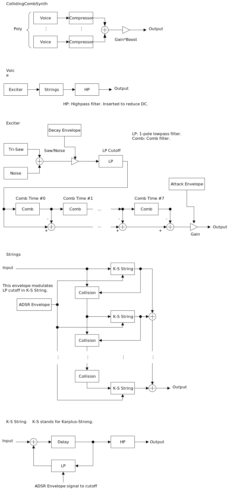

---
lang: en
...

# CollidingCombSynth


CollidingCombSynth is an experimental synthesizer which sounds like bowed string. Equipped with 24 Karplus-Strong string models which collide to each other. Tuning of pitch is possible, but difficult. So mostly suitable for sound effects.


- [Download CollidingCombSynth {{ latest_version["CollidingCombSynth"] }} `{{ target }}` - VST 3 (github.com)]({{ download_url }}) 


- [Download Presets (github.com)]({{ preset_download_url["CollidingCombSynth"] }})


{{ section["package"] }}

{{ section["contact_installation_guiconfig"] }}

## Controls
{{ section["gui_common"] }}

{{ section["gui_knob"] }}

{{ section["gui_barbox"] }}

## Caution
Output amplitude varies a lot, even if `Compressor` is turned on. Recommend to always insert limiter after CollidingCombSynth.

## Block Diagram
If the image is small, use <kbd>Ctrl</kbd> + <kbd>Mouse Wheel</kbd> or "View Image" on right click menu to scale.

Diagram only shows overview. It's not exact implementation.



## Parameters
### Gain
Gain, Boost

:   Master gain. Value of `Gain` and value of `Boost` will be multiplied.

    ```
    masterGain = Gain * Boost
    ```

Compressor

:   Turn on/off the comporessors. Each voice has a compressor.

Time

:   Attack/Release time of compressor.

    Larger `Time` value may sound more natural, but compression becomes leaky. In this case, try turning down the value of `Threshold`.

Threshold

:   Compressor starts compressing the signal when input amplitude exceeds `Threshold`. Usually, `Threshold` is set to less than 1.0.

### Tuning
Octave, Semi, Milli

:   Changes master pitch.

    - `Semi` stands for semitone.
    - `Milli` is 1/1000 of semitone or 1/10 cent.

ET, A4 [Hz]

:   Changes tuning.

    `ET` stands for equal temperament. Note that when `ET` is less than 12, some notes may become silent due to frequency becomes too high or too low.

    `A4 [Hz]` is frequency of note A4.

### Unison
nUnison

:   Number of voices used by unison.

    To avoid interruption of release, increase the number of `Poly` in Misc. section. Note that increasing `Poly` consumes more resources.

Detune, Random Detune

:   `Detune` is the difference of pitch between voices used in a unison.

    When `Random Detune` is checked, amount of detune changes for each note-on.

    ```
    random = RandomDetune ? rand() : 1
    detune = pitch * (1 + random * unisonIndex * Detune)
    ```

Spread

:   Amount of stereo spread for a unison.

Gain

:   Amount of randomization of gain for voices used in a unison.

### Random
Random section has configurations for 4 random number generators (RNG).

- Noise: RNG for gaussian noise oscillator on exciter.
- Comb: RNG to randomize `Comb Time` in `Exciter` section.
- Str.Freq: RNG to randomize `Frequency` in `String` section.
- Unison: RNG used in `Detune` and `Gain` in `Unison` section.

Amount

:   Amount of randomization. Randomization is disabled when `Amount` is set to 0.

Seed

:   Seed value. Different seed generates different sequence of pseudo random number.

Retrigger

:   When checked, the synth resets seed for each note-on.

### Exciter
Configuration of exciter. Excitation is some force to start physical model. For example, picking of guitar, impact of piano string and hammer, impact of stick and drumhead, are excitation.

The exciter of CollidingCombSynth consists of sawtooth/noise oscillator and serially connected 8 comb filters.

LP Cutoff

:   Cutoff frequency of lowpass filter which applies to oscillator output. Unit of display value is Hz.

Gain

:   オシレータの音量です。

A, D

:   `A` is the attack time of oscillator. `D` is the decay time of oscillator.

    Turning `A` knob to right makes sound softer.

Saw/Noise

:   Mixing ratio of sawtooth and gaussian noise in oscillator output. When set to leftmost, oscillator only outputs sawtooth. When set to rightmost, oscillator only outputs gaussian noise.

Comb Time

:   Delay time of comb filter. Unit of display value is seconds.

### String
Configurations of Karplus-Strong strings.

LP Cutoff

:   Cutoff frequency of lowpass filter which is inserted in feedback path of string model. Unit of display value is Hz.

HP Cutoff

:   Cutoff frequency of highpass filter which applies to string output. Unit of display value is Hz.

Distance

:   Distance between strings. When an immediate amplitude of a string exceeds `Distance`, exceeded amplitude will be propagated to a neighbouring string.

Propagation

:   The value of `Propagation` changes the loss of force when strings are collided. The bounce will be weaken if `Propagation` is smaller.

Connection

:   Connection type of strings.

    - `Parallel`: Connect strings in parallel. Input of excitation starts from string 0, then incrementally going through the rest of strings. Collided signal is accumulated to the excitation signal incrementally.
    - `Serial`: Connect strings in serial. Excitation is only input to string 0. Then output of string 0 goes to input of string 1, output of string 1 goes to input of string 2, and so on. Beware that output signal may become louder than `Parallel`, so take care when turn off `Compressor`.

A, D, S, R

:   Envelope parameters which modulates `LP Cutoff`. This envelope basically works as the gain envelope of CollidingCombSynth.

    - `A` : Attack time which is the length from note-on to reaching `LP Cutoff` value.
    - `D` : Decay time which is the length from `LP Cutoff` value to reaching `(LP Cutoff) * S`.
    - `S` : Sustain level which is the gain after decay.
    - `R` : Release time which is the length from note-off to the `LP Cutoff` reaching to 0.

Frequency

:   Fundamental frequency of string. The final frequency of a string is calculated by multiplying note pitch by `Frequency`.

    ```
    noteFrequency = A4Hz * pow(2, Octave + (Semi - 69) / ET + Milli / (ET * 1000))
    stringFrequency = Frequency * noteFrequency
    ```

## Change Log

- {{version}}
  
  - {{ log }}
  


## Old Versions

N/A.

  
- [CollidingCombSynth {{ x["version"] }} - VST 3 (github.com)]({{ x["url"] }})
  


## License
CollidingCombSynth is licensed under GPLv3. Complete licenses are linked below.

- [https://github.com/ryukau/VSTPlugins/tree/master/License](https://github.com/ryukau/VSTPlugins/tree/master/License)

If the link above doesn't work, please send email to `ryukau@gmail.com`.

### About VST
VST is a trademark of Steinberg Media Technologies GmbH, registered in Europe and other countries.
