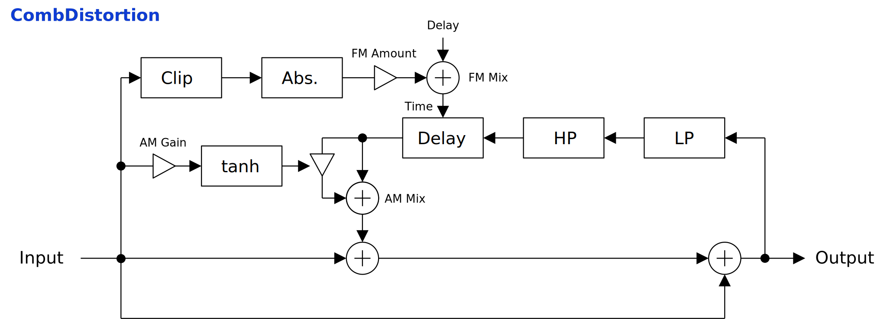

---
lang: en
...

# CombDistortion

CombDistortion is a distortion using self-modulating comb filter. Raw output sounds harsh, and it is better to use with external cabinet impulse response. Note event can be used to control delay time of comb filter.


- [Download CombDistortion {{ latest_version["CombDistortion"] }} `{{ target }}` - VST 3 (github.com)]({{ download_url }}) 


- [Download Presets (github.com)]({{ preset_download_url["CombDistortion"] }})


{{ section["package"] }}

{{ section["contact_installation_guiconfig"] }}

## Controls
{{ section["gui_common"] }}

{{ section["gui_knob"] }}

## Block Diagram
If the image is small, use <kbd>Ctrl</kbd> + <kbd>Mouse Wheel</kbd> or "View Image" on right click menu to scale.

Diagram only shows overview. It's not exact implementation.

## Note Event Input
CombDistortion can receive note events to control the delay time of feedback. This is an convenience feature to match the texture of distortion to the input signal, by supplying the same note events used to generate input signal.

## Parameters
Characters inside of square brackets \[\] represents unit. Following is a list of units used in CombDistortion.

- \[s\]: Second.
- \[st.\]: Semitone.
- \[Hz\]: Herz.

### Comb
Output

:   Output gain.

Mix

:   Mixing ratio of input signal and distorted signal.

    When set to leftmost, input signal will be bypassed. When the value approaches to rightmost, feedback becomes stronger.

Feedback

:   Feedback gain.

    Beware that `Feedback` doesn't change output when `Mix` is set to leftmost.

Delay

:   Delay time of comb filter.

AM Mix, AM Gain, AM Invert

:   The amount of amplitude modulation applied to feedback signal.

    - `AM Mix`: Mixing ratio of the signal before and after the modulation.
    - `AM Gain`: Gain of modulation signal.
    - `AM Invert`: When checked, invert the phase of modulation signal.

    To avoid blow up, `tanh` is used to limit the amplitude of modulation signal. This means that the character of sound may differ depending on the amplitude of input signal. However, when `AM Gain` is high, the difference may be negligible.

FM Mix, FM Amount, FM Clip

:   The amount of delay time modulation applied to feedback signal.

    - `FM Mix`: Mixing ratio of the signal before and after the modulation.
    - `FM Gain`: Gain of modulation signal.
    - `FM Clip`: Ceiling value of hard clipping applied to modulation signal.

    To avoid setting negative delay time, `abs` is applied to modulation signal.

Highpass \[Hz\], Lowpass \[Hz\]

:   Cutoff frequency of highpass or lowpass filter on feedback path.

### Note
Origin \[st.\]

:   Origin of MIDI note number.

    Note event with this note number doesn't change the sound.

Scaling

:   Scaling of note event modulation to delay time.

    When set to `1.0`, the modulation amount follows the pitch of the note. When set to `-1.0` pitch will be inverted.

Release \[s\]

:   Release time to resume to the original `Delay` time after note-off. The value is rough indication and not exact.

### Misc.
Smoothing \[s\]

:   Paramter smoothing time in seconds.

    For example, if the value of `Smoothing` is set to `0.01` or something short, the change of parameter almost immediately applies. So it sounds more snappy, but may introduce audible pop noise. On the other hand, if the value of `Smoothing` is set to `1.0` for example, the change of parameter is only slowly followed.

Oversampling

:   Oversampling options.

    - `1x`: Disables oversampling.
    - `16x Halfway`: Enables 16-fold oversampling, but with incomplete up-sampling which adds some distortion.
    - `16x`: Enables 16-fold oversampling.

## Change Log

- {{version}}
  
  - {{ log }}
  


## Old Versions

N/A.

  
- [CombDistortion {{ x["version"] }} - VST 3 (github.com)]({{ x["url"] }})
  


## License
CombDistortion is licensed under GPLv3. Complete licenses are linked below.

- [https://github.com/ryukau/VSTPlugins/tree/master/License](https://github.com/ryukau/VSTPlugins/tree/master/License)

If the link above doesn't work, please send email to `ryukau@gmail.com`.

### About VST
VST is a trademark of Steinberg Media Technologies GmbH, registered in Europe and other countries.
