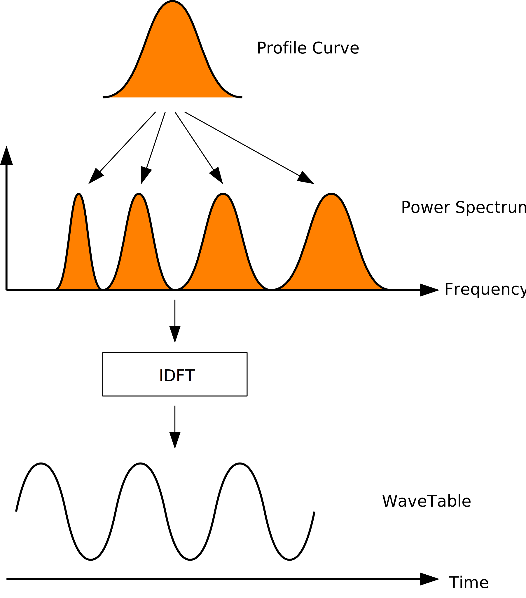
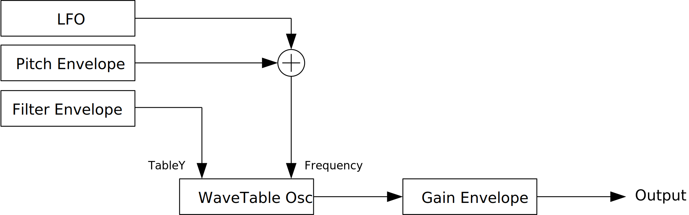
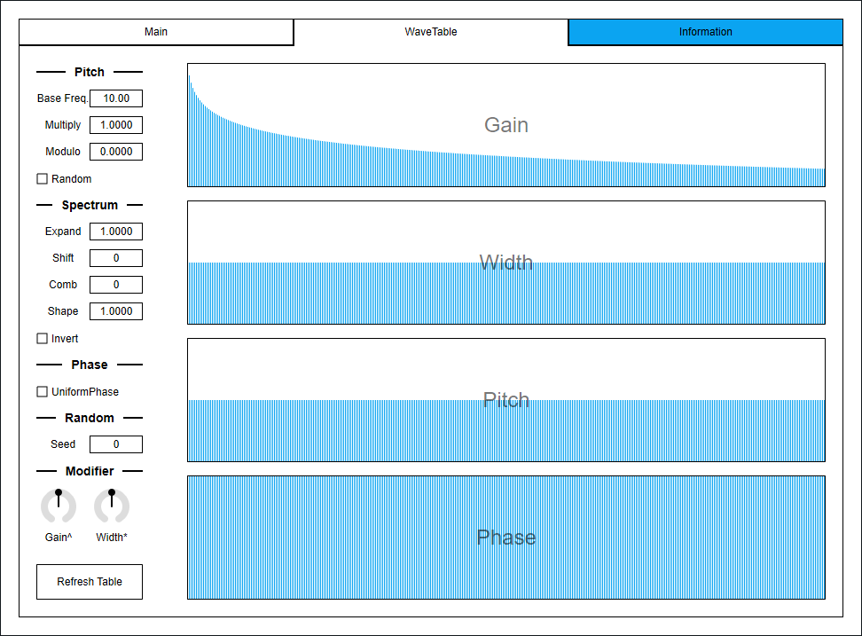
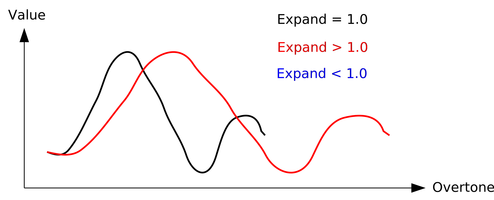
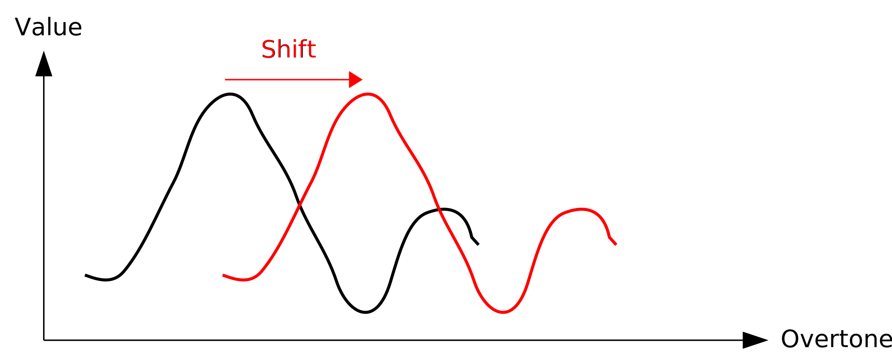
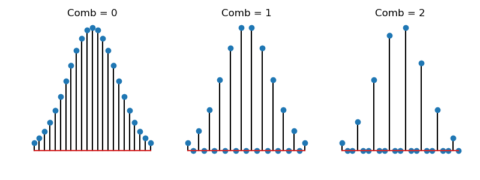

---
lang: en
...

# CubicPadSynth


CubicPadSynth is a wavetable synthesizer which uses PADsynth algorithm to generate oscillator tables. Cubic interpolation is used to get smooth sound even at inaudible low frequency range. LFO waveform can be directly drawn.

- [Download CubicPadSynth 0.1.11 - VST® 3 (github.com)](https://github.com/ryukau/VSTPlugins/releases/download/BasicLimiterAndFDN64Reverb/CubicPadSynth_0.1.11.zip) 
- [Download Presets (github.com)](https://github.com/ryukau/VSTPlugins/releases/download/BarBoxFocusFix/CubicPadSynthPresets.zip)

CubicPadSynth requires CPU which supports AVX or later SIMD instructions.

The package includes following builds:

- Windows 64bit
- Linux 64bit

On 2022-05-15, macOS is not supported. Current code fails to build as macOS universal binary. I'm planning to support macOS in future. However due to my financial situation, I can't purchase M1 mac for now.

Linux build is built on Ubuntu 20.04. If you are using distribution other than Ubuntu 20.04, plugin will not likely run. In this case, please take a look at [build instruction](https://github.com/ryukau/VSTPlugins/blob/master/build_instruction.md).

## Contact
Feel free to contact me on [GitHub repository](https://github.com/ryukau/VSTPlugins/commits/master) or `ryukau@gmail.com.`

## Installation
### Plugin
Place `*.vst3` directory to:

- `/Program Files/Common Files/VST3/` for Windows.
- `$HOME/.vst3/` for Linux.
- `/Users/$USERNAME/Library/Audio/Plug-ins/VST3/` for macOS.

DAW may provides additional VST3 directory. For more information, please refer to the manual of the DAW.

### Presets
Extract preset zip, then place preset directory to the OS specific path:

- Windows : `/Users/$USERNAME/Documents/VST3 Presets/Uhhyou`
- Linux : `$HOME/.vst3/presets/Uhhyou`
- macOS : `/Users/$USERNAME/Library/Audio/Presets/Uhhyou`

Preset directory name must be the same as the plugin. Make `Uhhyou` directory if it does not exist.

### Windows Specific
If DAW doesn't recognize the plugin, try installing C++ redistributable (`vc_redist.x64.exe`). Installer can be found in the link below.

- [The latest supported Visual C++ downloads](https://support.microsoft.com/en-us/help/2977003/the-latest-supported-visual-c-downloads)

### Linux Specific
On Ubuntu 18.0.4, those packages are required.

```bash
sudo apt install libxcb-cursor0  libxkbcommon-x11-0
```

If DAW doesn't recognize the plugin, take a look at `Package Requirements` section of the link below and make sure all the VST3 related package is installed.

- [VSTGUI: Setup](https://steinbergmedia.github.io/vst3_doc/vstgui/html/page_setup.html)

REAPER on Linux may not recognize the plugin. A workaround is to delete a file `~/.config/REAPER/reaper-vstplugins64.ini` and restart REAPER.

### macOS Specific
**Important**: Current package do not contain mac OS build.

When trying to run plugin first time, following message may appear on macOS.

```
<PluginName>.vst3 is damaged and can't be opened. You should move it to
the Trash"
```

In this case, open terminal and try running following command to unzipped `.vst3` directory.

```sh
xattr -rc /path/to/PluginName.vst3
```

Plugin may be considered as unsigned/un-notarized application. In this case, try following the steps below.

1. Open terminal and run `sudo spctl --master-disable`.
2. Go to System Preferences → Security and Privacy → General → Allow apps downloaded from, then select "Anywhere".

Beware that steps above degrades security of your system. To revert the settings, follow the steps below.

1. Go to System Preferences → Security and Privacy → General → Allow apps downloaded from, then select option to "App Store and identified developers".
2. Open terminal and run `sudo spctl --master-enable`.

#### Reference
- [How to Fix App “is damaged and can’t be opened. You should move it to the Trash” Error on Mac](https://osxdaily.com/2019/02/13/fix-app-damaged-cant-be-opened-trash-error-mac/)
- [Allowing unsigned/un-notarized applications/plugins in Mac OS | Venn Audio](https://www.vennaudio.com/allowing-unsigned-un-notarized-applications-plugins-in-mac-os/)
- [Safely open apps on your Mac - Apple Support](https://support.apple.com/en-us/HT202491)

## Color Configuration
At first time, create color config file to:

- `/Users/USERNAME/AppData/Roaming/UhhyouPlugins/style/style.json` on Windows.
- `$XDG_CONFIG_HOME/UhhyouPlugins/style/style.json` on Linux.
  - If `$XDG_CONFIG_HOME` is empty, make `$HOME/.config/UhhyouPlugins/style/style.json`.
- `/Users/$USERNAME/Library/Preferences/UhhyouPlugins/style/style.json` on macOS.

Below is a example of `style.json`.

```json
{
  "fontPath": "",
  "foreground": "#000000",
  "foregroundButtonOn": "#000000",
  "foregroundInactive": "#8a8a8a",
  "background": "#ffffff",
  "boxBackground": "#ffffff",
  "border": "#000000",
  "borderCheckbox": "#000000",
  "borderLabel": "#000000",
  "unfocused": "#dddddd",
  "highlightMain": "#0ba4f1",
  "highlightAccent": "#13c136",
  "highlightButton": "#fcc04f",
  "highlightWarning": "#fc8080",
  "overlay": "#00000088",
  "overlayHighlight": "#00ff0033"
}
```

Hex color codes are used.

- 6 digit color is RGB.
- 8 digit color is RGBA.

First letter `#` is conventional. Plugins ignore the first letter of color code, thus `?102938`, `\n11335577` are valid.

Do not use characters outside of `0-9a-f` for color value.

- `fontPath`: Absolute path to *.ttf font file. Not implemented in VST 3 version.
- `foreground`: Text color.
- `foregroundButtonOn`: Text color of active toggle button. Recommend to use the same value of `foreground` or `boxBackground`.
- `foregroundInactive`: Text color of inactive components. Currently, only used for TabView.
- `background`: Background color.
- `boxBackground`: Background color of inside of box shaped components (Barbox, Button, Checkbox, OptionMenu, TextKnob, VSlider).
- `border`: Border color of box shaped components.
- `borderCheckbox`: Border color of CheckBox.
- `borderLabel`: Line color of parameter section label.
- `unfocused`: Color to fill unfocused components. Currently, only used for knobs.
- `highlightMain`: Color to indicate focus is on a component. Highlight colors are also used for value of slider components (BarBox and VSlider).
- `highlightAccent`: Same as `highlightMain`. Used for cosmetics.
- `highlightButton`: Color to indicate focus is on a button.
- `highlightWarning`: Same as `highlightMain`, but only used for parameters which requires extra caution.
- `overlay`: Overlay color. Used to overlay texts and indicators.
- `overlayHighlight`: Overlay color to highlight current focus.

## Controls
Knob and slider can do:

- <kbd>Ctrl</kbd> + <kbd>Left Click</kbd>: Reset value.
- <kbd>Shift</kbd> + <kbd>Left Drag</kbd>: Fine adjustment.

There is an additional control for number sliders used for `Octave`, `Seed` etc.

- <kbd>Middle Click</kbd> : Flip minimum and maximum.

Control with many blue vertical bars (BarBox) have some keyboard shortcuts. `LFO Wave` on Main tab and `Gain`, `Width`, `Pitch`, `Phase` on Wavetable tab are using BarBox. Shortcuts are enabled after left clicking BarBox and mouse cursor is on the inside of BarBox. Cheat sheet is available on Infomation tab.

| Input                                                      | Control                            |
| ---------------------------------------------------------- | ---------------------------------- |
| <kbd>Left Drag</kbd>                                       | Change Value                       |
| <kbd>Shift</kbd> + <kbd>Left Drag</kbd>                    | Change Value (Snapped)             |
| <kbd>Ctrl</kbd> + <kbd>Left Drag</kbd>                     | Reset to Default                   |
| <kbd>Ctrl</kbd> + <kbd>Shift</kbd> + <kbd>Left Drag</kbd>  | Change Value (Skip Between Frames) |
| <kbd>Right Drag</kbd>                                      | Draw Line                          |
| <kbd>Shift</kbd> + <kbd>Right Drag</kbd>                   | Edit One Bar                       |
| <kbd>Ctrl</kbd> + <kbd>Right Drag</kbd>                    | Reset to Default                   |
| <kbd>Ctrl</kbd> + <kbd>Shift</kbd> + <kbd>Right Drag</kbd> | Toggle Lock                        |
| <kbd>a</kbd>                                               | Alternate Sign                     |
| <kbd>d</kbd>                                               | Reset Everything to Default        |
| <kbd>D</kbd>                                               | Toggle Min/Mid/Max                 |
| <kbd>e</kbd>                                               | Emphasize Low                      |
| <kbd>E</kbd>                                               | Emphasize High                     |
| <kbd>f</kbd>                                               | Low-pass Filter                    |
| <kbd>F</kbd>                                               | High-pass Filter                   |
| <kbd>i</kbd>                                               | Invert Value (Preserve minimum)    |
| <kbd>I</kbd>                                               | Invert Value (Minimum to 0)        |
| <kbd>l</kbd>                                               | Toggle Lock under Mouse Cursor     |
| <kbd>L</kbd>                                               | Toggle Lock for All                |
| <kbd>n</kbd>                                               | Normalize (Preserve minimum)       |
| <kbd>N</kbd>                                               | Normalize (Minimum to 0)           |
| <kbd>p</kbd>                                               | Permute                            |
| <kbd>r</kbd>                                               | Randomize                          |
| <kbd>R</kbd>                                               | Sparse Randomize                   |
| <kbd>s</kbd>                                               | Sort Descending Order              |
| <kbd>S</kbd>                                               | Sort Ascending Order               |
| <kbd>t</kbd>                                               | Subtle Randomize (Random walk)     |
| <kbd>T</kbd>                                               | Subtle Randomize (Converge to 0)   |
| <kbd>z</kbd>                                               | Undo                               |
| <kbd>Z</kbd>                                               | Redo                               |
| <kbd>,</kbd> (Comma)                                       | Rotate Back                        |
| <kbd>.</kbd> (Period)                                      | Rotate Forward                     |
| <kbd>1</kbd>                                               | Decrease                           |
| <kbd>2</kbd>-<kbd>9</kbd>                                  | Decrease 2n-9n                     |

Snapping is not available for all BarBox. If you'd like to have snapping for certain BarBox, feel free to open issue to [GitHub repository](https://github.com/ryukau/VSTPlugins).

Edit One Bar with <kbd>Shift</kbd> + <kbd>Right Drag</kbd> holds a bar under the cursor when mouse right button is pressed. Then only changes that one bar while holding down mouse right button.

Toggle Lock with <kbd>Ctrl</kbd> + <kbd>Shift</kbd> + <kbd>Right Drag</kbd> behaves as line edit. When right mouse button (RMB) is pressed, it holds the opposite state of the bar below mouse cursor, then use the state for the rest of bars. For example, if RMB is pressed on a locked bar, dragging unlocks bars while holding down RMB.

Some BarBox has scroll bar to zoom in. Scroll bar has handles on left end and right end. To control zoom, use <kbd>Left Drag</kbd> on one of the handle. Scroll bar also has following controls:

- <kbd>Right Click</kbd> : Reset zoom.
- <kbd>Mouse Wheel</kbd> : Zoom in/out.

## Caution
Pressing `Refresh LFO` or `Refresh Table` button stop sound. They also stop all midi notes.

## Wavetable Specification
Length of a wavetable is `2^18` samples.

136 band-limited wavetables are generated for each MIDI note. Pitch bending is supported as high as 21100 Hz. 21100 Hz is derived from MIDI note number 136. Frequency of MIDI note number 137 is higher then 22050 Hz. That's why 136 is selected.

When fundamental frequency of a note is lower than 8.18 Hz, some overtones on high frequency may lost. However, cubic interpolation may cause noise which makes those frequency not to be 0.

```
noteToFreq(note) := 440 * Math.pow(2, (note - 69) / 12)
noteToFreq(0) = 8.175798915643707
noteToFreq(136) = 21096.16364242367
noteToFreq(137) = 22350.606811712252
```

Wavetable is represented as 2D array with size of `136 * 2^18`. Bicubic interpolation is used to get the value from the table. Coordinate on time/band-limit axis is determined by phase and frequency of oscillator.

The size of wavetable is large for a synthesizer. [Xrun](https://alsa.opensrc.org/Xruns) may occur if memory is slow. It may also consume more resources for higher notes because access pattern becomes close to random.

- [Alsa Opensrc Org - Independent ALSA and linux audio support site](https://alsa.opensrc.org/Xruns)
- [linux - What are XRuns? - Unix & Linux Stack Exchange](https://unix.stackexchange.com/questions/199498/what-are-xruns)

## PADsynth Algorithm Overview
CubicPadSynth uses PADsynth algorithm, which is originated from [ZynAddSubFX](https://zynaddsubfx.sourceforge.io/). [Yoshimi](http://yoshimi.sourceforge.net/) is also using PADsynth algorithm.

Passing phase randomized spectrum to IDFT (inverse discrete fourier transform) generates a cyclic waveform which is smooth when connecting an end to another end. PADsynth is utilizing this property.

"Profile" function is used to synthesize spectrum. CubicPadSynth uses normal distribution curve for profile, which is same as original PADsynth algorithm. Center frequency of profile can be set arbitrary. In default, CubicPadSynth uses fundamental frequency set by `Base Freq.` and its overtones.



- [PADsynth algorithm](https://zynaddsubfx.sourceforge.io/doc/PADsynth/PADsynth.htm)

## Block Diagram
If the image is small, use <kbd>Ctrl</kbd> + <kbd>Mouse Wheel</kbd> or "View Image" on right click menu to scale.

Diagram only shows overview. It's not exact implementation.



## Parameters
### Main Tab


#### Tuning
Octave, Semi, Milli

:   Changes master pitch.

    `Milli` is 1/1000 of semitone or 1/10 cent.

ET, A4 [Hz]

:   Changes tuning.

    `ET` stands for equal temperament. Note that when `ET` is less than 12, some notes becomes silent due to frequency becomes too high or too low.

    `A4 [Hz]` is frequency of note A4.

#### Gain
A, D, S, R

:   Gain envelope parameters.

    - `A` : Attack time which is the length from note-on to reaching peak value.
    - `D` : Decay time which is the length from peak value to reaching sustain level.
    - `S` : Sustain level which is the gain after decay.
    - `R` : Release time which is the length from note-off to the gain reaching to 0.

Gain

:   Master output gain.

#### Lowpass
This is a psuedo low-pass filter. It shifts to wavetable which contains less overtone to get low-passed output.

Equation to get cutoff frequency is following.

```
cut = Cutoff * 128
keyFollowRange = Cutoff * (nTable - pitch)
lowpassPitch = (cut + KeyFollow * (keyFollowRange - cut)) - lowpassEnvelope * Amount;
if (lowpassPitch < 0) lowpassPitch = 0

noteToFreq(note) := 440 * Math.pow(2, (note - 69) / 12)
range  = noteToFreq(nTable)
lpFreq = noteToFreq(midiNote + lowpassPitch)
ntFreq = noteToFreq(midiNote)
cutoffFrequency = (1 + (range - lpFreq) / range) * ntFreq
```

128 used to calculate `lpCut` is an arbitrary value which came from MIDI note number range + 1. `nTable` is set to 136.

Cutoff

:   Changes filter cutoff frequency.

KeyFollow

:   When set to right-most, cutoff frequency is set to make the number of overtone to be almost same regardless of pitch of note. When set to left-most, it only use the value of `Cutoff`.

A, D, S, R, Amount

:   Filter envelope parameters. `Amount` changes the amount of modulation to cutoff.

#### Pitch
A, D, S, R, Amount

:   Pitch envelope parameters.

Negative

:   Changes the sign of pitch envelope output.

#### Unison
nUnison

:   Number of voices used by unison.

    To avoid interruption of release, increase the number of `nVoice` in Misc. section. Note that increasing `nVoice` consumes more resources.

Detune, Random Detune

:   `Detune` is the difference of pitch between voices used in a unison.

    When `Random Detune` is checked, amount of detune changes for each note-on.

    ```
    random = RandomDetune ? rand() : 1
    detune = pitch * (1 + random * unisonIndex * Detune)
    ```

GainRnd

:   Amount of randomization of gain for voices used in a unison.

Phase

:   Amount of randomization of phase for voices used in a unison.

    This parameter makes no effect when `Reset` in Phase section is checked.

Spread, Spread Type

:   `Spread` is an amount of stereo spread for a unison.

    `Spread Type` provides options to assign panpot values according to voice pitch.

    - `Alternate L-R`: Alternates `Ascend L -> R` and `Ascend R -> L`.
    - `Alternate M-S`: Alternates `HighOnMid` and `HighOnSide`.
    - `Ascend L -> R`: Ascend pitch from left to right.
    - `Ascend R -> L`: Ascend pitch from right to left.
    - `HighOnMid`: Ascend pitch from side to mid.
    - `HighOnSide`: Ascend pitch from mid to side.
    - `Random`: Randomize pan. May be biased.
    - `RotateL`: Rotate to left for each note-on.
    - `RotateR`: Rotate to right for each note-on.
    - `Shuffle`: Randomly assign pan which is evenly ordered.

#### LFO
Refresh LFO

:   Refresh LFO wavetable based on current value of `LFO Wave`.

    Note that refreshing wavetable stops sound. It also interrupts MIDI notes.

Interpolation

:   Type of LFO wavetable interpolation.

    

Tempo, Multiply

:   Sets LFO frequency according to current tempo. Lower numeral represents the length of note. Upper numeral is the number of notes.

    Value of `Multiply` is multiplied to the frequency calculated from `Tempo`.

    ```
    // (60 seconds) * (4 beat) = 240
    lfoFrequency = Multiply * (BPM / 240) / (TempoUpperNumeral / TempoLowerNumeral)
    ```

Retrigger

:   When checked, resets LFO phase for each note-on.

Amount

:   LFO frequency modulation amount.

Lowpass

:   Changes cutoff freequency of low-pass filter for LFO.

LFO Wave

:   LFO waveform.

#### Phase
Phase

:   Initial phase of oscillator.

Reset

:   When checked, resets oscillator phase to the value set by `Phase`.

Random

:   When checked, randomize phase for each note-on. In this case, value of `Phase` becomes range of randomization.

#### Misc.
Smooth

:   Time length to change some parameter value to current one. Unit is in second.

    List of parameters related to `Smooth`. `*` represents wild card.

    - All parameters in Tuning section.
    - Gain
      - `S`
      - `Gain`
    - Lowpass
      - `Cutoff`
      - `KeyFollow`
      - `S`
      - `Amount`
    - Pitch
      - `S`
      - `Amount`
      - `Negative`
    - LFO
      - `Tempo`
      - `Multiply`
      - `Amount`
      - `Lowpass`
    - Phase
      - `Phase`

nVoice

:   Maximum polyphony. Lowering the number of this option reduces CPU load.

Pool

:   When checked, most quiet note is released when the number of active voice is close to maximum polyphony. This can be used to reduce pop noise which occurs on note-on.

### Wavetable Tab


#### Overtone Controls
Gain

:   Gain of profile.

Width

:   Width of profile.

Pitch

:   This value is multiplied to profile center frequency.

Phase

:   Range of randomization for the phase of profile.

#### Pitch
Base Freq.

:   Fundamental frequency of wavetable. Note that if this value is small, master pitch becomes out of tune.

Multiply, Modulo

:   Changes profile center frequency.

    ```
    profileCenterFrequency = mod(
      BaseFreq * profileIndex * overtonePitch * Multiply,
      440 * pow(2, (Modulo - 69) / 12)
    )
    ```

Random

:   When checked, randomize profile center frequency. Ignores values of `Pitch` in overtone control.

#### Spectrum
Expand

:   Scaling factor to shrink/expand the spectrum along to frequency axis.

    

Shift

:   Shift spectrum along to frequency axis.

    

Comb

:   When this value is higher than 1, it changes the shape of profile like a comb. The value specifies interval between peaks.

    

Shape

:   Changes profile shapes by using the value of `Shape` as an exponent.

    ```
    shapedProfile = powf(profile, shape);
    ```

Invert

:   Invert spectrum to make the maximum of absolute value to 0, and 0 to the max-abs value. Signs are preserved. Phases aren't considered.

    ```
    maxRe = max(abs(spectrumRe))
    maxIm = max(abs(spectrumIm))
    invertedSpectrumRe = spectrumRe - sgn(spectrumRe) * maxRe
    invertedSpectrumIm = spectrumIm - sgn(spectrumIm) * maxIm
    ```

#### Phase
UniformPhase

:   When checked, phase of a profile becomes an uniform value.

#### Random
Seed

:   Random seed. This value change random number sequence.

#### Modifier
Gain^

:   Exponent for `Gain` in overtone control.

    ```
    profileGain = pow(Gain, Gain^)
    ```

Width\*

:   Multiplier for `Width` in overtone control.

    ```
    profileWidth = Width * (Width*)
    ```

#### Refresh Table
Refresh PADsynth wavetable based on current configuration of Wavetable tab.

Note that refreshing wavetable stops sound. It also interrupts MIDI notes.

## Change Log
- 0.1.11
  - Changed font to Tinos.
- 0.1.10
  - Fixed to reset properly.
  - Fixed `bypass` parameter behavior. This fixes playing all the notes at the moment of unmute, even if host sends note to plugin while muting. This bug was only happening on the hosts which respect VST 3 `bypass` parameter.
- 0.1.9
  - Implemented process context requirements.
  - Added/Changed BarBox functionality to match LV2 version.
    - Edit one bar.
    - Lock.
    - Internal mouse wheel sensitivitly.
    - Snapping (implemented, but not used).
    - Starting bar of line edit is now fixed to anchor point.
- 0.1.8
  - Added check that DSP is initialized or not.
- 0.1.7
  - Added scroll bar to dense BarBox.
  - Added undo/redo to BarBox.
- 0.1.6
  - Added color configuration.
- 0.1.5
  - Reverted parameter smoother to the old one which works with variable size audio buffer.
- 0.1.4
  - Fixed a bug that refreshing wavetable before parameters are loaded at launch.
  - Fixed off by one error in LFO wavetable with cubic interpolation.
- 0.1.3
  - Fixed a bug that some shortcuts are disabled for BarBox.
- 0.1.2
  - Changed `Refresh Table` and `Refresh LFO` from VST message to parameter. This enables automation and midi mapping.
  - Changed BarBox shortcuts to be disabled when mouse cursor is on the outside of BarBox.
- 0.1.1
  - Fixed a bug that cause crash when drawing string.
- 0.1.0
  - Initial release.

### Old Versions
- [CubicPadSynth 0.1.10 - VST 3 (github.com)](https://github.com/ryukau/VSTPlugins/releases/download/ResetAndMuteFix/CubicPadSynth_0.1.10.zip)
- [CubicPadSynth 0.1.9 - VST 3 (github.com)](https://github.com/ryukau/VSTPlugins/releases/download/CollidingCombSynth0.1.0/CubicPadSynth0.1.9.zip)
- [CubicPadSynth 0.1.8 - VST 3 (github.com)](https://github.com/ryukau/VSTPlugins/releases/download/L3Reverb0.1.0/CubicPadSynth0.1.8.zip)
- [CubicPadSynth 0.1.7 - VST 3 (github.com)](https://github.com/ryukau/VSTPlugins/releases/download/L4Reverb0.1.0/CubicPadSynth0.1.7.zip)
- [CubicPadSynth 0.1.6 - VST 3 (github.com)](https://github.com/ryukau/VSTPlugins/releases/download/ColorConfig/CubicPadSynth0.1.6.zip)
- [CubicPadSynth 0.1.5 - VST 3 (github.com)](https://github.com/ryukau/VSTPlugins/releases/download/LatticeReverb0.1.0/CubicPadSynth0.1.5.zip)
- [CubicPadSynth 0.1.4 - VST 3 (github.com)](https://github.com/ryukau/VSTPlugins/releases/download/WavetableInitializationBugFix/CubicPadSynth0.1.4.zip)
- [CubicPadSynth 0.1.3 - VST 3 (github.com)](https://github.com/ryukau/VSTPlugins/releases/download/LightPadSynth0.1.0/CubicPadSynth0.1.3.zip)
- [CubicPadSynth 0.1.2 - VST 3 (github.com)](https://github.com/ryukau/VSTPlugins/releases/download/BarBoxFocusFix/CubicPadSynth0.1.2.zip)
- [CubicPadSynth 0.1.1 - VST 3 (github.com)](https://github.com/ryukau/VSTPlugins/releases/download/DrawStringFix/CubicPadSynth0.1.1.zip)

## License
CubicPadSynth is licensed under GPLv3. Complete licenses are linked below.

- [https://github.com/ryukau/VSTPlugins/tree/master/License](https://github.com/ryukau/VSTPlugins/tree/master/License)

If the link above doesn't work, please send email to `ryukau@gmail.com`.

### About VST
VST is a trademark of Steinberg Media Technologies GmbH, registered in Europe and other countries.
