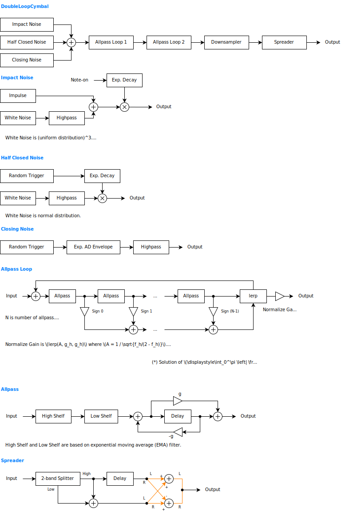

---
lang: en
...

# DoubleLoopCymbal


DoubleLoopCymbal is a synthesizer that produces a sound somewhere between hi-hat and triangle. Metallic texture comes from 2 all-pass loops.


- [Download DoubleLoopCymbal {{ latest_version["DoubleLoopCymbal"] }} `{{ target }}` - VST 3 (github.com)]({{ download_url }}) 


- [Download Presets (github.com)]({{ preset_download_url["DoubleLoopCymbal"] }})


**Note**: Presets produce the expected sound only if the sampling rate is 48000 Hz.

{{ section["package"] }}

{{ section["contact_installation_guiconfig"] }}

## Controls
{{ section["gui_common"] }}

{{ section["gui_knob"] }}

## Caution
Output can be loud. Always use with limiter.

## Block Diagram
If the image is small, use <kbd>Ctrl</kbd> + <kbd>Mouse Wheel</kbd> or "View Image" on right click menu to scale.

Diagram only shows overview. It's not exact implementation.



## Parameters
Characters inside of square brackets \[\] represents unit. Following is a list of units used in DoubleLoopCymbal.

- \[dB\] : Decibel.
- \[s\] : Second.
- \[Hz\] : Frequency in Hertz.
- \[sample\] : Time in samples. 1 sample is `1 / (sampling rate)` seconds.
- \[st.\] : Ssemitone. 1 semitone is `1 / 12` octave.

### Mix & Options
Output \[dB\]

:   Output gain.

2x Sampling

:   Enables 2x oversampling when checked.

Release

:   When checked,

    - The sound will not stop after note-off.
    - All settings in the `Closing Noise` section will be ignored.

Fixed Noise

:   When checked, fluttering of sound will be reduced.

    Internally, the random number seed used to synthesize the noise signal will be reset at each note-on.

Spread

:   Amount of stereo spreading. More spreading when the value is close to 1.

Split \[Hz\]

:   Crossover frequency of stereo spreader. Spreading effect is reduced below this frequency.

External Input \[dB\]

:   External input gain.

    DoubleLoopCymbal can be used as an FX to add metallic texture to the external input.

    **Important**: DoubleLoopCymbal requires note events even when using as an effector. External input is muted until a note is played.

    Note events are used for expressions similar to opening and closing of a hi-hat. An example setup is to play a MIDI keyboard with one hand and tap on a desk with the other hand to produce noise that is picked up by a microphone.

    When using a microphone as the source of external input, the external input is better to be equalized. For example, tapping on a desk with hands may contain too much low frequencies for DoubleLoopCymbal. If it is a collision of hard materials such as a drum stick and a plastic plate, it may be used without equalization.

    When replacing the excitation signal (noise) with the external input, set all the following parameters to minimum (-inf dB).

    - `Impact Noise` -> `Gain`
    - `Half Closed Noise` -> `Gain`
    - `Closing Noise` -> `Gain`

    To route external inputs and note events, please refer to your DAW's manual.

### Tuning
Note -> Pitch

:   Amount of pitch modulation applied from the pitch of a note-on event.

    Regardless of the value of `Note -> Pitch`, the amount of pitch modulation will be 0 when the pitch is A3 (57 in MIDI note number).

    When the value of `Note -> Pitch` is 0.0, the pitch of the note is ignored.

    When the value of `Note -> Pitch` is 1.0, the pitch of a note is directly applied to the pitch of the synthesizer. Some drum sounds do not have a clear pitch, so it may sound out of tune in some cases. Also, higher the pitch, more out of tune it becomes. This is because delays doesn't use interpolations to be more efficient, and to avoid lowpass in feedback path.

    When the value of `Note -> Pitch` is -1.0, the pitch is reversed.

Transpose \[st.\]

:   Transposes pitch of note in semitone steps.

    **Note**: No effect when `Note -> Pitch` is 0.0.

Pitch Bend Range \[st.\]

:   Pitch bend range in semitones.

Slide Time \[s\]

:   Pitch slide time.

    The pitch starts sliding when 2 or more notes are played at the same time.

### Velocity Map
Below is a list of abbreviations used in this section.

- `Imp.` -> Impulse Noise
- `HC` -> Half Closed Noise
- `Cl.` -> Closing Noise
- `AP` -> Allpass Loop

\> Imp. Gain \[dB\]

:   Amount of how much a note-on velocity changes the gain of impact noises.

    When playing on a MIDI keyboard, it may become easier to play by narrowing the range to around -30 dB.

\> Imp. Highpass

:   Amount of how much a note-on velocity changes `Highpass` in `Impact Noise`.

    - If the value is greater than 0, higher velocity leads to higher cutoff.
    - If the value is less than 0, higher velocity leads to lower cutoff.

\> HC Density

:   Amount of how much a note-on velocity changes `Density` in `Half Closed Noise`.

    `> Half Closed Highpass` and `> Modulation` are there to make the sound more like a crash cymbal at higher velocities. However, it does not sound like a real crash cymbal in most cases.

    `> Half Closed Density` has little effect when `Decay` in `Half Closed Noise` is short.

\> HC Highpass

:   Amount of how much a note-on velocity changes `Highpass` in `Half Closed Noise`.

Note-off Velocity

:   Type of velocity used for hi-hat closing.

    When turned on, note-off velocity is used. When turned off, note-on velocity is used. Below is a list of parameters which is affected by `Note-off Velocity`.

    - `> Cl. Gain`
    - `> Cl. Duration`
    - `> Cl. Highpass`

\> Cl. Gain \[dB\]

:   Amount of how much a velocity changes `Gain` in `Closing Noise`.

\> Cl. Release

:   Amount of how much a velocity changes `Release Ratio` in `Closing Noise`.

\> Cl. Highpass

:   Amount of how much a note-on velocity changes `Highpass` in `Closing Noise`.

\> AP Modulation

:   Amount of how much a note-on velocity changes `Modulation` in `Allpass Loop`.

### Impact Noise
Impact noise imitates collision of a stick with a cymbal.

Seed

:   `Seed` can dramatically change the overall texture.

Texture Mix

:   Ratio of mixing of 2 noises. One random number sequance is fixed for each note. Another sequence changes for each note.

    When the value is close to 1.0, fluttering of sound will be reduced. It has a similar effect to `Fixed Noise`, except that it does not affect `Half Closed Noise` and `Closing Noise`.

Gain \[dB\]

:   Gain of noise.

Decay \[s\]

:   Decay time of noise.

Highpass \[Hz\]

:   Cutoff frequency of high-pass that is applied to noise.

### Half Closed Noise
Half closed noise imitates texture of half-closed hi-hat.

Gain \[dB\]

:   Gain of noise.

Decay \[s\]

:   Decay time of noise.

Sustain \[dB\]

:   Gain of noise after the time specified by `Decay` has elapsed.

Pulse Duration \[s\]

:   Decay time of noise per collision.

    When the value of `Pulse Duration` and `Density` ​​are both small, a rattling texture is produced.

Density \[Hz\]

:   Collision frequency.

    Freqeuency here is how many collisions are likely to happen within a duration (probabilistic frequency), rather than a frequency of a musical tone (oscillation frequency).

    When `Density` is high, the texture becomes more like a rattling with a longer collision interval. When the value is small, the texture becomes more like a hiss.

Highpass \[Hz\]

:   Cutoff frequency of high-pass that is applied to noise.

### Closing Noise
Closing noise imitates closing of a hi-hat. Closing is performed only when `Release` is unchecked, which in the `Mix & Options` section.

Gain \[dB\]

:   Gain of noise.

Attack \[s\]

:   Time to reach maximum amplitude of noise.

    Increasing `Attack` also increases the release time and reduces the maximum amplitude.

Release Ratio

:   Release time of noise.

    **Caution**: When `Attack` is short, increasing `Release Ratio` can produce loud signal.

Highpass \[Hz\]

:   Cutoff frequency of high-pass that is applied to noise.

### Allpass Loop
Metallic texture can be adjusted in this section. An allpass loop is more like a loop of wire rather than a plate. So it sounds more like a triangle rather than a cymbal.

Character

:   Adjusts texture by changing internal delay time.

    When the value is 0, the pitch becomes clear. Fixed preset delay times are used in this case.

    When the value is 1, the pitch becomes unclear. Delay times are randomly set from `Seed` in `Impact Noise`.

Pitch Ratio \[st.\]

:   Offset of pitch between 2 allpass loops.

    Only the delay times in second allpass loop will be changed.

Modulation \[sample\]

:   Modulation of delay time from feedback signal.

    **Caution**: Feedback may cause loud noises when `Modulation` is non-zero.

Delay Count 1

:   Number of delays in first allpass loop.

Delay Count 2

:   Number of delays in second allpass loop.

Feed 1

:   Allpass filter coefficients for first allpass loop.

    `Feed*` parameters works similar to the feedback of a delay effect.

    When the value is close to 1 or -1, the sound decays slower. When the value is exactly 1 or exactly -1, the sound sustains and do not decay.

Feed 2

:   Allpass filter coefficients for second allpass loop.

Mix Spike

:   Mixing ratio of noise.

    `Mix Spike` works similar to dry-wet ratio of a reverb.

    When the value is 0, the raw noise signal almost disappears. When the value is 1, the raw noise signal is summed together with the output from allpass loops.

Mix Alt. Sign

:   Adjusts the texture of output from allpass loop.

    When the value is 0, the allpass outputs in a loop will be simply summed together.

    ```
    loopOutput = ap1 + ap2 + ap3 + ap4 + ap5 + ...
    ```

    When the value is 1, the signs are flipped for each allpass.

    ```
    loopOutput = ap1 - ap2 + ap3 - ap4 + ap5 - ...
    ```

### Filter
Settings related to the filters in the all-pass loop.

High Shelf Cutoff \[Hz\]

:   Cutoff frequency of high shelf filter.

    To produce cymbal sounds, set `High Shelf Cutoff` to around 10000 Hz, and `High Shelf Gain` to between -1 and 0 dB.

High Shelf Gain \[dB\]

:   Gain of high shelf filter.

Low Shelf Cutoff \[Hz\]

:   Cutoff frequency of low shelf filter.

Low Shelf Gain \[dB\]

:   Gain of low shelf filter.

    **Caution**: When the value is set to 0 dB, direct current may appear.

## Change Log

- {{version}}
  
  - {{ log }}
  


## Old Versions

N/A.

  
- [DoubleLoopCymbal {{ x["version"] }} - VST 3 (github.com)]({{ x["url"] }})
  


## License
DoubleLoopCymbal is licensed under GPLv3. Complete licenses are linked below.

- [https://github.com/ryukau/VSTPlugins/tree/master/License](https://github.com/ryukau/VSTPlugins/tree/master/License)

If the link above doesn't work, please send email to `ryukau@gmail.com`.

### About VST
VST is a trademark of Steinberg Media Technologies GmbH, registered in Europe and other countries.
