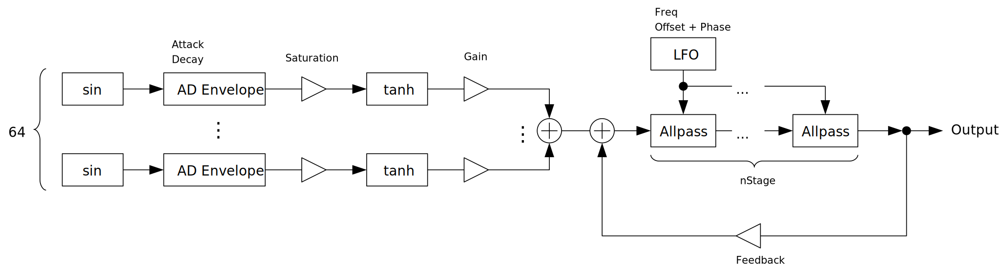

---
lang: ja
...

# EnvelopedSine


<ruby>EnvelopedSine<rt>エンベロープド サイン</rt></ruby> はノート 1 つあたり 64 のサイン波を計算する加算合成シンセサイザです。各サイン波に AD エンベロープとサチュレータがついているので IterativeSinCluster よりもパーカッシブな音が得意です。

- [EnvelopedSine {{ latest_version["EnvelopedSine"] }} をダウンロード - VST® 3 (github.com)]({{ latest_download_url["EnvelopedSine"] }}) 

- [プリセットをダウンロード (github.com)]({{ preset_download_url["EnvelopedSine"] }})


EnvelopedSine を使うには CPU が AVX 以降の SIMD 命令セットをサポートしている必要があります。

パッケージには次のビルドが含まれています。

- Windows 64bit
- Linux 64bit

{{ section["macos_warning"] }}

Linux ビルドは Ubuntu 20.04 でビルドしています。もし Ubuntu 20.04 以外のディストリビューションを使っているときは、プラグインが読み込まれないなどの不具合が起こることがあります。この場合は[ビルド手順](https://github.com/ryukau/VSTPlugins/blob/master/build_instruction.md)に沿ってソースコードからビルドしてください。

{{ section["contact_installation_guiconfig"] }}

## 操作
{{ section["gui_common"] }}

{{ section["gui_knob"] }}

{{ section["gui_barbox"] }}

## ブロック線図
図が小さいときはブラウザのショートカット <kbd>Ctrl</kbd> + <kbd>マウスホイール</kbd> や、右クリックから「画像だけを表示」などで拡大できます。

図で示されているのは大まかな信号の流れです。実装と厳密に対応しているわけではないので注意してください。



## パラメータ
### Overtone
右上にある 4 つの大きなコントロールです。

Attack, Decay

:   各オシレータの音量エンベロープのアタックとディケイです。

Gain

:   各オシレータの音量です。

Saturation

:   各オシレータのサチュレーションの大きさです。

### Gain
Boost, Gain

:   どちらも音量を調整します。出力のピーク値は `Boost * Gain` となります。

### Pitch
Add Aliasing

:   チェックを入れると、ナイキスト周波数より高い周波数が指定されたサイン波もレンダリングします。

    ナイキスト周波数とは、ざっくりいえば録音したデータが再現可能な最高周波数のことです。音を生成するときはナイキスト周波数以上の値を指定することができますが、折り返し（エイリアシング）と呼ばれる現象によって計算結果は予期しない周波数になってしまいます。 `Add Aliasing` は、こうしたエイリアシングノイズを足し合わせるオプションです。

Octave

:   ノートのオクターブです。

Multiply, Modulo

:   サイン波の周波数を変更します。

    計算式は `ノートの周波数 * (1 + fmod(Multiply * pitch, Modulo))` のようになっています。 `pitch` はノートの音程と倍音のインデックスから計算される係数です。 `fmod(a, b)` は `a` を `b` で割った余りを計算する関数です。

Expand

:   倍音コントロールのインデックスを拡大・縮小するスケーリング係数です。

    

Shift

:   倍音コントロールのインデックスを右シフトする量です。

    

### Random
ランダマイズに関するパラメータです。 `Unison` にチェックを入れた状態で使うと効果的です。

Retrigger

:   チェックを入れると、ノートオンごとに乱数列をリセットします。

Seed

:   乱数のシード値です。この値を変えると生成される乱数が変わります。

To Gain, To Attack, To Decay, To Sat.

:   倍音コントロールの値をランダマイズします。ランダマイズの式は `value * random` です。 `random` の値の範囲は `[0.0, 1.0)` です。

To Pitch

:   ピッチをランダマイズします。

To Phase

:   位相をランダマイズします。

### Misc.
Smooth

:   特定の値を変更したときに、変更前の値から変更後の値に移行する時間（秒）です。

    `Smooth` と関連するパラメータのリストです。 `*` はワイルドカードです。

    - `Gain` セクションの全て
    - `Phaser` セクションの `nStages` 以外

    他のパラメータはノートオンのタイミングで指定されていた値を、ノートの発音が終わるまで使い続けます。

nVoices

:   最大同時発音数です。

Unison

:   チェックを入れるとユニゾンを有効にします。

    ユニゾンが有効になると 1 つのノートについて左右のチャンネルに 1 つずつボイスを配置します。 `Random.To Phase` や `Random.To Pitch` と組み合わせることで広がりのある音を作ることができます。

### Modifier
Attack\*, Decay\*

:   倍音コントロールの `Attack` と `Decay` にかけ合わせる値です。まとめて長さを変えたいときに使えます。

Declick

:   チェックを入れると、倍音コントロールの `Attack` あるいは `Decay` の値が 0 のときに生じるプチノイズを低減します。各オシレータのピッチに応じた値を足し合わせます。

Gain^

:   倍音コントロールの `Gain` をべき乗する値です。 1 つのオシレータの最終的なゲインは次の式で計算されます。

    ```
    Gain.Boost * Gain.Gain * pow(Overtone.Gain, Modifier.Gain^)
    ```

Sat. Mix

:   サチュレーションの Dry : Wet の信号比です。右いっぱいにすると Dry : Wet = 0 : 1 になります。

### Phaser
nStages

:   オールパスフィルタの数です。

Mix

:   フェイザの Dry : Wet の信号比です。右いっぱいにすると Dry : Wet = 0 : 1 になります。

Freq

:   LFO の周波数です。

Feedback

:   フィードバックの大きさです。 12 時にするとフィードバックなし、左に回すと負のフィードバック、右に回すと正のフィードバックとなります。

Range

:   LFO によって変更するオールパスフィルタの特性の幅です。

Min

:   LFO によって変調するオールパスフィルタの特性の最小値です。

Offset

:   左右の LFO の位相差です。

Phase

:   LFO の位相です。オートメーションで音を作りたいときに使えます。 `Freq` を左いっぱいに回すことで LFO の周波数を 0 にできます。

## チェンジログ

- {{version}}
  
  - {{ log }}
  


## 旧バージョン

旧バージョンはありません。

  
- [EnvelopedSine {{ x["version"] }} - VST 3 (github.com)]({{ x["url"] }})
  


## ライセンス
EnvelopedSine のライセンスは GPLv3 です。 GPLv3 の詳細と、利用したライブラリのライセンスは次のリンクにまとめています。リンクが切れているときは `ryukau@gmail.com` にメールを送ってください。

- [https://github.com/ryukau/VSTPlugins/tree/master/License](https://github.com/ryukau/VSTPlugins/tree/master/License)

### VST® について
VST is a trademark of Steinberg Media Technologies GmbH, registered in Europe and other countries.
