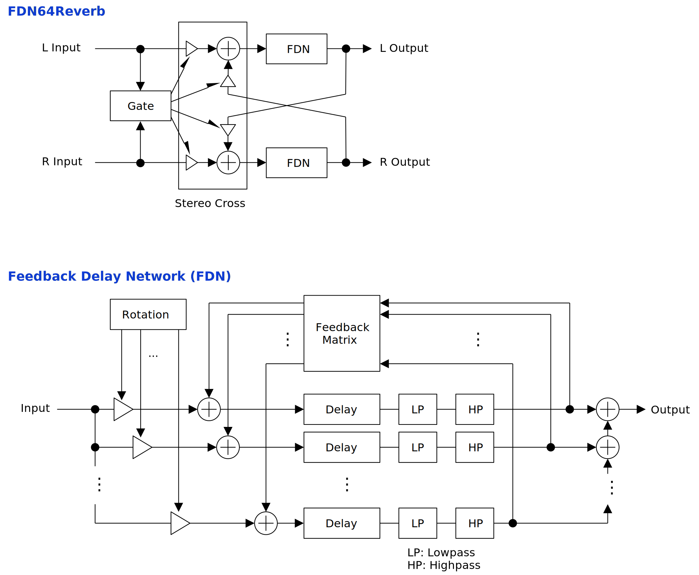

---
lang: en
...

# FDN64Reverb


FDN64Reverb is a reverb equipped with a feedback delay network (FDN). However, the size of feedback matrix is 64.

- [Download FDN64Reverb {{ latest_version["FDN64Reverb"] }} - VST® 3 (github.com)]({{ latest_download_url["FDN64Reverb"] }}) 

- [Download Presets (github.com)]({{ preset_download_url["FDN64Reverb"] }})


The package includes following builds:

- Windows 64bit
- Linux 64bit
- macOS universal binary

Linux build is built on Ubuntu 20.04. If you are using distribution other than Ubuntu 20.04, plugin will not likely to run. In this case, please take a look at [build instruction](https://github.com/ryukau/VSTPlugins/blob/master/build_instruction.md).

{{ section["contact_installation_guiconfig"] }}

## Controls
{{ section["gui_common"] }}

{{ section["gui_knob"] }}

{{ section["gui_barbox"] }}

## Caution
Setting `Feedback` to 1 and `Highpass Cutoff` to 0 might adds massive direct current depending on input signal.

## Block Diagram
If the image is small, use <kbd>Ctrl</kbd> + <kbd>Mouse Wheel</kbd> or "View Image" on right click menu to scale.

Diagram only shows overview. It's not exact implementation.



## Parameters
Delay Time \[s\]

:   Delay times in seconds. Below is the equation to calculate the total of delay time.

    ```
    delayTime = (Time Multi.) * (Delay Time) + (Time LFO Amount) * random().
    ```

    Note that maximum delay time do not exceed 1 second. This means that if both `Delay Time` and `Time LFO Amount` are set to 1, then LFO stop working.

Time LFO Amount \[s\]

:   Amounts of LFO modulation to delay times.

    When `Interp. Rate` exceeds 1.0, LFO modulations start adding noticeable noise. To get smooth output, recommend to set `Interp. Rate` under 0.25.

Lowpass Cutoff \[Hz\]

:   Cutoff frequencies of lowpass filters that are applied to delay outputs.

Highpass Cutoff \[Hz\]

:   Cutoff frequencies of highpass filters that are applied to delay outputs.

    Note that setting `Feedback` to 1 and `Highpass Cutoff` to 0 might adds massive direct current depending on input signal.

### Delay
Time Multi.

:   A multiplier to `Delay Time`. Useful to change all the delay time at once.

Feedback

:   Feedback amount of FDN. In other words, `Feedback` is a scalar that multiplies feedback matrix.

    When `Feedback` is close to 1.0, it lengthen the reverb time. When set to exactly 1.0, the reverb stop to decay. In this case, `Gate` can be used to shut down the reverb.

Interp. Rate

:   Rate limiting value of delay time interpolation. For example, when `Interp. Rate` is set to 0.1, changing delay time from 0 to 1 samples requires 10 samples of interpolation time.

Gate \[dB\]

:   Threshold of gate.

    When input amplitude is less than the value of `Gate` for a while, the gate modulates `Stereo Cross` to make output amplitude to 0.

    Gate is intended to use with rotation. Release time is approximately 5 ms.

Matrix

:   Type of feedback matrix. Note that changing this parameter may cause pop nosie.

    | Abbreviation | Full Name          | Additional Infomation               | Quality |
    | ------------ | ------------------ | ----------------------------------- | ------- |
    | Ortho.       | Orthogonal         |                                     | Good    |
    | S. Ortho.    | Special orthogonal |                                     | Good    |
    | Circ. Ortho. | Circulant          |                                     | OK      |
    | Circ. 4      | Circulant          | 4 non-zero elements per row         | SFX     |
    | Circ. 8      | Circulant          | 8 non-zero elements per row         | SFX     |
    | Circ. 16     | Circulant          | 16 non-zero elements per row        | SFX     |
    | Circ. 32     | Circulant          | 32 non-zero elements per row        | SFX     |
    | Upper Tri. + | Upper triangular   | Range of randomization is `[0, 1]`  | Bad     |
    | Upper Tri. - | Upper triangular   | Range of randomization is `[-1, 0]` | Bad     |
    | Lower Tri. + | Lower triangular   | Range of randomization is `[0, 1]`  | Bad     |
    | Lower Tri. - | Lower triangular   | Range of randomization is `[-1, 0]` | Bad     |
    | Schroeder +  | Schroeder reverb   | Range of randomization is `[0, 1]`  | Bad     |
    | Schroeder -  | Schroeder reverb   | Range of randomization is `[-1, 0]` | Bad     |
    | Absorbent +  | Absorbent allpass  | Range of randomization is `[0, 1]`  | OK      |
    | Absorbent -  | Absorbent allpass  | Range of randomization is `[-1, 0]` | OK      |
    | Hadamard     | Hadamard           | No randomization                    | Good    |
    | Conference   | Conference         | No randomization                    | Good    |

    Quality is rough indication. Bad means it frequently adds metallic tones to output. Good means almost no metallic tone. OK is in between good and bad. SFX means they sound strange as a reverb. Bad matrices can be used to add more effects with rotation.

Seed

:   Seed value for randomization of feedback matrix. Note that changing this parameter may cause pop nosie.

Change Matrix

:   A button to randomize feedback matrix. Pressing `Change Matrix` also changes the value of `Seed`. Note that changing this parameter may cause pop nosie.

### Mix
Dry \[dB\]

:   A gain applied to input signal which bypasses FDN.

Wet \[dB\]

:   FDN output gain.

Stereo Cross

:   Stereo crossing feedback amount between left and right FDNs. Setting `Stereo Cross` to 1.0 stops input to prevent blow up.

### Rotation
Speed \[Hz\]

:   Rotation speed of FDN input gains.

Offset

:   Initial phase of the waveform to rotate input gains.

    `Offset` can be used to change the sound when `Speed` is 0, but `Skew` is greater than 0. Feedback matrix affects the character of output.

Skew

:   Changes the waveform used to rotate input gains. Note that when `Skew` is set to 0, `Speed` and `Offset` stop working.

    Below is a plot of relation between `Skew` and rotation waveform.

    <figure>
    
    </figure>

## Change Log

- {{version}}
  
  - {{ log }}
  


## Old Versions

N/A.

  
- [FDN64Reverb {{ x["version"] }} - VST 3 (github.com)]({{ x["url"] }})
  


## License
FDN64Reverb is licensed under GPLv3. Complete licenses are linked below.

- [https://github.com/ryukau/VSTPlugins/tree/master/License](https://github.com/ryukau/VSTPlugins/tree/master/License)

If the link above doesn't work, please send email to `ryukau@gmail.com`.

### About VST
VST is a trademark of Steinberg Media Technologies GmbH, registered in Europe and other countries.
