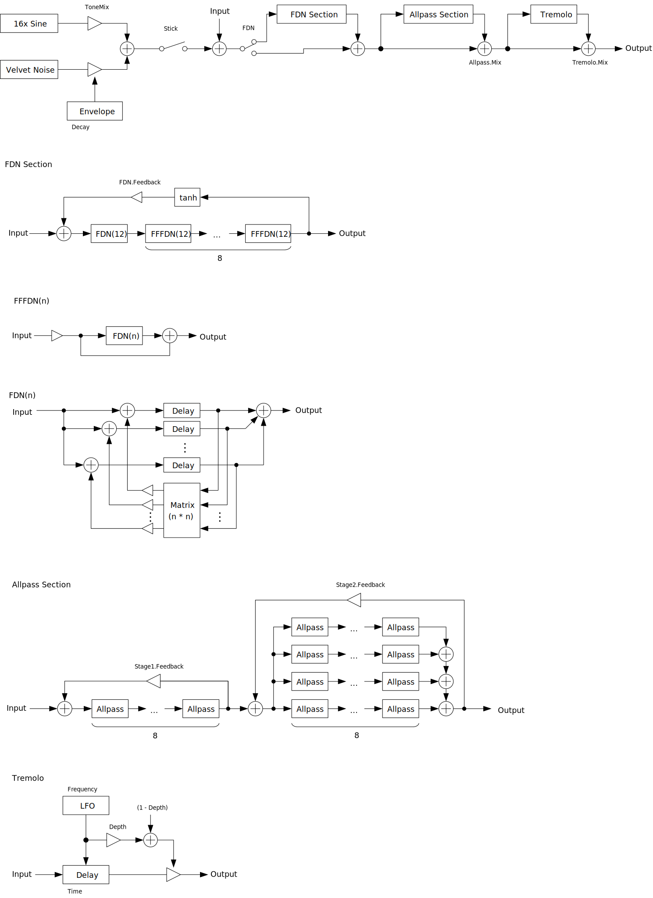

---
lang: en
...

# FDNCymbal


FDNCymbal is a cymbal sound synthesizer. It can also be used as an effect. Unlike the name, most of metallic texture comes from Schroeder allpass section rather than FDN (feedback delay network). FDN section makes nice impact sound when `FDN.Time` is short. Tremolo is added to simulate wobbling of cymbal.

- [Download FDNCymbal 0.2.4 - VST® 3 (github.com)](https://github.com/ryukau/VSTPlugins/releases/download/L3Reverb0.1.0/FDNCymbal0.2.4.zip) 
- [Download Presets (github.com)](https://github.com/ryukau/VSTPlugins/releases/download/BarBoxFocusFix/FDNCymbalPresets.zip)

The package includes following builds:

- Windows 64bit
- Linux 64bit
- macOS 64bit

macOS build isn't tested because I don't have Mac. If you found a bug, please file a issue to [GitHub repository](https://github.com/ryukau/VSTPlugins) or send email to `ryukau@gmail.com`.

Linux build is built on Ubuntu 18.0.4 and tested on Bitwig 3.1.2 and Reaper 6.03. Bitwig 3.1.2 seems to have a bug that occasionally blackouts GUI.

## Installation
### Plugin
Place `*.vst3` directory to:

- `/Program Files/Common Files/VST3/` for Windows.
- `$HOME/.vst3/` for Linux.
- `/Users/$USERNAME/Library/Audio/Plug-ins/VST3/` for macOS.

DAW may provides additional VST3 directory. For more information, please refer to the manual of the DAW.

### Presets
Extract preset zip, then place preset directory to the OS specific path:

- Windows : `/Users/$USERNAME/Documents/VST3 Presets/Uhhyou`
- Linux : `$HOME/.vst3/presets/Uhhyou`
- macOS : `/Users/$USERNAME/Library/Audio/Presets/Uhhyou`

Preset directory name must be the same as the plugin. Make `Uhhyou` directory if it does not exist.

### Windows Specific
If DAW doesn't recognize the plugin, try installing C++ redistributable (`vc_redist.x64.exe`). Installer can be found in the link below.

- [The latest supported Visual C++ downloads](https://support.microsoft.com/en-us/help/2977003/the-latest-supported-visual-c-downloads)

### Linux Specific
On Ubuntu 18.0.4, those packages are required.

```bash
sudo apt install libxcb-cursor0  libxkbcommon-x11-0
```

If DAW doesn't recognize the plugin, take a look at `Package Requirements` section of the link below and make sure all the VST3 related package is installed.

- [VST 3 Interfaces: Setup Linux for building VST 3 Plug-ins](https://steinbergmedia.github.io/vst3_doc/vstinterfaces/linuxSetup.html)

REAPER on Linux may not recognize the plugin. A workaround is to delete a file `~/.config/REAPER/reaper-vstplugins64.ini` and restart REAPER.

## Color Configuration
At first time, create color config file to:

- `/Users/USERNAME/AppData/Roaming/UhhyouPlugins/style/style.json` on Windows.
- `$XDG_CONFIG_HOME/UhhyouPlugins/style/style.json` on Linux.
  - If `$XDG_CONFIG_HOME` is empty, make `$HOME/.config/UhhyouPlugins/style/style.json`.
- `/Users/$USERNAME/Library/Preferences/UhhyouPlugins/style/style.json` on macOS.

Below is a example of `style.json`.

```json
{
  "fontPath": "",
  "foreground": "#ffffff",
  "foregroundButtonOn": "#000000",
  "foregroundInactive": "#8a8a8a",
  "background": "#353d3e",
  "boxBackground": "#000000",
  "border": "#808080",
  "borderCheckbox": "#808080",
  "unfocused": "#b8a65c",
  "highlightMain": "#368a94",
  "highlightAccent": "#2c8a58",
  "highlightButton": "#a77842",
  "highlightWarning": "#8742a7",
  "overlay": "#ffffff88",
  "overlayHighlight": "#00ff0033"
}
```

Hex color codes are used.

- 6 digit color is RGB.
- 8 digit color is RGBA.

First letter `#` is conventional. Plugins ignore the first letter of color code, thus `?102938`, `\n11335577` are valid.

Do not use characters outside of `0-9a-f` for color value.

- `fontPath`: Absolute path to *.ttf font file. Not implemented in VST 3 version.
- `foreground`: Text color.
- `foregroundButtonOn`: Text color of active toggle button. Recommend to use the same value of `foreground` or `boxBackground`.
- `foregroundInactive`: Text color of inactive components. Currently, only used for TabView.
- `background`: Background color.
- `boxBackground`: Background color of inside of box shaped components (Barbox, Button, Checkbox, OptionMenu, TextKnob, VSlider).
- `border`: Border color of box shaped components.
- `borderCheckbox`: Border color of CheckBox.
- `unfocused`: Color to fill unfocused components. Currently, only used for knobs.
- `highlightMain`: Color to indicate focus is on a component. Highlight colors are also used for value of slider components (BarBox and VSlider).
- `highlightAccent`: Same as `highlightMain`. Used for cosmetics.
- `highlightButton`: Color to indicate focus is on a button.
- `highlightWarning`: Same as `highlightMain`, but only used for parameters which requires extra caution.
- `overlay`: Overlay color. Used to overlay texts and indicators.
- `overlayHighlight`: Overlay color to highlight current focus.

## Controls
Knob and slider can do:

- Ctrl + Left Click: Reset value.
- Shift + Left Drag: Fine adjustment.

## Caution
There's no compatibility between version 0.1.x and 0.2.x.

When `FDN.Feedback` is non zero, it may possibly blow up. If that happens, turn `FDN.Feedback` to leftmost.

When `HP Cutoff` is moving fast, it may output massive DC. To avoid this, use Shift + Mouse Left Drag or turn up Smooth.

## Use as Effect
FDNCymbal can be use as effect, but it's not intuitive.

When loaded, FDNCymbal is muted to prevent unexpected blow up at initialization. Therefore user must send MIDI note-on to FDNCymbal. Note that output volume could be changed by velocity. `Seed` and parameters under `FDN` section are only refreshed when FDNCymbal receives a new note.

## Block Diagram
If the image is small, use <kbd>Ctrl</kbd> + <kbd>Mouse Wheel</kbd> or "View Image" on right click menu to scale.

Diagram only shows overview. It's not exact implementation.



## Parameters
### Gain
Output gain.

### Smooth
Time in seconds to move the value of parameters from previous one to changed one. Below is a list of parameter that is affected by `Smooth`.

- `Gain`
- `FDN.Time`
- `FDN.Feedback`
- `FDN.CascadeMix`
- `Allpass.Mix`
- `Allpass.Stage1.Time`
- `Allpass.Stage1.Feedback`
- `Allpass.Stage2.Time`
- `Allpass.Stage2.Feedback`
- `Tremolo.Mix`
- `Tremolo.Depth`
- `Tremolo.Frequency`
- `Tremolo.DelayTime`

### Stick
When `Stick` is on, each note on triggers stick oscillator. Noise density and pitch of tone are related to the pitch of note.

Pulse

:   Gain of impulse of stick oscillator.

Tone

:   Gain of sine wave tone of stick oscillator.

Velvet

:   Gain of velvet noise of stick oscillator.

    Velvet noise is a noise algorithm which output different height of impulses with randomized interval.

Decay

:   Decay time of stick oscillator.

### Random
Seed

:   Value of random seed.

Retrigger.Time

:   When not checked, internal delay time controlled by following 3 parameters will be changed for each note on.

    - `FDN.Time`
    - `Allpass.Stage1.Time`
    - `Allpass.Stage2.Time`

Retrigger.Stick

:   When not checked, stick oscillator output varies for each note.

Retrigger.Tremolo

:   When not checked, tremolo parameters will be changed for each note on.

### FDN
When turned on, the signal go through FDN section.

Time

:   FDN delay time. Internal delay time will be randomized with respect to this value.

Feedback

:   FDN section feedback. Beware that if this value is non zero, it's possible to blow up.

CascadeMix

:   Controls mixing of Cascaded FDN.

### Allpass
Mix

:   Mixing ratio of Schroeder allpass section.

### Stage 1 and Stage 2
Stage 1 is serially connected 8 Schroeder allpass. On stage 2, there are 4 Schroeder allpass section connected in parallel. For each section has serially connected 8 Schroeder allpass.

Time

:   Max delay time of Schroeder allpass section. Internally, delay time will be randomized.

Feedback

:   Feedback of Schroeder allpass section.

HP Cutoff

:   Cutoff frequency of high-pass filter to the output of Schroeder allpass section.

Tanh

:   When checked, stage 1 feedback go through tanh saturator.

### Tremolo
Mix

:   Mixing ratio of tremolo effect.

Depth

:   Maximum change of amplitude with tremolo.

Frequency

:   Tremolo LFO frequency.

DelayTime

:   Maximum delay time. Delay time is modulated by LFO. This delay simulates doppler effect.

### Random (Tremolo)
Depth

:   Amount of randomization to `Tremolo.Depth` for each note on.

Freq

:   Amount of randomization to `Tremolo.Frequency` for each note on.

Time

:   Amount of randomization to `Tremolo.DelayTime` for each note on.

## Change Log
- 0.2.4
  - Added check that DSP is initialized or not.
- 0.2.3
  - Added color configuration.
- 0.2.2
  - Reverted parameter smoother to the old one which works with variable size audio buffer.
- 0.2.1
  - Fixed a bug that cause crash when drawing string.
- 0.2.0
  - Changed display method for pop-up which shows up by clicking plugin title.
  - Added `Pulse` parameter to control pulse gain.
  - Added `Velvet` parameter to control velvet noise gain.
  - Changed `ToneMix` to `Tone`. Value range is increased from [0, 0.002] to [0, 0.02].
  - Changed algorithm to allocate sine frequency.
  - Fixed velvet noise oscillator to randomize interval.
- 0.1.5
  - Fixed to stop sounds when deactivated.
  - Fixed a bug that was causing noise on PreSonus Studio One 4.6.1.
- 0.1.4
  - Enabled GUI for Linux build.
- 0.1.3
  - Fixed a bug that sound stops on Steinberg host.
- 0.1.2
  - Added support for synchronization between multiple GUI instances.
  - Fixed a bug that opening splash screen causes crash.
  - Fixed a bug that crash plugin when reloading.
  - Fixed GUI to follow host automation.
- 0.1.1
  - Fixed note on/off event to be triggered at exact timing.
  - Fixed a bug that `Allpass.Stage1.Feedback` was disabled.
- 0.1.0
  - Initial release.

### Old Versions
- [FDNCymbal 0.2.3 - VST 3 (github.com)](https://github.com/ryukau/VSTPlugins/releases/download/ColorConfig/FDNCymbal0.2.3.zip)
- [FDNCymbal 0.2.2 - VST 3 (github.com)](https://github.com/ryukau/VSTPlugins/releases/download/LatticeReverb0.1.0/FDNCymbal0.2.2.zip)
- [FDNCymbal 0.2.1 - VST 3 (github.com)](https://github.com/ryukau/VSTPlugins/releases/download/DrawStringFix/FDNCymbal0.2.1.zip)
- [FDNCymbal 0.1.5 - VST 3 (github.com)](https://github.com/ryukau/VSTPlugins/releases/download/EsPhaser0.1.0/FDNCymbal0.1.5.zip)
- [FDNCymbal 0.1.4 - VST 3 (github.com)](https://github.com/ryukau/VSTPlugins/releases/download/LinuxGUIFix/FDNCymbal0.1.4.zip)
- [FDNCymbal 0.1.3 - VST 3 (github.com)](https://github.com/ryukau/VSTPlugins/releases/download/EnvelopedSine0.1.0/FDNCymbal0.1.3.zip)
- [FDNCymbal 0.1.2 - VST 3 (github.com)](https://github.com/ryukau/VSTPlugins/releases/download/IterativeSinCluster0.1.0/FDNCymbal0.1.2.zip)

Presets for old versions.

- [Presets for version 0.1.* (github.com)](https://github.com/ryukau/VSTPlugins/releases/download/EnvelopedSine0.1.0/FDNCymbalPresets.zip)

## License
FDNCymbal is licensed under GPLv3. Complete licenses are linked below.

- [https://github.com/ryukau/VSTPlugins/tree/master/License](https://github.com/ryukau/VSTPlugins/tree/master/License)

If the link above doesn't work, please send email to `ryukau@gmail.com`.

### About VST
VST is a trademark of Steinberg Media Technologies GmbH, registered in Europe and other countries.
