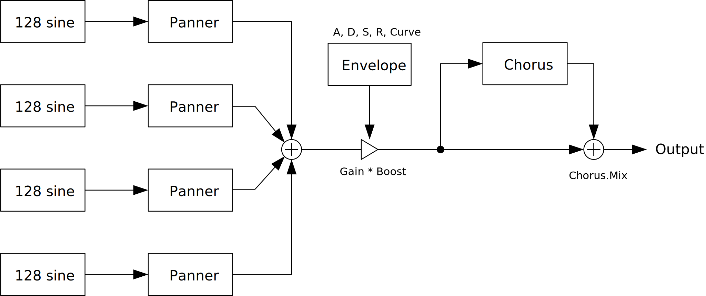

---
lang: en
...

# IterativeSinCluster


IterativeSinCluster is an additive synthesizer. This synth computes 512 sine waves for each note to make tone cluster. I somehow thought "iterative sin" is a valid term. Correct term is "recursive sine".

- [Download IterativeSinCluster {{ latest_version["IterativeSinCluster"] }} - VST® 3 (github.com)]({{ latest_download_url["IterativeSinCluster"] }}) 

- [Download Presets (github.com)]({{ preset_download_url["IterativeSinCluster"] }})


IterativeSinCluster requires CPU which supports AVX or later SIMD instructions.

The package includes following builds:

- Windows 64bit
- Linux 64bit

{{ section["macos_warning"] }}

Linux build is built on Ubuntu 20.04. If you are using distribution other than Ubuntu 20.04, plugin will not likely to run. In this case, please take a look at [build instruction](https://github.com/ryukau/VSTPlugins/blob/master/build_instruction.md).

{{ section["contact_installation_guiconfig"] }}

## Controls
{{ section["gui_common"] }}

{{ section["gui_knob"] }}

{{ section["gui_barbox"] }}

## Block Diagram
If the image is small, use <kbd>Ctrl</kbd> + <kbd>Mouse Wheel</kbd> or "View Image" on right click menu to scale.

Diagram only shows overview. It's not exact implementation.



## Parameters
### Gain
Boost, Gain

:   Both controls output gain. Peak value of output will be `Boost * Gain`.

    It's possible that output gain becomes too small while changing gain of `Note`, `Chord`, `Overtone`. `Boost` can be useful in this situation.

ADSR

:   Parameters for gain envelope.

    - `A` : Attack time which is the length from note-on to reaching peak value.
    - `D` : Decay time which is the length from peak value to reaching sustain level.
    - `S` : Sustain level which is the gain after decay.
    - `R` : Release time which is the length from note-off to the gain reaching to 0.

Curve

:   Change attack curve of gain envelope.

### Shelving
Cutoff freqeuncy can be changed by `Semi`, which is relative to a note frequency. For example, if the note is C4 and `Semi` is 12.000, cutoff frequency is set to `C4 + 12 semitone = C5`.

- `Low` shelving changes `Gain` of sine waves **less than or equal to** the cutoff frequency specified by `Semi`.
- `High` shelving changes `Gain` of sine waves **greater than or equal to** the cutoff frequency specified by `Semi`.

### Pitch
Add Aliasing

:   When checked, the synth enables rendering of sine waves over nyquist frequency.

    Roughly speaking, nyquist frequency is the highest frequency that can be reconstructed from recorded digital signal. When generating sound, it's possible to set value that is higher than nyquist frequency. However, the result may contain unexpected frequency due to a phenomenon called aliasing. `Add Aliasing` is option to add those aliasing noise.

Reverse Semi

:   When checked, negate sign of `Semi`. For example, 7.000 becomes -7.000.

Octave

:   Note octave.

ET

:   `ET` stands for equal temperament. This parameter can be used to change tuning of `Semi` and `Milli`.

    Note that this parameter is not to change tuning of notes sent from plugin host. Only affect to internal parameters.

Multiply, Modulo

:   Change sine wave frequency.

    Equation is `noteFrequency * (1 + fmod(Multiply * pitch, Modulo))`. `pitch` is calculated from `Note`, `Chord` and `Overtone`. `fmod(a, b)` is a function that returns reminder of `a / b`.

### Smooth
Time length to change some parameter value to current one. Unit is in second.

List of parameters related to `Smooth`. `*` represents wild card.

- All parameters in `Gain` section.
- `Chord.Pan`
- All parameters in `Chorus` section, except `Key Follow`.

Other parameter uses the value obtained from the timing of note-on for entire duration of a note.

### nVoice
Maximum polyphony. Lowering the number of this option reduces CPU load.

### Random
Retrigger

:   When checked, reset random seed for each note-on.

Seed

:   Random seed. This value change random number sequence.

To Gain

:   Amount of randomization to sine wave gain. Randomization is done for each note-on.

To Pitch

:   Amount of randomization to sine wave pitch. Randomization is done for each note-on.

### Note, Chord, Overtone
Change sine wave gain and pitch.

1 `Note` have 16 `Overtone`. 1 `Chord` consists of 8 `Note`. 4 `Chord` are available to use.

Common parameters for `Note` and `Chord`.

- `Gain` : Sine wave gain.
- `Semi` :  Distance from note frequency. Unit is semitone.
- `Milli` : Distance from note frequency. Unit is 1 / 1000 semitone, or 1 / 10 cent.

Leftmost of `Overtone` is gain of fundamental frequency (1st overtone) of a note. For each bar from left represents 1st, 2nd, 3rd, ... , 16th overtone gain.

Below is the summary of calculation of sine wave frequency.

```
function toneToPitch(semi, milli):
  return 2 ^ (1000 * semi + milli) / (ET * 1000)

for each Chord:
  chordPitch = toneToPitch(Chord.semi, Chord.milli)
  for each Note:
    notePitch = toneToPitch(Note.semi, Note.milli)
    for each Overtone:
      frequency = midiNoteFrequency
        * (1 + mod(Multiply * Overtone * notePitch * chordPitch, Modulo))
```

### Chorus
Mix

:   Change Dry/Wet mix ratio.

Freq

:   Chorus LFO frequency.

Depth

:   Change stereo spread.

Range

:   Amount of modulation from LFO to delay time. There are three delays in this chorus.

Time

:   Delay time.

Phase

:   LFO phase.

Offset

:   Phase difference between delays.

Feedback

:   Feedback of delay.

Key Follow

:   When checked, change delay time relative to note frequency.

## Change Log

- {{version}}
  
  - {{ log }}
  


## Old Versions

N/A.

  
- [IterativeSinCluster {{ x["version"] }} - VST 3 (github.com)]({{ x["url"] }})
  


## License
IterativeSinCluster is licensed under GPLv3. Complete licenses are linked below.

- [https://github.com/ryukau/VSTPlugins/tree/master/License](https://github.com/ryukau/VSTPlugins/tree/master/License)

If the link above doesn't work, please send email to `ryukau@gmail.com`.

### About VST
VST is a trademark of Steinberg Media Technologies GmbH, registered in Europe and other countries.
