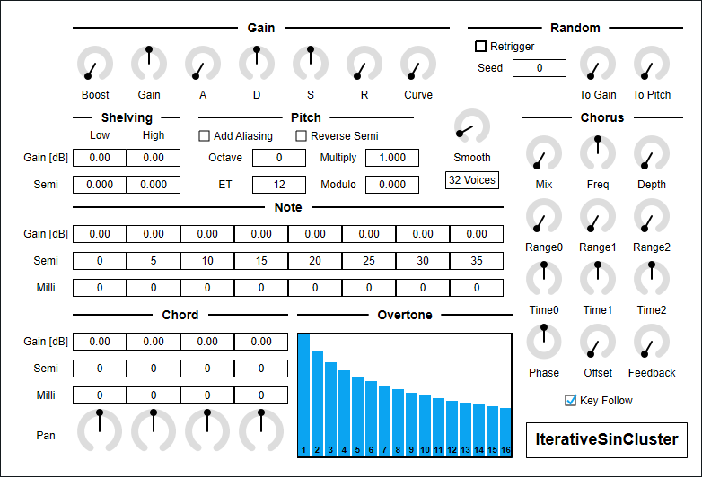

---
lang: en
...

# IterativeSinCluster


IterativeSinCluster is an additive synthesizer. This synth computes 512 sine waves for each note to make tone cluster. I somehow thought "iterative sin" is a valid term. Correct term is "recursive sine".

- [Download IterativeSinCluster 0.1.13 - VST® 3 (github.com)](https://github.com/ryukau/VSTPlugins/releases/download/BasicLimiterAndFDN64Reverb/IterativeSinCluster_0.1.13.zip) 
- [Download Presets (github.com)](https://github.com/ryukau/VSTPlugins/releases/download/EnvelopedSine0.1.0/IterativeSinClusterPresets.zip)

IterativeSinCluster requires CPU which supports AVX or later SIMD instructions.

The package includes following builds:

- Windows 64bit
- Linux 64bit

On 2022-05-15, macOS is not supported. Current code fails to build as macOS universal binary. I'm planning to support macOS in future. However due to my financial situation, I can't purchase M1 mac for now.

Linux build is built on Ubuntu 20.04. If you are using distribution other than Ubuntu 20.04, plugin will not likely run. In this case, please take a look at [build instruction](https://github.com/ryukau/VSTPlugins/blob/master/build_instruction.md).

## Contact
Feel free to contact me on [GitHub repository](https://github.com/ryukau/VSTPlugins/commits/master) or `ryukau@gmail.com.`

## Installation
### Plugin
Place `*.vst3` directory to:

- `/Program Files/Common Files/VST3/` for Windows.
- `$HOME/.vst3/` for Linux.
- `/Users/$USERNAME/Library/Audio/Plug-ins/VST3/` for macOS.

DAW may provides additional VST3 directory. For more information, please refer to the manual of the DAW.

### Presets
Extract preset zip, then place preset directory to the OS specific path:

- Windows : `/Users/$USERNAME/Documents/VST3 Presets/Uhhyou`
- Linux : `$HOME/.vst3/presets/Uhhyou`
- macOS : `/Users/$USERNAME/Library/Audio/Presets/Uhhyou`

Preset directory name must be the same as the plugin. Make `Uhhyou` directory if it does not exist.

### Windows Specific
If DAW doesn't recognize the plugin, try installing C++ redistributable (`vc_redist.x64.exe`). Installer can be found in the link below.

- [The latest supported Visual C++ downloads](https://support.microsoft.com/en-us/help/2977003/the-latest-supported-visual-c-downloads)

### Linux Specific
On Ubuntu 18.0.4, those packages are required.

```bash
sudo apt install libxcb-cursor0  libxkbcommon-x11-0
```

If DAW doesn't recognize the plugin, take a look at `Package Requirements` section of the link below and make sure all the VST3 related package is installed.

- [VSTGUI: Setup](https://steinbergmedia.github.io/vst3_doc/vstgui/html/page_setup.html)

REAPER on Linux may not recognize the plugin. A workaround is to delete a file `~/.config/REAPER/reaper-vstplugins64.ini` and restart REAPER.

### macOS Specific
**Important**: Current package do not contain mac OS build.

When trying to run plugin first time, following message may appear on macOS.

```
<PluginName>.vst3 is damaged and can't be opened. You should move it to
the Trash"
```

In this case, open terminal and try running following command to unzipped `.vst3` directory.

```sh
xattr -rc /path/to/PluginName.vst3
```

Plugin may be considered as unsigned/un-notarized application. In this case, try following the steps below.

1. Open terminal and run `sudo spctl --master-disable`.
2. Go to System Preferences → Security and Privacy → General → Allow apps downloaded from, then select "Anywhere".

Beware that steps above degrades security of your system. To revert the settings, follow the steps below.

1. Go to System Preferences → Security and Privacy → General → Allow apps downloaded from, then select option to "App Store and identified developers".
2. Open terminal and run `sudo spctl --master-enable`.

#### Reference
- [How to Fix App “is damaged and can’t be opened. You should move it to the Trash” Error on Mac](https://osxdaily.com/2019/02/13/fix-app-damaged-cant-be-opened-trash-error-mac/)
- [Allowing unsigned/un-notarized applications/plugins in Mac OS | Venn Audio](https://www.vennaudio.com/allowing-unsigned-un-notarized-applications-plugins-in-mac-os/)
- [Safely open apps on your Mac - Apple Support](https://support.apple.com/en-us/HT202491)

## Color Configuration
At first time, create color config file to:

- `/Users/USERNAME/AppData/Roaming/UhhyouPlugins/style/style.json` on Windows.
- `$XDG_CONFIG_HOME/UhhyouPlugins/style/style.json` on Linux.
  - If `$XDG_CONFIG_HOME` is empty, make `$HOME/.config/UhhyouPlugins/style/style.json`.
- `/Users/$USERNAME/Library/Preferences/UhhyouPlugins/style/style.json` on macOS.

Below is a example of `style.json`.

```json
{
  "fontPath": "",
  "foreground": "#000000",
  "foregroundButtonOn": "#000000",
  "foregroundInactive": "#8a8a8a",
  "background": "#ffffff",
  "boxBackground": "#ffffff",
  "border": "#000000",
  "borderCheckbox": "#000000",
  "borderLabel": "#000000",
  "unfocused": "#dddddd",
  "highlightMain": "#0ba4f1",
  "highlightAccent": "#13c136",
  "highlightButton": "#fcc04f",
  "highlightWarning": "#fc8080",
  "overlay": "#00000088",
  "overlayHighlight": "#00ff0033"
}
```

Hex color codes are used.

- 6 digit color is RGB.
- 8 digit color is RGBA.

First letter `#` is conventional. Plugins ignore the first letter of color code, thus `?102938`, `\n11335577` are valid.

Do not use characters outside of `0-9a-f` for color value.

- `fontPath`: Absolute path to *.ttf font file. Not implemented in VST 3 version.
- `foreground`: Text color.
- `foregroundButtonOn`: Text color of active toggle button. Recommend to use the same value of `foreground` or `boxBackground`.
- `foregroundInactive`: Text color of inactive components. Currently, only used for TabView.
- `background`: Background color.
- `boxBackground`: Background color of inside of box shaped components (Barbox, Button, Checkbox, OptionMenu, TextKnob, VSlider).
- `border`: Border color of box shaped components.
- `borderCheckbox`: Border color of CheckBox.
- `borderLabel`: Line color of parameter section label.
- `unfocused`: Color to fill unfocused components. Currently, only used for knobs.
- `highlightMain`: Color to indicate focus is on a component. Highlight colors are also used for value of slider components (BarBox and VSlider).
- `highlightAccent`: Same as `highlightMain`. Used for cosmetics.
- `highlightButton`: Color to indicate focus is on a button.
- `highlightWarning`: Same as `highlightMain`, but only used for parameters which requires extra caution.
- `overlay`: Overlay color. Used to overlay texts and indicators.
- `overlayHighlight`: Overlay color to highlight current focus.

## Controls
Knob and slider can do:

- <kbd>Ctrl</kbd> + <kbd>Left Click</kbd>: Reset value.
- <kbd>Shift</kbd> + <kbd>Left Drag</kbd>: Fine adjustment.

Additionally, number sliders use in `Gain`, `Semi` etc. can do:

- <kbd>Wheel Click</kbd>: Toggle Min/Max.

`Overtone` has following controls:

- <kbd>Ctrl</kbd> + <kbd>Left Drag</kbd>: Reset to Default
- <kbd>Mouse Wheel Drag</kbd>: Draw Line

## Block Diagram
If the image is small, use <kbd>Ctrl</kbd> + <kbd>Mouse Wheel</kbd> or "View Image" on right click menu to scale.

Diagram only shows overview. It's not exact implementation.


## Parameters
### Gain
Boost, Gain

:   Both controls output gain. Peak value of output will be `Boost * Gain`.

    It's possible that output gain becomes too small while changing gain of `Note`, `Chord`, `Overtone`. `Boost` can be useful in this situation.

ADSR

:   Parameters for gain envelope.

    - `A` : Attack time which is the length from note-on to reaching peak value.
    - `D` : Decay time which is the length from peak value to reaching sustain level.
    - `S` : Sustain level which is the gain after decay.
    - `R` : Release time which is the length from note-off to the gain reaching to 0.

Curve

:   Change attack curve of gain envelope.

### Shelving
Cutoff freqeuncy can be changed by `Semi`, which is relative to a note frequency. For example, if the note is C4 and `Semi` is 12.000, cutoff frequency is set to `C4 + 12 semitone = C5`.

- `Low` shelving changes `Gain` of sine waves **less than or equal to** the cutoff frequency specified by `Semi`.
- `High` shelving changes `Gain` of sine waves **greater than or equal to** the cutoff frequency specified by `Semi`.

### Pitch
Add Aliasing

:   When checked, the synth enables rendering of sine waves over nyquist frequency.

    Roughly speaking, nyquist frequency is the highest frequency that can be reconstructed from recorded digital signal. When generating sound, it's possible to set value that is higher than nyquist frequency. However, the result may contain unexpected frequency due to a phenomenon called aliasing. `Add Aliasing` is option to add those aliasing noise.

Reverse Semi

:   When checked, negate sign of `Semi`. For example, 7.000 becomes -7.000.

Octave

:   Note octave.

ET

:   `ET` stands for equal temperament. This parameter can be used to change tuning of `Semi` and `Milli`.

    Note that this parameter is not to change tuning of notes sent from plugin host. Only affect to internal parameters.

Multiply, Modulo

:   Change sine wave frequency.

    Equation is `noteFrequency * (1 + fmod(Multiply * pitch, Modulo))`. `pitch` is calculated from `Note`, `Chord` and `Overtone`. `fmod(a, b)` is a function that returns reminder of `a / b`.

### Smooth
Time length to change some parameter value to current one. Unit is in second.

List of parameters related to `Smooth`. `*` represents wild card.

- All parameters in `Gain` section.
- `Chord.Pan`
- All parameters in `Chorus` section, except `Key Follow`.

Other parameter uses the value obtained from the timing of note-on for entire duration of a note.

### nVoice
Maximum polyphony. Lowering the number of this option reduces CPU load.

### Random
Retrigger

:   When checked, reset random seed for each note-on.

Seed

:   Random seed. This value change random number sequence.

To Gain

:   Amount of randomization to sine wave gain. Randomization is done for each note-on.

To Pitch

:   Amount of randomization to sine wave pitch. Randomization is done for each note-on.

### Note, Chord, Overtone
Change sine wave gain and pitch.

1 `Note` have 16 `Overtone`. 1 `Chord` consists of 8 `Note`. 4 `Chord` are available to use.

Common parameters for `Note` and `Chord`.

- `Gain` : Sine wave gain.
- `Semi` :  Distance from note frequency. Unit is semitone.
- `Milli` : Distance from note frequency. Unit is 1 / 1000 semitone, or 1 / 10 cent.

Leftmost of `Overtone` is gain of fundamental frequency (1st overtone) of a note. For each bar from left represents 1st, 2nd, 3rd, ... , 16th overtone gain.

Below is the summary of calculation of sine wave frequency.

```
function toneToPitch(semi, milli):
  return 2 ^ (1000 * semi + milli) / (ET * 1000)

for each Chord:
  chordPitch = toneToPitch(Chord.semi, Chord.milli)
  for each Note:
    notePitch = toneToPitch(Note.semi, Note.milli)
    for each Overtone:
      frequency = midiNoteFrequency
        * (1 + mod(Multiply * Overtone * notePitch * chordPitch, Modulo))
```

### Chorus
Mix

:   Change Dry/Wet mix ratio.

Freq

:   Chorus LFO frequency.

Depth

:   Change stereo spread.

Range

:   Amount of modulation from LFO to delay time. There are three delays in this chorus.

Time

:   Delay time.

Phase

:   LFO phase.

Offset

:   Phase difference between delays.

Feedback

:   Feedback of delay.

Key Follow

:   When checked, change delay time relative to note frequency.

## Change Log
- 0.1.13
  - Changed font to Tinos.
- 0.1.12
  - Fixed to reset properly.
  - Fixed `bypass` parameter behavior. This fixes playing all the notes at the moment of unmute, even if host sends note to plugin while muting. This bug was only happening on the hosts which respect VST 3 `bypass` parameter.
- 0.1.11
  - Implemented process context requirements.
- 0.1.10
  - Added check that DSP is initialized or not.
- 0.1.9
  - Added undo/redo to BarBox.
- 0.1.8
  - Added color configuration.
- 0.1.7
  - Reverted parameter smoother to the old one which works with variable size audio buffer.
  - Enabled pitch bend.
- 0.1.6
  - Changed BarBox shortcuts to be disabled when mouse cursor is on the outside of BarBox.
- 0.1.5
  - Fixed a bug that cause crash when drawing string.
- 0.1.4
  - Changed display method for pop-up which shows up by clicking plugin title.
- 0.1.3
  - Fixed a bug that was causing noise on PreSonus Studio One 4.6.1.
- 0.1.2
  - Enabled GUI for Linux build.
- 0.1.1
  - Fixed macOS build.
  - Added code paths for AVX and AVX512 instructions.
  - Fixed wobbling knob bug.
- 0.1.0
  - Initial release.

### Old Versions
- [IterativeSinCluster 0.1.12 - VST 3 (github.com)](https://github.com/ryukau/VSTPlugins/releases/download/ResetAndMuteFix/IterativeSinCluster_0.1.12.zip)
- [IterativeSinCluster 0.1.11 - VST 3 (github.com)](https://github.com/ryukau/VSTPlugins/releases/download/CollidingCombSynth0.1.0/IterativeSinCluster0.1.11.zip)
- [IterativeSinCluster 0.1.10 - VST 3 (github.com)](https://github.com/ryukau/VSTPlugins/releases/download/L3Reverb0.1.0/IterativeSinCluster0.1.10.zip)
- [IterativeSinCluster 0.1.9 - VST 3 (github.com)](https://github.com/ryukau/VSTPlugins/releases/download/L4Reverb0.1.0/IterativeSinCluster0.1.9.zip)
- [IterativeSinCluster 0.1.8 - VST 3 (github.com)](https://github.com/ryukau/VSTPlugins/releases/download/ColorConfig/IterativeSinCluster0.1.8.zip)
- [IterativeSinCluster 0.1.7 - VST 3 (github.com)](https://github.com/ryukau/VSTPlugins/releases/download/LatticeReverb0.1.0/IterativeSinCluster0.1.7.zip)
- [IterativeSinCluster 0.1.6 - VST 3 (github.com)](https://github.com/ryukau/VSTPlugins/releases/download/BarBoxFocusFix/IterativeSinCluster0.1.6.zip)
- [IterativeSinCluster 0.1.5 - VST 3 (github.com)](https://github.com/ryukau/VSTPlugins/releases/download/DrawStringFix/IterativeSinCluster0.1.5.zip)
- [IterativeSinCluster 0.1.3 - VST 3 (github.com)](https://github.com/ryukau/VSTPlugins/releases/download/EsPhaser0.1.0/IterativeSinCluster0.1.3.zip
- [IterativeSinCluster 0.1.2 - VST 3 (github.com)](https://github.com/ryukau/VSTPlugins/releases/download/LinuxGUIFix/IterativeSinCluster0.1.2.zip)
- [IterativeSinCluster 0.1.1 - VST 3 (github.com)](https://github.com/ryukau/VSTPlugins/releases/download/EnvelopedSine0.1.0/IterativeSinCluster0.1.1.zip)
- [IterativeSinCluster 0.1.0 - VST 3 (github.com)](https://github.com/ryukau/VSTPlugins/releases/download/IterativeSinCluster0.1.0/IterativeSinCluster0.1.0.zip)

## License
IterativeSinCluster is licensed under GPLv3. Complete licenses are linked below.

- [https://github.com/ryukau/VSTPlugins/tree/master/License](https://github.com/ryukau/VSTPlugins/tree/master/License)

If the link above doesn't work, please send email to `ryukau@gmail.com`.

### About VST
VST is a trademark of Steinberg Media Technologies GmbH, registered in Europe and other countries.
