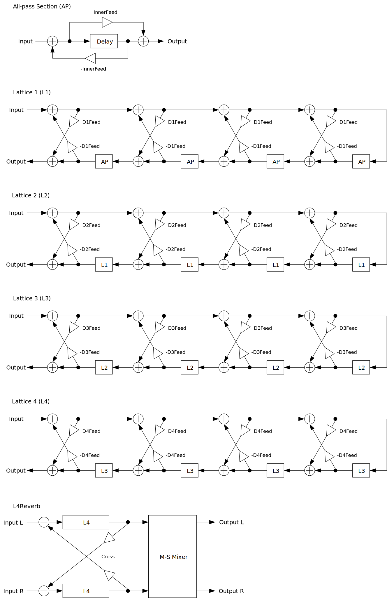

---
lang: ja
...

# L4Reverb


<ruby>L4Reverb<rt>エル フォー リバーブ</rt></ruby> は LatticeReverb の拡張版です。今回の格子構造はチャンネル毎に 4 * 4 * 4 * 4 = 256 のセクションが設けてあります。

- [L4Reverb 0.1.5 をダウンロード - VST® 3 (github.com)](https://github.com/ryukau/VSTPlugins/releases/download/BasicLimiterAndFDN64Reverb/L4Reverb_0.1.5.zip) 
- [プリセットをダウンロード (github.com)](https://github.com/ryukau/VSTPlugins/releases/download/L4Reverb0.1.0/L4ReverbPresets.zip)

もし L4Reverb が重たすぎるときは L3Reverb を試してみてください。 <ruby>L3Reverb<rt>エル スリー リバーブ</rt></ruby> は L4Reverb の軽量版です。格子構造はチャンネル毎に 3 * 3 * 3 * 5 = 135 のセクションが設けてあります。

- [L3Reverb 0.1.5 をダウンロード - VST® 3 (github.com)](https://github.com/ryukau/VSTPlugins/releases/download/BasicLimiterAndFDN64Reverb/L3Reverb_0.1.5.zip) 
- [プリセットをダウンロード (github.com)](https://github.com/ryukau/VSTPlugins/releases/download/L3Reverb0.1.0/L3ReverbPresets.zip)

L4Reverb と L3Reverb の利用には AVX 以降の SIMD 命令セットをサポートする CPU が必要です。

パッケージには次のビルドが含まれています。

- Windows 64bit
- Linux 64bit

2022-05-14 の時点ではユニバーサルバイナリのビルドに失敗するので、 macOS ビルドはパッケージに含まれていません。将来的に対応したいですが、お財布の問題で M1 mac 入手のめどが立たないので時期は未定です。

Linux ビルドは Ubuntu 20.04 でビルドしています。もし Ubuntu 20.04 以外のディストリビューションを使っているときは、プラグインが読み込まれないなどの不具合が起こることがあります。この場合は[ビルド手順](https://github.com/ryukau/VSTPlugins/blob/master/build_instruction.md)に沿ってソースコードからビルドしてください。

## 連絡先
何かあれば [GitHub のリポジトリ](https://github.com/ryukau/VSTPlugins)に issue を作るか `ryukau@gmail.com` までお気軽にどうぞ。

[paypal.me/ryukau](paypal.me/ryukau) から開発資金を投げ銭することもできます。現在の目標は macOS と ARM ポートのための M1 mac の購入資金を作ることです。 🤑💸💻

## インストール
### プラグイン
名前が `.vst3` で終わるディレクトリを OS ごとに決められた位置に配置してください。

- Windows では `/Program Files/Common Files/VST3/` に配置します。
- Linux では `$HOME/.vst3/` に配置します。
- macOS では `/Users/$USERNAME/Library/Audio/Plug-ins/VST3/` に配置します。

DAW によっては上記とは別に VST3 をインストールできるディレクトリを提供していることがあります。詳しくは利用している DAW のマニュアルを参照してください。

### プリセット
解凍して出てきたディレクトリを OS ごとに決められた位置に配置すると使えるようになります。

- Windows : `/Users/$USERNAME/Documents/VST3 Presets/Uhhyou`
- Linux : `$HOME/.vst3/presets/Uhhyou`
- macOS : `/Users/$USERNAME/Library/Audio/Presets/Uhhyou`

プリセットディレクトリの名前はプラグインと同じである必要があります。 `Uhhyou` ディレクトリが無いときは作成してください。

### Windows
プラグインが DAW に認識されないときは C++ redistributable をインストールしてみてください。インストーラは次のリンクからダウンロードできます。ファイル名は `vc_redist.x64.exe` です。

- [The latest supported Visual C++ downloads](https://support.microsoft.com/en-us/help/2977003/the-latest-supported-visual-c-downloads)

### Linux
Ubuntu 18.0.4 では次のパッケージのインストールが必要です。

```bash
sudo apt install libxcb-cursor0  libxkbcommon-x11-0
```

もし DAW がプラグインを認識しないときは、下のリンクの `Package Requirements` を参考にして VST3 に必要なパッケージがすべてインストールされているか確認してみてください。

- [VSTGUI: Setup](https://steinbergmedia.github.io/vst3_doc/vstgui/html/page_setup.html)

REAPER の Linux 版がプラグインを認識しないときは `~/.config/REAPER/reaper-vstplugins64.ini` を削除して REAPER を再起動してみてください。

### macOS
**重要**: 現バージョンのパッケージは macOS 未対応です。

**注意**: この節は英語で macOS を使用しているユーザからの報告によって作成されました。日本語でのエラーメッセージが分からなかったので曖昧な書き方になっています。

プラグインの初回起動時に「破損している」という趣旨のメッセージが表示されることがあります。この場合は、ターミナルを開いて、解凍した `.vst3` ディレクトリに次のコマンドを適用してみてください。

```sh
xattr -rc /path/to/PluginName.vst3
```

プラグインは署名されていない (unsigned) 、または公証されていない (un-notarized) アプリケーションとして認識されることがあります。この場合は以下の手順を試してみてください。

1. ターミナルを開いて `sudo spctl --master-disable` を実行。
2. システム環境設定 → セキュリティとプライバシー → 一般 → ダウンロードしたアプリケーションの実行許可、を開いて 「全てのアプリケーションを許可」 を選択。

上記の手順を実行するとシステムのセキュリティが弱くなるので注意してください。元に戻すには以下の手順を実行してください。

1. システム環境設定 → セキュリティとプライバシー → 一般 → ダウンロードしたアプリケーションの実行許可、を開いて 「App Store と認証済みの開発元からのアプリケーションを許可」 を選択。
2. ターミナルを開いて `sudo spctl --master-enable` を実行。

#### 参考リンク
- [How to Fix App “is damaged and can’t be opened. You should move it to the Trash” Error on Mac](https://osxdaily.com/2019/02/13/fix-app-damaged-cant-be-opened-trash-error-mac/)
- [Allowing unsigned/un-notarized applications/plugins in Mac OS | Venn Audio](https://www.vennaudio.com/allowing-unsigned-un-notarized-applications-plugins-in-mac-os/)
- [Safely open apps on your Mac - Apple Support](https://support.apple.com/en-us/HT202491)

## 色の設定
初回設定時は手動で次のファイルを作成してください。

- Windows では `/Users/ユーザ名/AppData/Roaming/UhhyouPlugins/style/style.json` 。
- Linux では `$XDG_CONFIG_HOME/UhhyouPlugins/style/style.json` 。
  - `$XDG_CONFIG_HOME` が空のときは `$HOME/.config/UhhyouPlugins/style/style.json` 。
- macOS では `/Users/$USERNAME/Library/Preferences/UhhyouPlugins/style/style.json` 。

既存の色のテーマを次のリンクに掲載しています。 `style.json` にコピペして使ってください。

- [LV2Plugins/style/themes at master · ryukau/LV2Plugins · GitHub](https://github.com/ryukau/LV2Plugins/tree/master/style/themes)

`style.json` の設定例です。

```json
{
  "fontPath": "",
  "foreground": "#000000",
  "foregroundButtonOn": "#000000",
  "foregroundInactive": "#8a8a8a",
  "background": "#ffffff",
  "boxBackground": "#ffffff",
  "border": "#000000",
  "borderCheckbox": "#000000",
  "borderLabel": "#000000",
  "unfocused": "#dddddd",
  "highlightMain": "#0ba4f1",
  "highlightAccent": "#13c136",
  "highlightButton": "#fcc04f",
  "highlightWarning": "#fc8080",
  "overlay": "#00000088",
  "overlayHighlight": "#00ff0033"
}
```

16 進数カラーコードを使っています。

- 6 桁の色は RGB 。
- 8 桁の色は RGBA 。

プラグインはカラーコードの 1 文字目を無視します。よって `?102938` や `\n11335577` も有効なカラーコードです。

2 文字目以降のカラーコードの値に `0-9a-f` 以外の文字を使わないでください。

以下は設定できる色の一覧です。設定に抜けがあるとデフォルトの色が使われます。

- `fontPath`: フォント (*.ttf) の絶対パス。VST 3 版では実装されていません。
- `foreground`: 文字の色。
- `foregroundButtonOn`: オンになっているボタンの文字の色。 `foreground` か `boxBackground` のいずれかと同じ値にすることを推奨します。
- `foregroundInactive`: 非アクティブなタブの文字の色。
- `background`: 背景色。
- `boxBackground`: 矩形の UI 部品の内側の背景色。
- `border`: <ruby>縁<rt>ふち</rt></ruby>の色。
- `borderCheckbox`: チェックボックスの縁の色。
- `borderLabel`: パラメータセクションのラベルの左右の直線の色。
- `unfocused`: つまみがフォーカスされていないときの色。
- `highlightMain`: フォーカスされたときの色。スライダの値の表示にも使用されます。
- `highlightAccent`: フォーカスされたときの色。一部のプラグインをカラフルにするために使用されます。
- `highlightButton`: ボタンがフォーカスされたときの色。
- `highlightWarning`: 変更に注意を要する UI がフォーカスされたときの色。
- `overlay`: オーバーレイの色。
- `overlayHighlight`: フォーカスを示すオーバーレイの色。

## 操作
操作できる箇所を右クリックすると DAW によって提供されているコンテキストメニューを開くことができます。

つまみとスライダーでは次の操作ができます。

- <kbd>Ctrl</kbd> + <kbd>左クリック</kbd> : 値のリセット。
- <kbd>Shift</kbd> + <kbd>左ドラッグ</kbd> : 細かい値の変更。

数値スライダーでは、上記に加えて次の操作ができます。

- <kbd>ホイールクリック</kbd> : 最小値、中央値、最大値の切り替え。

青い縦棒が並んだコントロール (BarBox) ではショートカットが使えます。ショートカットは BarBox を左クリックしてフォーカスすると有効になります。フォーカス後にマウスカーソルを BarBox の領域外に移動させると、ショートカットが一時的に無効になります。ショートカットによって変更されるパラメータはカーソルの位置によって変更できます。

左下のプラグイン名をクリックすると、よく使いそうな一部のショートカットを見ることができます。利用できる全てのショートカットを次の表に掲載しています。

| 入力                                                             | 操作                                     |
| ---------------------------------------------------------------- | ---------------------------------------- |
| <kbd>左ドラッグ</kbd>                                            | 値の変更                                 |
| <kbd>Shift</kbd> + <kbd>左ドラッグ</kbd>                         | 値の変更 (スナップ)                      |
| <kbd>Ctrl</kbd> + <kbd>左ドラッグ</kbd>                          | デフォルト値にリセット                   |
| <kbd>Ctrl</kbd> + <kbd>Shift</kbd> + <kbd>左ドラッグ</kbd>       | 値の変更 (フレーム間の補間が無効)        |
| <kbd>ホイールドラッグ</kbd>                                      | 直線の描画                               |
| <kbd>Shift</kbd> + <kbd>ホイールドラッグ</kbd>                   | 1 つのバーを編集                         |
| <kbd>Ctrl</kbd> + <kbd>ホイールドラッグ</kbd>                    | デフォルト値にリセット                   |
| <kbd>Ctrl</kbd> + <kbd>Shift</kbd> + <kbd>ホイールドラッグ</kbd> | ロックの切り替え                         |
| <kbd>a</kbd>                                                     | 符号を交互に入れ替え                     |
| <kbd>d</kbd>                                                     | すべての値をデフォルト値にリセット       |
| <kbd>D</kbd>                                                     | 最小値・中央値・最大値の切り替え         |
| <kbd>e</kbd>                                                     | 低域の強調                               |
| <kbd>E</kbd>                                                     | 高域の強調                               |
| <kbd>f</kbd>                                                     | ローパスフィルタ                         |
| <kbd>F</kbd>                                                     | ハイパスフィルタ                         |
| <kbd>i</kbd>                                                     | 値の反転 (最小値を保存)                  |
| <kbd>I</kbd>                                                     | 値の反転 (最小値を 0 に設定)             |
| <kbd>l</kbd>                                                     | マウスカーソル下のバーのロックの切り替え |
| <kbd>L</kbd>                                                     | 全てのバーのロックを切り替え             |
| <kbd>n</kbd>                                                     | 最大値を 1 に正規化 (最小値を保存)       |
| <kbd>N</kbd>                                                     | 最大値を 1 に正規化 (最小値を 0 に設定)  |
| <kbd>p</kbd>                                                     | ランダムに並べ替え                       |
| <kbd>r</kbd>                                                     | ランダマイズ                             |
| <kbd>R</kbd>                                                     | まばらなランダマイズ                     |
| <kbd>s</kbd>                                                     | 降順にソート                             |
| <kbd>S</kbd>                                                     | 昇順にソート                             |
| <kbd>t</kbd>                                                     | 少しだけランダマイズ (ランダムウォーク)  |
| <kbd>T</kbd>                                                     | 少しだけランダマイズ (0 に収束)          |
| <kbd>z</kbd>                                                     | アンドゥ                                 |
| <kbd>Z</kbd>                                                     | リドゥ                                   |
| <kbd>,</kbd> (Comma)                                             | 左に回転                                 |
| <kbd>.</kbd> (Period)                                            | 右に回転                                 |
| <kbd>1</kbd>                                                     | すべての値を低減                         |
| <kbd>2</kbd>-<kbd>9</kbd>                                        | インデックスが 2n-9n の値を低減          |

<kbd>Shift</kbd> + <kbd>左ドラッグ</kbd> のスナップは一部の BarBox だけで有効になっています。特定の BarBox にスナップを追加したいという要望があれば、お気軽に [GitHub のリポジトリ](https://github.com/ryukau/VSTPlugins)に issue を開いてください。

<kbd>Shift</kbd> + <kbd>ホイールドラッグ</kbd> による 1 つのバーを編集は、マウスホイールが押された時点でカーソルの下にあるバーだけを編集します。マウスホイールが押されている間はカーソルの左右の位置に関わらず、選択したバーのみを編集できます。

<kbd>Ctrl</kbd> + <kbd>Shift</kbd> + <kbd>ホイールドラッグ</kbd> によるロックの切り替えでは、マウスホイールが押された時点でカーソルの下にあるバーの反対の状態が残り全てに適用されます。例えばカーソルの下のバーがアクティブだったときはロックに切り替えます。

いくつかの BarBox の下にはスクロールバーがついています。細かい調整を行うときはスクロールバーの左右のハンドルを <kbd>左ドラッグ</kbd> で動かすことで表示範囲を変更できます。スクロールバーでは次の操作が行えます。

- <kbd>右クリック</kbd> : 表示範囲のリセット
- <kbd>マウスホイール</kbd> : ズームイン・ズームアウト

## 注意
サンプリング周波数やバッファサイズによって出力が変わります。

`Cross` と `Spread` の両方が 0 でないときに発散することがあります。

`*Feed` の `offset` が 0 でないときに出力が大きくなることがあります。

次の手順に沿った操作が行われると出力が大きくなることがあります。

1. `OuterFeed` あるいは `InnerFeed` のいくつかを最大値あるいは最小値の近くに設定。
2. 信号を入力。
3. 手順 1. で設定した `OuterFeed` あるいは `InnerFeed` の値を変更する。

## ブロック線図
図が小さいときはブラウザのショートカット <kbd>Ctrl</kbd> + <kbd>マウスホイール</kbd> や、右クリックから「画像だけを表示」などで拡大できます。

図で示されているのは大まかな信号の流れです。実装と厳密に対応しているわけではないので注意してください。



## パラメータ

Time

:   オールパスフィルタのディレイ時間です。

InnerFeed

:   格子構造の内側に入れ子になったオールパスフィルタのフィードバック、フィードフォワードの値です。

D1Feed

:   格子構造の入れ子の最下層のフィードバック、フィードフォワードの値です。

D2Feed

:   格子構造の入れ子の底から 2 番目の階層でのフィードバック、フィードフォワードの値です。

D3Feed

:   格子構造の入れ子の底から 3 番目の階層でのフィードバック、フィードフォワードの値です。

D4Feed

:   格子構造の入れ子の最上層でのフィードバック、フィードフォワードの値です。

**Tip**: フィードバック、フィードフォワードの値をすべて負の値にすることで、入力信号の音がぼやけてウェットな質感になります。特に `D4Feed` をうまく調整してみてください。

### Multiplier
`Time` や `*Feed` の値をまとめて変更する係数です。減衰時間をまとめて変えるときなどに使えます。

`Base` は左右のチャンネルで両方で使われる値です。 `Base` によってリバーブの大まかな質感が決まります。

`Offset` は左右のチャンネルの値の比率です。 `Offset` によって左右の広がりを作ることができます。

```
if (Offset >= 0) {
  valueL = Base
  valueR = Base * (1 - Offset)
}
else {
  valueL = Base * (1 + Offset)
  valueR = Base
}
```

`Modulation` にチェックが入っているとき、 `Offset` の値はバッファごとにランダマイズされます。 `Smooth` でモジュレーションの質感を変えることができます。

### Panic!
ボタンを押すと `Time` と `*Feed` の Multiplier を 0 にしてリバーブの出力を止めます。

出力が想定外に大きくなったときなど、音を手早く止めたいときに使えます。

### Mix
Dry

:   バイパスされる入力信号の音量です。

Wet

:   リバーブを通った信号の音量です。

### Stereo
Cross

:   あるチャンネルから、もう片方のチャンネルに格子構造の出力をフィードバックする量です。 0 のときはもう片方のチャンネルからの信号はミックスされません。

Spread

:   ミッドとサイド (M-S) の信号の比率です。

    ミッドとサイドの信号は次の式で計算されます。

    ```
    mid  = left + right
    side = left - right

    left  = mid - Spread * (mid - side)
    right = mid - Spread * (mid + side)
    ```

### Misc.
Seed

:    疑似乱数列のシード値です。

Smooth

:   パラメータを変更したときに、変更前の値から変更後の値へと移行する大まかな秒数です。

## チェンジログ
### L4Reverb
- 0.1.5
  - フォントを Tinos に変更。
- 0.1.4
  - リセットが正しく行われるように修正。
  - `bypass` パラメータの挙動を修正。この修正によって、ホストがミュート中のプラグインにノートを送り続けても、ミュート解除とともにそれまでに送られたノートがすべて再生されなくなった。このバグは VST 3 の `bypass` パラメータを正しく実装しているホストでのみ発生していた。
- 0.1.2
  - Process context requirements を実装。
  - BarBox の機能が LV2 版と同等になるように更新。
    - 1 つのバーを編集を追加。
    - ロックを追加。
    - 内部的なマウスホイールの感度を追加。
    - スナップを追加 (未使用) 。
    - 直線の描画での開始点の値をアンカーポイントに固定するように変更。
- 0.1.1
  - DSP が初期化されているかどうかのチェックを追加。
  - カラーコンフィグを追加。
- 0.1.0
  - 初期リリース。

### L3Reverb
- 0.1.5
  - フォントを Tinos に変更。
- 0.1.4
  - リセットが正しく行われるように修正。
  - `bypass` パラメータの挙動を修正。この修正によって、ホストがミュート中のプラグインにノートを送り続けても、ミュート解除とともにそれまでに送られたノートがすべて再生されなくなった。このバグは VST 3 の `bypass` パラメータを正しく実装しているホストでのみ発生していた。
- 0.1.2
  - L4Reverb のバージョンと同じにするため 0.1.1 をスキップ。
  - Process context requirements を実装。
  - BarBox の機能が LV2 版と同等になるように更新。
    - 1 つのバーを編集を追加。
    - ロックを追加。
    - 内部的なマウスホイールの感度を追加。
    - スナップを追加 (未使用) 。
    - 直線の描画での開始点の値をアンカーポイントに固定するように変更。
- 0.1.0
  - 初期リリース。

### 旧バージョン
#### L4Reverb
- [L4Reverb 0.1.4 - VST 3 (github.com)](https://github.com/ryukau/VSTPlugins/releases/download/ResetAndMuteFix/L4Reverb_0.1.4.zip)
- [L4Reverb 0.1.2 - VST 3 (github.com)](https://github.com/ryukau/VSTPlugins/releases/download/CollidingCombSynth0.1.0/L4Reverb0.1.2.zip)
- [L4Reverb 0.1.1 - VST 3 (github.com)](https://github.com/ryukau/VSTPlugins/releases/download/L3Reverb0.1.0/L4Reverb0.1.1.zip)
- [L4Reverb 0.1.0 - VST 3 (github.com)](https://github.com/ryukau/VSTPlugins/releases/download/L4Reverb0.1.0/L4Reverb0.1.0.zip)

#### L3Reverb
- [L3Reverb 0.1.4 - VST 3 (github.com)](https://github.com/ryukau/VSTPlugins/releases/download/ResetAndMuteFix/L3Reverb_0.1.4.zip)

## ライセンス
L4Reverb と L3Reverb のライセンスは GPLv3 です。 GPLv3 の詳細と、利用したライブラリのライセンスは次のリンクにまとめています。

- [https://github.com/ryukau/VSTPlugins/tree/master/License](https://github.com/ryukau/VSTPlugins/tree/master/License)

リンクが切れているときは `ryukau@gmail.com` にメールを送ってください。

### VST® について
VST is a trademark of Steinberg Media Technologies GmbH, registered in Europe and other countries.
