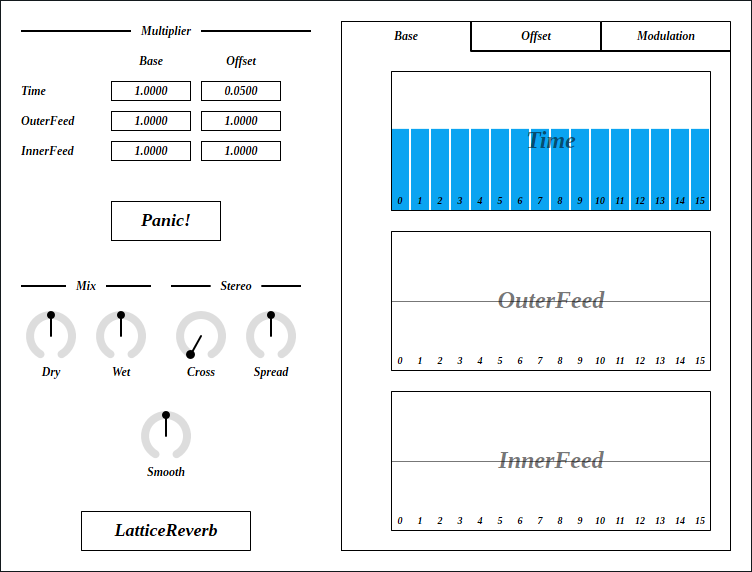
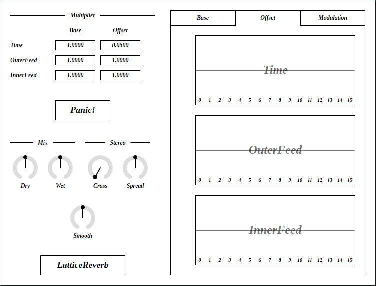

---
lang: en
...

# LatticeReverb


LatticeReverb is a reverb using lattice structure. Equipped with 16 delays per channel.

- [Download LatticeReverb {{ latest_version["LatticeReverb"] }} - VST® 3 (github.com)]({{ latest_download_url["LatticeReverb"] }}) 

- [Download Presets (github.com)]({{ preset_download_url["LatticeReverb"] }})


The package includes following builds:

- Windows 64bit
- Linux 64bit
- macOS universal binary

Linux build is built on Ubuntu 20.04. If you are using distribution other than Ubuntu 20.04, plugin will not likely to run. In this case, please take a look at [build instruction](https://github.com/ryukau/VSTPlugins/blob/master/build_instruction.md).

{{ section["contact_installation_guiconfig"] }}

## Controls
{{ section["gui_common"] }}

{{ section["gui_knob"] }}

{{ section["gui_barbox"] }}

## Caution
Output may change with different sample rate or buffer size.

Output may become loud when following steps are performed.

1. Set some of the `OuterFeed` or `InnerFeed` to close to minimum or maximum.
2. Input signals.
3. Change the value of `OuterFeed` or `InnerFeed` which was set at step 1.

## Block Diagram
If the image is small, use <kbd>Ctrl</kbd> + <kbd>Mouse Wheel</kbd> or "View Image" on right click menu to scale.

Diagram only shows overview. It's not exact implementation.


## Parameters
`Base` is value used in both left and right channel. `Base` value determines the character of reverb.

`Offset` is ratio of value between left and right channel. Changing `Offset` spreads reverb to stereo.

```
if (Offset >= 0) {
  valueL = Base
  valueR = Base * (1 - Offset)
}
else {
  valueL = Base * (1 + Offset)
  valueR = Base
}
```

Time

:   Delay time of all-pass filter.

OuterFeed

:   Feedback and feedforward gain of lattice structure.

InnerFeed

:   Feedback and feedforward gain of an all-pass filter.

### Multiplier
Multiplier for `Time`, `OuterFeed`, `InnerFeed`. Useful to shorten or lengthen reverb without changing much of the character.

### Panic!
Pressing `Panic!` button stops reverb output by setting multiplier of `Time`, `OuterFeed`, `InnerFeed` to 0.

Useful to stop sounds in case of blow up.

### Mix
Dry

:   Gain of input signal.

Wet

:   Gain of reverb signal.

### Stereo
Cross

:   Mixing ratio of stereo signal for odd stage in lattice structure.

    If the value is 0, signal from other channel will not be mixed. If the value is 0.5, mixing ratio of current channel and other channel becomes 1:1.

Spread

:   Mid-side (M-S) signal ratio.

    Following equations are used to calculate mid-side signal.

    ```
    mid  = left + right
    side = left - right

    left  = mid - Spread * (mid - side)
    right = mid - Spread * (mid + side)
    ```

### Misc.
Smooth

:    Transition time to change parameter value to current one. Unit is in second.

### Base


`Base` tab provides controls for common values used in both channels.

Character of reverb is mostly determined by `Base` values.

### Offset


`Offset` tab provides controls for ratio of value between left and right channel.

Changing values in `Offset` tab spreads reverb to stereo.

### Modulation


Time LFO

:   LFO modulation amount to `Time`.

    LFO waveform is noise (uniform pseudo random number). Smoothness of LFO is changed by `Time LFO Cutoff` and `Smooth`.

Time LFO Cutoff

:   Low-pass filter cutoff frequency for LFO.

Lowpass Cutoff

:   Cutoff frequency of low-pass filters placed for each stage of lattice structure.

    Useful to change the brightness of reverb.

## Change Log

- {{version}}
  
  - {{ log }}
  


## Old Versions

N/A.

  
- [LatticeReverb {{ x["version"] }} - VST 3 (github.com)]({{ x["url"] }})
  


## License
LatticeReverb is licensed under GPLv3. Complete licenses are linked below.

- [https://github.com/ryukau/VSTPlugins/tree/master/License](https://github.com/ryukau/VSTPlugins/tree/master/License)

If the link above doesn't work, please send email to `ryukau@gmail.com`.

### About VST
VST is a trademark of Steinberg Media Technologies GmbH, registered in Europe and other countries.
