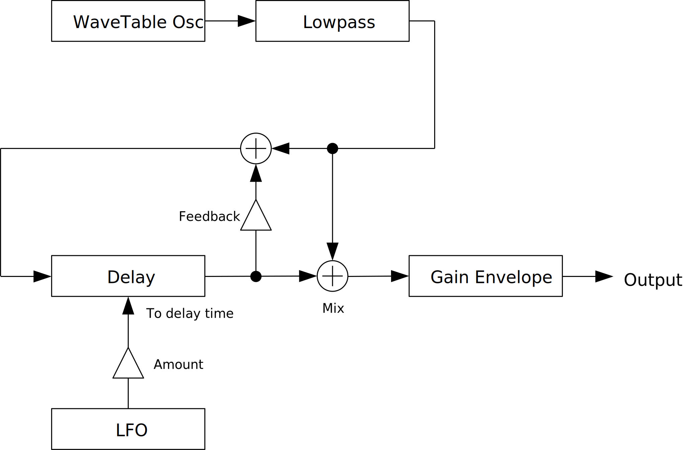
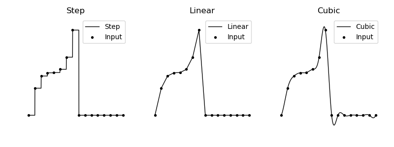

---
lang: en
...

# LightPadSynth


LightPadSynth is a lightweight version of CubicPadSynth. For efficiency, interpolation is changed to linear. Also pitch modulation is omitted. Instead, a delay is added for each voice.


- [Download LightPadSynth {{ latest_version["LightPadSynth"] }} `{{ target }}` - VST 3 (github.com)]({{ download_url }}) 


- [Download Presets (github.com)]({{ preset_download_url["LightPadSynth"] }})


{{ section["package"] }}

{{ section["contact_installation_guiconfig"] }}

## Controls
{{ section["gui_common"] }}

{{ section["gui_knob"] }}

{{ section["gui_barbox"] }}

## Caution
Pressing `Refresh LFO` or `Refresh Table` button stop sound. They also stop all midi notes.

## Wavetable Specification
128 wavetables are generated. The number 128 comes from MIDI note number range. The indices of wavetables correspond to MIDI note numbers.

When tuning is not exact, an index will be truncated to semitones. For example, if MIDI note number is 60 and tuning is -20 cents, index becomes `floor(60 - 0.20) = 59`. Thus, 59th wavetable will be used.

## Block Diagram
If the image is small, use <kbd>Ctrl</kbd> + <kbd>Mouse Wheel</kbd> or "View Image" on right click menu to scale.

Diagram only shows overview. It's not exact implementation.



## Parameters
### Main Tab


#### Gain
A, D, S, R

:   Gain envelope parameters.

    - `A` : Attack time which is the length from note-on to reaching peak value.
    - `D` : Decay time which is the length from peak value to reaching sustain level.
    - `S` : Sustain level which is the gain after decay.
    - `R` : Release time which is the length from note-off to the gain reaching to 0.

Gain

:   Master output gain.

#### Lowpass
Naive 3-pole low-pass filter.

Cutoff

:   Cutoff frequency of the filter.

Resonance

:   Resonance of the filter. Be careful when turning to right, output will be loud.

KeyFollow

:   When set to right-most, cutoff frequency is set to the frequency of a note. When set to left-most, it only use the value of `Cutoff`.

A, D, S, R, Amount

:   Filter envelope parameters. `Amount` changes the amount of modulation to cutoff.

#### Tuning
Octave, Semi, Milli

:   Changes master pitch.

    `Milli` is 1/1000 of semitone or 1/10 cent.

ET, A4 [Hz]

:   Changes tuning.

    `ET` stands for equal temperament. Note that when `ET` is less than 12, some notes becomes silent due to frequency becomes too high or too low.

    `A4 [Hz]` is frequency of note A4.

#### Unison
nUnison

:   Number of voices used by unison.

    To avoid interruption of release, increase the number of `nVoice` in Misc. section. Note that increasing `nVoice` consumes more resources.

Detune, Random Detune

:   `Detune` is the difference of pitch between voices used in a unison.

    When `Random Detune` is checked, amount of detune changes for each note-on.

    ```
    random = RandomDetune ? rand() : 1
    detune = pitch * (1 + random * unisonIndex * Detune)
    ```

GainRnd

:   Amount of randomization of gain for voices used in a unison.

Phase

:   Amount of randomization of phase for voices used in a unison.

    This parameter makes no effect when `Reset` in Phase section is checked.

Spread, Spread Type

:   `Spread` is an amount of stereo spread for a unison.

    `Spread Type` provides options to assign panpot values according to voice pitch.

    - `Alternate L-R`: Alternates `Ascend L -> R` and `Ascend R -> L`.
    - `Alternate M-S`: Alternates `HighOnMid` and `HighOnSide`.
    - `Ascend L -> R`: Ascend pitch from left to right.
    - `Ascend R -> L`: Ascend pitch from right to left.
    - `HighOnMid`: Ascend pitch from side to mid.
    - `HighOnSide`: Ascend pitch from mid to side.
    - `Random`: Randomize pan. May be biased.
    - `RotateL`: Rotate to left for each note-on.
    - `RotateR`: Rotate to right for each note-on.
    - `Shuffle`: Randomly assign pan which is evenly ordered.

#### Phase
Phase

:   Initial phase of oscillator.

Reset

:   When checked, resets oscillator phase to the value set by `Phase`.

Random

:   When checked, randomize phase for each note-on. In this case, value of `Phase` becomes range of randomization.

#### Misc.
Smooth

:   Time length to change some parameter value to current one. Unit is in second.

    List of parameters related to `Smooth`. `*` represents wild card.

    - All parameters in Tuning section.
    - Gain
      - `Gain`
      - `S`
    - Lowpass
      - `Cutoff`
      - `S`
      - `Amount`
      - `KeyFollow`
    - Delay
      - `Mix`
      - `Feedback`
      - `Attack`
      - `Semi`
      - `Milli`
    - Delay LFO
      - `Tempo`
      - `Multiply`
      - `Amount`
      - `Lowpass`
    - Phase
      - `Phase`

Poly

:   Maximum polyphony. Lowering the number of this option reduces CPU load.

Seed

:   Random seed. This value change random number sequence.

    LightPadSynth has 2 random number generaters. One is used in `Main` tab and the other is in `Wavetable` tab.

#### Delay
Mix

:   Mixing ratio of filter output and delay output.

Feedback

:   Feedback of a delay. Positive feedback when turning right. Negative feedback when turning left.

Attack

:   Attack time of gate between filter output and delay.

Semi, Milli

:   Delay time relative to note frequency. Following equation is used.

    ```
    delayTime = 1 / (noteFreq * pow(2, (semi + 0.001 * milli) / 12))
    ```

#### LFO
Tempo, Multiply

:   Sets LFO frequency according to current tempo. Lower numeral represents the length of note. Upper numeral is the number of notes.

    Value of `Multiply` is multiplied to the frequency calculated from `Tempo`.

    ```
    // (60 seconds) * (4 beat) = 240
    lfoFrequency = Multiply * (BPM / 240) / (TempoUpperNumeral / TempoLowerNumeral)
    ```

Amount

:   LFO frequency modulation amount.

Lowpass

:   Changes cutoff freequency of low-pass filter for LFO.

Interpolation

:   Type of LFO wavetable interpolation.

    

Refresh LFO

:   Refresh LFO wavetable based on current value of `LFO Wave`.

    Note that refreshing wavetable stops sound. It also interrupts MIDI notes.

LFO Wave

:   LFO waveform.

### Wavetable Tab


#### Overtone Controls
Gain

:   Gain of profile.

Width

:   Width of profile.

Pitch

:   This value is multiplied to profile center frequency.

Phase

:   Range of randomization for the phase of profile.

#### Pitch
Base Freq.

:   Fundamental frequency of wavetable. Note that if this value is small, master pitch becomes out of tune.

Multiply, Modulo

:   Changes profile center frequency.

    ```
    profileCenterFrequency = mod(
      BaseFreq * profileIndex * overtonePitch * Multiply,
      440 * pow(2, (Modulo - 69) / 12)
    )
    ```

#### Spectrum
Expand

:   Scaling factor to shrink/expand the spectrum along to frequency axis.

    

Shift

:   Shift spectrum along to frequency axis.

    

Comb

:   When this value is higher than 1, it changes the shape of profile like a comb. The value specifies interval between peaks.

    

Shape

:   Changes profile shapes by using the value of `Shape` as an exponent.

    ```
    shapedProfile = powf(profile, shape);
    ```

#### Phase
UniformPhase

:   When checked, phase of a profile becomes an uniform value.

#### Random
Seed

:   Random seed. This value change random number sequence.

    LightPadSynth has 2 random number generaters. One is used in `Main` tab and the other is in `Wavetable` tab.

#### BufferSize
Size of a wavetable. The power of 2 values can be selected from `2^10` to `2^21`.

The value inside parentheses indicates number of bytes in a sum of all wavetables. A number of bytes is calculated with following equation.

```
bytes = 4 * 128 * BufferSize
```

#### Modifier
Gain^

:   Exponent for `Gain` in overtone control.

    ```
    profileGain = pow(Gain, Gain^)
    ```

Width*

:   Multiplier for `Width` in overtone control.

    ```
    profileWidth = Width * (Width*)
    ```

#### Refresh Table
Refresh PADsynth wavetable based on current configuration of Wavetable tab.

Note that refreshing wavetable stops sound. It also interrupts MIDI notes.

## Change Log

- {{version}}
  
  - {{ log }}
  


## Old Versions

N/A.

  
- [LightPadSynth {{ x["version"] }} - VST 3 (github.com)]({{ x["url"] }})
  


## License
LightPadSynth is licensed under GPLv3. Complete licenses are linked below.

- [https://github.com/ryukau/VSTPlugins/tree/master/License](https://github.com/ryukau/VSTPlugins/tree/master/License)

If the link above doesn't work, please send email to `ryukau@gmail.com`.

### About VST
VST is a trademark of Steinberg Media Technologies GmbH, registered in Europe and other countries.
