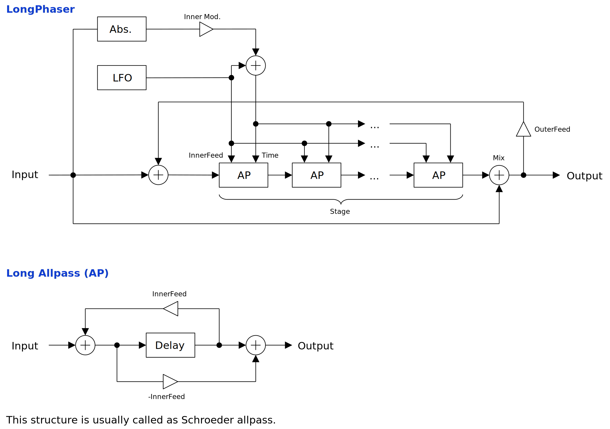

---
lang: en
...

# LongPhaser


LongPhaser is a phaser using Schroeder all-pass filters which is able to set some long delay time. The sound is like somewhere between delay and phaser. It feels a bit underwhelming, however modulation with LFO and note events may be used to compensate the lack of character.


- [Download LongPhaser {{ latest_version["LongPhaser"] }} `{{ target }}` - VST 3 (github.com)]({{ download_url }}) 


- [Download Presets (github.com)]({{ preset_download_url["LongPhaser"] }})


{{ section["package"] }}

{{ section["contact_installation_guiconfig"] }}

## Controls
{{ section["gui_common"] }}

{{ section["gui_knob"] }}

{{ section["gui_barbox"] }}

## Block Diagram
If the image is small, use <kbd>Ctrl</kbd> + <kbd>Mouse Wheel</kbd> or "View Image" on right click menu to scale.

Diagram only shows overview. It's not exact implementation.



## Note Event Input
LongPhaser can receive note events to control delay time in allpass filters.

## Parameters
Characters inside of square brackets \[\] represents unit. Following is a list of units used in LongPhaser.

- \[s\]: Second.

### Allpass
Output

:   Output gain.

Mix

:   Mixing ratio of input signal and distorted signal.

    When set to leftmost, input signal will be bypassed. When the value approaches to rightmost, the effect of `OuterFeed` becomes stronger.

OuterFeed

:   Feedback gain for the signal that goes back to the start of serial allpass section.

InnerFeed

:   Feedback and feedforward gain of allpass filters in serial allpass section.

Inner Mod.

:   LFO modulation amount to `InnerFeed`.

Time Spread

:   `Time Spread` gradually changes delay time multipliers between `[1, 1, 1, ...]` and `[1/1, 1/2, 1/3, ...]`.

    Phaser is an effector with serially connected allpass filters. When `Time Spread` is set to leftmost, all the delay time are set to the same value. When `Time Spread` is set to rightmost, delay time are set to 1/1, 1/2, 1/3, and so on, in order from the front.

Base Time \[s\]

:   Base delay time used inside of allpass filters.

LFO > Time

:   LFO modulation amount to delay times inside of allpass filters.

    Unit of display value depends on `Mod. Type`.

Input > Time

:   Amount of modulation from input signal to delay time in allpass filter.

    To avoid setting negative delay time, `abs` is applied to modulation signal.

    Unit of display value depends on `Mod. Type`.

Mod. Type

:   Type of delay time modulation. Character of `Input > Time` and `LFO > Time` are affected.

    - `Multiply`: Multiples modulation signal after applying `exp2`. Unit of `Input > Time` and `LFO > Time` becomes octave.
    - `Add`: Adds modulation signal to delay time. Unit of `Input > Time` and `LFO > Time` becomes second.

Interp. Rate

:   Rate limiting value, or slew rate, of delay time interpolation. For example, when `Interp. Rate` is set to 0.1, changing delay time from 0 to 1 samples requires 10 samples of interpolation time.

Stage

:   Number of allpass filters in the serial section.

### LFO
L-R Offset

:   LFO phase offset between stereo channels.

Phase

:   A value that is added to LFO phase.

    To manually control LFO phase, set `Rate` to leftmost to stop LFO, then change the value of `Phase`. Also, the value of `Smoothing` affects the response time when `Phase` is changed.

Sync.

:   When checked, it enables tempo synchronization (tempo sync). LFO phase also synchronize to the exact position derived from sync interval, and time passed from the start of playback.

    When not checked, LFO behaves as same as if synchronizing to 120 BPM. It also disables LFO phase sync.

Tempo Upper

:   Numerator of sync interval.

    LFO synchronizes to 1 bar when `(Tempo Upper) / (Tempo Lower)` is `1/1`. `1/4` synchronizes to 1 beat when time signature of `4/4`. Note that `Rate` multiplies the sync interval.

    Following is the equation to calculate sync interval.

    ```
    syncInterval = (Rate) * (Tempo Upper) / (Tempo Lower);
    ```

Tempo Lower

:   Denominator of sync interval.

    Note that `Rate` multiplies the sync interval.

Rate

:   Multiplier to sync interval.

    `Rate` is convenient when changing sync interval while keeping the values of `Tempo Upper` and `Tempo Lower`.

Wave Interp.

:   LFO wave form interpolation method.

    - `Step`: Holding.
    - `Linear`: Linear interpolation.
    - `PCHIP`: Monotonic cubic interpolation.

    `Step` makes LFO to act like a sequencer. `Linear` sounds similar to `PCHIP`, and the computation cost is lower. `PCHIP` is the most smooth among all 3.

LFO Wave

:   LFO waveform.

### Misc.
Note Origin

:   Origin of MIDI note number.

    Note event with this note number doesn't change the sound.

Note Scale

:   Scaling of note event modulation to delay time.

    When set to `1.0`, the modulation amount follows the pitch of the note. When set to `-1.0` pitch will be inverted.

Smoothing \[s\]

:   Paramter smoothing time in seconds.

    For example, if the value of `Smoothing` is set to `0.01` or something short, the change of parameter almost immediately applies. So it sounds more snappy, but may introduce audible pop noise. On the other hand, if the value of `Smoothing` is set to `1.0` for example, the change of parameter is only slowly followed.

2x Sampling

:   When checked, 2-fold oversampling is enabled.

## Change Log

- {{version}}
  
  - {{ log }}
  


## Old Versions

N/A.

  
- [LongPhaser {{ x["version"] }} - VST 3 (github.com)]({{ x["url"] }})
  


## License
LongPhaser is licensed under GPLv3. Complete licenses are linked below.

- [https://github.com/ryukau/VSTPlugins/tree/master/License](https://github.com/ryukau/VSTPlugins/tree/master/License)

If the link above doesn't work, please send email to `ryukau@gmail.com`.

### About VST
VST is a trademark of Steinberg Media Technologies GmbH, registered in Europe and other countries.
