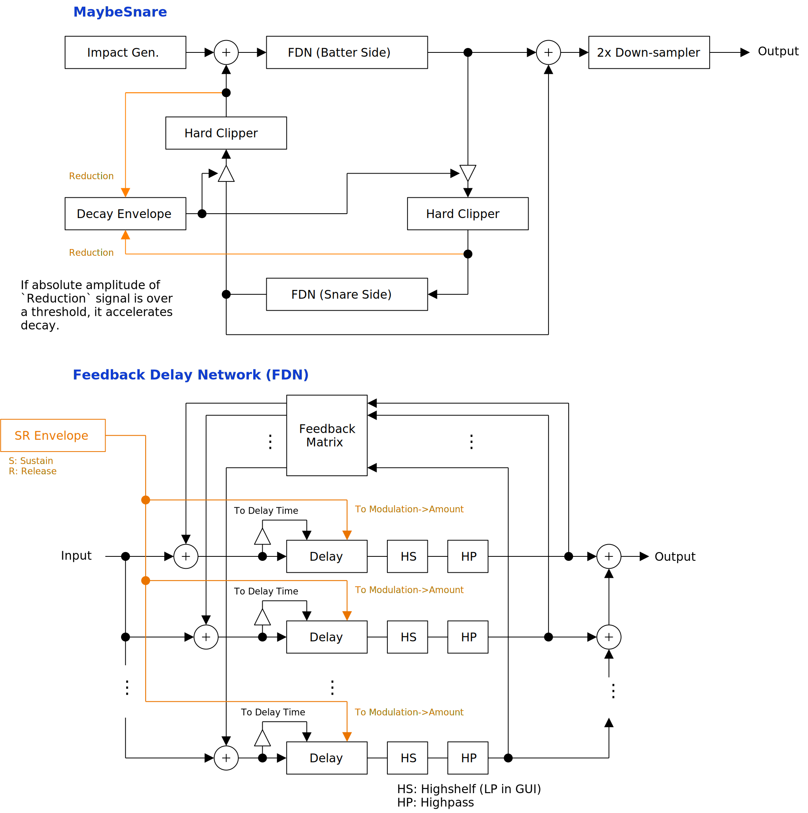

---
lang: en
...

# MaybeSnare

MaybeSnare is a synthesizer that resembles sound of snare drum. This is basically 2 MembraneSynth coupled by cross feedback. Snare wire is not included. However, the noise of modulation adds rattling texture similar to snare wire.


- [Download MaybeSnare {{ latest_version["MaybeSnare"] }} `{{ target }}` - VST 3 (github.com)]({{ download_url }}) 


- [Download Presets (github.com)]({{ preset_download_url["MaybeSnare"] }})


{{ section["package"] }}

{{ section["contact_installation_guiconfig"] }}

## Controls
{{ section["gui_common"] }}

{{ section["gui_knob"] }}

{{ section["gui_barbox"] }}

## Caution
Recommend to insert limiter after MaybeSnare because output amplitude varies greatly.

### Blow-up and Oscillation
Blow-up (or divergence) is the state when the sound is getting louder and louder. Oscillation is the state when the amplitude is not changing, but the sound doesn't stop.

Blow-up may happen when `Coupling -> Amount` is large. An recommendation is to set `Coupling -> Amount` to 2 or less. Even when the output blows up, the sound stops roughly after the time specified on `Coupling -> Decay`. However, beware that the output amplitude may become very loud. Also, sending many notes in short period of time increases the chance of blow-up.

It may oscillates when following conditions are met:

- `Modulation -> Amount` is greater than 0.
- `Interp. Rate` is greater than 0.
- `Envelope` is disabled.

Oscillation can be utilized for some noisy drone or sound effects, however it can be a problem when making percussion sounds. Recommend to always enable `Envelope` for percussion sounds.

## Block Diagram
If the image is small, use <kbd>Ctrl</kbd> + <kbd>Mouse Wheel</kbd> or "View Image" on right click menu to scale.

Diagram only shows overview. It's not exact implementation.

## Parameters
Characters inside of square brackets \[\] represents unit. Following is a list of units used in MaybeSnare.

- \[dB\] : Decibel.
- \[s\] : Second.
- \[st.\] : Semitone.
- \[Hz\] : Hertz.

Following is a list of terms used in this documentation.

- FDN: Feedback delay network.
- Batter side: Membrane on the upper side of snare drum.
- Snare side: Membrane on the lower side of snare drum, or the side where snare wires are attached.
- Coupling: On MaybeSnare, coupling specifically refers to propagation of vibration between batter side and snare side.

### Gain
Output \[dB\]

:   Output gain.

Batter-Snare Mix

:   Mixing ratio of batter side and snare side.

Normalize

:   When checked, output gain is normalized to keep almost same gain regardless of `Impact -> Amplitude`.

2x Sampling

:   When checked, it enables 2-fold oversampling.

### Tuning
Tuning section provides pitch related parameters.

Note that most of the time, the output of MaybeSnare might be out of tuning. If it is required to tune the pitch exactly to provided note, recommend to render the output sound, and use external sampler.

Snare Side Oct.

:   Pitch of snare side relative to batter side. Unit is octave.

Semitone, Cent

:   Pitch in semitone or cent. 1 semitone equals to 100 cents.

Equal Temp., A4 \[Hz\]

:   `Equal Temp.` is abbreviation of equal temperament (ET). When `Equal Temp.` is 12, then the tuning becomes standard 12 ET. Setting `Equal Temp.` to less than 12 might increase the range of note that doesn't change output sound, due to the internal pitch becomes too high or too low.

    `A4 [Hz]` is freqeuncy of note A4.

P.Bend Range \[st.\]

:   Range of pitch bend in semitone.

Slide Time \[s\]

:   Time to slide the pitch of latest note.

    Note that the time indicated in user interface is not exact. Internally, the value is converted to cutoff frequency of smoothing filter.

Slide at Note-on, Note-off

:   When checked, apply pitch slide at note-on or note-off.

    For percussion sounds, it may sound more natural without pitch slide.

### Impact
Impact section provides parameters for excitation. Excitation here means the signal that imitates the impact of stick and membrane. MaybeSnare provides 2 types of signal for excitation which are exponential decay and random noise from normal distribution.

Amplitude \[dB\]

:   Maximum amplitude of exponential decay. Roughly represents the intensity of impact.

Decay \[s\]

:   Time of exponential decay. Roughly represents the time that the membrane returns to resting position after impact.

    Increasing the value of `Decay` adds more low frequency. Depending on other parameter settings, rattling may vanish when `Decay` is greater than some certain value.

Position

:   `Position` introduces bias the FDN input gain to resemble the position of impact.

    Intention was to represent the center of membrane for `Position = 0`, and the rim of  membrane for `Position = 1`. However, it doesn't make much difference to the output sound.

Noise Mix

:   Mixing ratio of exponential decay and noise.

Noise Decay \[s\]

:   Decay time of noise.

Noise LP \[Hz\]

:   Cutoff frequency of a lowpass filter which applies to noise signal.

### Coupling
Amount

:   Amount of coupling.

    More coupling means more chance of blow-up. For usual case, recommend to set the value to 2 or less. When setting the value to greater than 2, reducing `Coupling -> Decay` and `Coupling -> Reduction` might prevent blow-up.

Decay \[s\]

:   Decay time of coupling amount.

Reduction

:   Coefficient to accelerate the coupling decay envelope. This value is only used when the amplitude of coupling signal is over an internal threshold.

    Reducing this value makes blow-up to end faster.

### Random
Random section provides parameters for randomization for each note-on.

Seed

:   Seed value of random number sequence.

    Changing `Seed` also changes the feedback matrix of FDN, and it changes the texture of cross feedback.

Matrix Rnd.

:   Ratio of randomization to the feedback matrix of FDN.

Overtone Rnd.

:   Maximum of random number that added to delay time multiplier.

### Batter Side, Snare Side
`Batter Side` tab and `Snare Side` tab shares same set of parameters.

By the way, MaybeSnare doesn't have anything related to snare wire. The texture of rattling comes from the discontinuity that occurs when delay time modulation is too fast. Increasing the value of `Interp. Rate` adds this discontinuity more often.

#### Delay
Delay section provides parameters for feedback and delay time tuning.

Cross Feed

:   Amount of cross feedback between delays.

    Higher value of `Cross Feed` adds more cross feedback, and harmonics become more complex.

Feedback

:   Amount of feedback of FDN.

    `Feedback` is used to change the length of sound. Oscillation can also be suppressed by decreasing `Feedback`.

Shape

:   Switch the delay time multiplier between string modes and circular membrane modes.

    When `Shape` is 0, the multipliers use string modes and it becomes 1, 2, 3, and so on. When `Shape` is 1, the multipliers use circular membrane modes and it becomes 1, 1.59, 2.13, and so on.

#### Modulation
Modulation section provides parameters related to self-modulation of FDN.

Amount

:   Amount of modulation to delay time by the absolute amplitude of feedback signal.

    When `Amount` is not 0, the pitch might drop like tom tom.

Interp. Rate

:   Slew rate of delay time modulation per sample.

    Higher `Interp. Rate` means more modulation, but also increases the risk of oscillation.

Max Ratio

:   Maximum of modulation represented as a ratio to resting delay time.

    For example, when `Max Ratio` is 0.3, and resting delay time is 1.0, the maximally modulated delay time becomes 0.7.

Batter Mod. Envelope, Snare Mod. Envelope

:   When lit, it enables modulation envelope.

    Modulation envelope decreases `Modulation -> Amount` through time to suppress oscillation. Recommend to always turn on for percussion sounds.

Sustain \[s\]

:   Sustain time of modulation envelope. Lengthen the sustain time tends to be more unnatural sound.

Release \[s\]

:   Release time of modulation envelope. When oscillating, shorten the release time might result in more natural sound.

#### Filter
Filter section provides parameters to tune the filters inserted in the feedback path of FDN.

LP Cut \[Hz\], HP Cut \[Hz\]

:   Cutoff frequency of lowpass (LP) or highpass (HP) filters.

    Lowpass is actually highshelf with the gain fixed to 0.5 (~= -6.02 dB). It is labeled as lowpass on the interface because it felt more intuitive.

LP Q, HP Q

:   Q factor of lowpass (LP) or highpass (HP).

    Q factors don't change the output sound that much. They can be ignored unless fine tuning is required. That said, following 2 recipes might be useful to suppress oscillation in some cases. Both reduces low frequency of the output sound.

    - Decrease index 0 (leftmost) of `HP Q`.
    - Decrease index 12 to 15 (3 bars from rightmost) of `HP Q`.

## Change Log

- {{version}}
  
  - {{ log }}
  


## Old Versions

N/A.

  
- [MaybeSnare {{ x["version"] }} - VST 3 (github.com)]({{ x["url"] }})
  


## License
MaybeSnare is licensed under GPLv3. Complete licenses are linked below.

- [https://github.com/ryukau/VSTPlugins/tree/master/License](https://github.com/ryukau/VSTPlugins/tree/master/License)

If the link above doesn't work, please send email to `ryukau@gmail.com`.

### About VST
VST is a trademark of Steinberg Media Technologies GmbH, registered in Europe and other countries.
