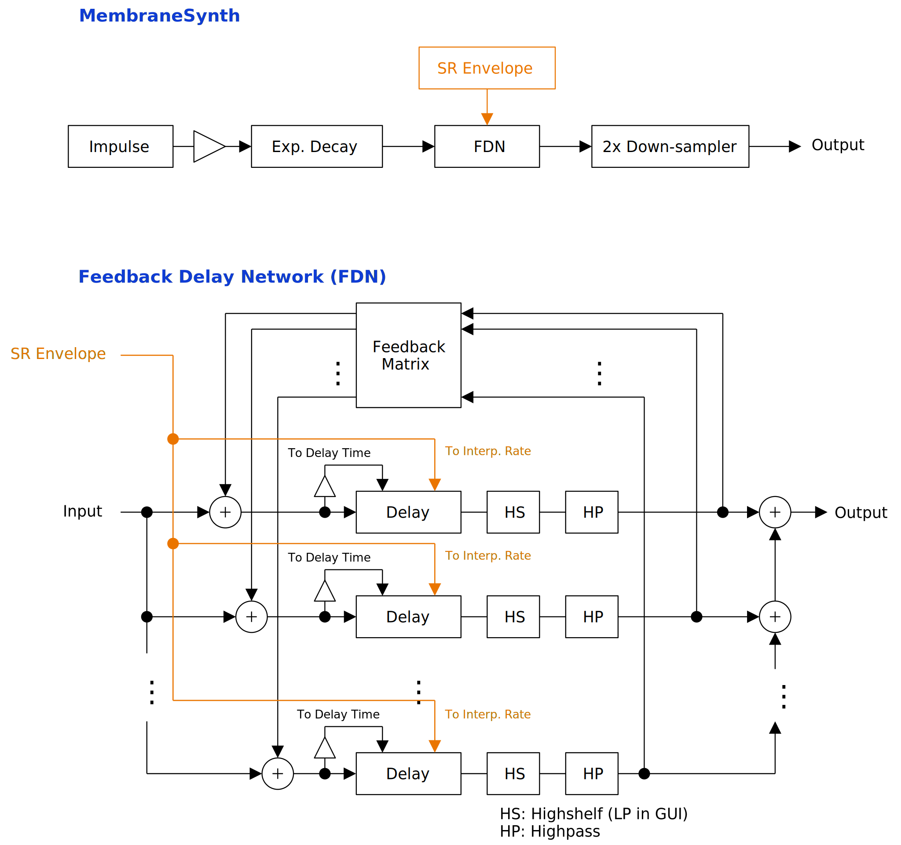

---
lang: ja
...

# MembraneSynth

<ruby>MembraneSynth<rt>メンブレイン シンセ</rt></ruby> は膜を張った打楽器のような音がでるシンセサイザです。バスドラムやタムタムのような低めの打楽器の音が得意ですが、自己変調による発振によって変な音を作ることもできます。

- [MembraneSynth {{ latest_version["MembraneSynth"] }} をダウンロード - VST® 3 (github.com)]({{ latest_download_url["MembraneSynth"] }}) 

- [プリセットをダウンロード (github.com)]({{ preset_download_url["MembraneSynth"] }})


パッケージには次のビルドが含まれています。

- Windows 64bit
- Linux 64bit
- macOS universal binary

Linux ビルドは Ubuntu 20.04 でビルドしています。もし Ubuntu 20.04 以外のディストリビューションを使っているときは、プラグインが読み込まれないなどの不具合が起こることがあります。この場合は[ビルド手順](https://github.com/ryukau/VSTPlugins/blob/master/build_instruction.md)に沿ってソースコードからビルドしてください。

{{ section["contact_installation_guiconfig"] }}

## 操作
{{ section["gui_common"] }}

{{ section["gui_knob"] }}

{{ section["gui_barbox"] }}

## 注意
音量の振れ幅が大きいので MembraneSynth の後に必ずリミッタを挿入することを推奨します。

以下の条件がそろったときに発振するおそれがあります。

- `Modulation -> Amount` が 0 より大きい。
- `Interp. Rate` が 0 より大きい。
- `Envelope` が無効。

発振はドローンや効果音を作るときには使えますが、打楽器の音を出したいときは問題となります。対策として、 `Envelope` を有効にすることで発振をいくらか防ぐことができます。

## ブロック線図
図が小さいときはブラウザのショートカット <kbd>Ctrl</kbd> + <kbd>マウスホイール</kbd> や、右クリックから「画像だけを表示」などで拡大できます。

図で示されているのは大まかな信号の流れです。実装と厳密に対応しているわけではないので注意してください。

## パラメータ
角かっこ \[\] で囲まれているのは単位です。以下は MembraneSynth のパラメータで使われている単位の一覧です。

- \[dB\] : デシベル (decibel) 。
- \[s\] : 秒 (second) 。
- \[st.\] : 半音 (semitone) 。
- \[Hz\] : 周波数 (Hertz) 。

また、ところどころに出てくる FDN という言葉はフィードバック・ディレイ・ネットワークという部品の略称です。詳細はブロック線図を参照してください。

### Gain
Output \[dB\]

:   出力のゲインです。

Normalize

:   チェックを入れると `Impact -> Amplitude` の値に応じてゲインを一定に保つように正規化します。

2x Sampling

:   チェックを入れると 2 倍のオーバーサンプリングを有効にします。

### Impact
Impact セクションでは、励起信号のパラメータが調整できます。ここでの励起信号とは、大まかにばちと打面の衝突を模倣する信号のことです。

Amplitude \[dB\]

:   励起信号の最大振幅です。大まかにばちと打面の衝突の強さを表しています。

Decay \[s\]

:   励起信号の減衰時間です。大まかに衝突時に沈み込んだ打面が元の位置に戻ってくるまでにかかる時間を表しています。

    `Decay` の値が大きいほど低い周波数成分が強くなります。また、他のパラメータの設定によっては `Decay` がある値より大きいときに、音のざらついた質感が消えることがあります。

Position

:   励起信号を FDN に分配するときの偏りを与えるパラメータです。大まかに打面の中央から<ruby>縁<rt>ふち</rt></ruby><r>の間の位置を表しています。

    `Position` が 0 のときは打面の中央、 1 のときは縁を表すはずだったのですが、今回の実装ではあまり大きく音が変わりません。

### Tuning
Tuning セクションでは DAW から送られてくるノートイベントと、シンセサイザ内部のピッチの対応を設定します。

MembraneSynth の癖として、すべての音程が正確に合うことはない点に注意してください。音程を合わせる必要があるときは、一度レンダリングして、外部のサンプラーに読み込んで使うことを推奨します。

Semitone, Cent

:   全体の音の高さを変更します。

    - `Semitone`: 半音
    - `Cent`: 1 半音の 1 / 100 。

Equal Temp., A4 \[Hz\]

:   音律を変更します。

    `Equal Temp.` は Equal Temperament (平均律) の略です。 `Equal Temp.` が 12 のときは 12 平均律となります。 `Equal Temp.` を 12 よりも小さくすると、内部的なピッチが高すぎるあるいは低すぎるために、音が変わらなくなる範囲が増えるので注意してください。

    `A4 [Hz]` は、音程 A4 の周波数です。

P.Bend Range \[st.\]

:   ピッチベンドの範囲です。

Slide Time \[s\]

:   最後に与えられたノートのピッチへとスライドする時間です。

    内部的にはフィルタのカットオフ周波数に置き換えられるので、正確な遷移時間を表しているわけではない点に注意してください。

Slide at Note-on, Note-off

:   チェックを入れると、ノートオンあるいはノートオフの時点でスライドを行います。

    打楽器の音を作るときは、ピッチスライドを行わないほうが自然な音に聞こえるかもしれません。

### Delay
Delay セクションでは、 FDN のディレイ間のフィードバックと、ディレイ時間に関するパラメータを設定できます。

Cross Feed

:   ディレイ間のクロス・フィードバックの割合です。

    値が大きいほうがクロス・フィードバックが増えて複雑な倍音が出ます。

Feedback

:   FDN 全体のフィードバック量です。

    `Feedback` によって音の長さを設定できます。また `Feedback` を下げることで発振を抑えることができます。

Shape

:   ディレイ時間の係数を、弦の振動のモードと円形の膜の振動のモードとの間で切り替えます。

    `Shape` が 0 のときは係数が弦の振動のモードに応じて 1 倍、 2 倍、 3 倍、 ... と設定されます。 `Shape` が 1 のときは係数が円形の膜の振動のモードに基づいて 1 倍、 1.59 倍、 2.13 倍、 ... と設定されます。

### Modulation
Modulation セクションでは、 FDN 内のフィードバック信号によってディレイ時間を短くする変調に関する設定ができます。

Amount

:   FDN 内のディレイ時間をフィードバックによって変調する量です。

    `Amount` が 0 でないときは、タムタムのようなピッチの下降が起こることがあります。

Interp. Rate

:   1 サンプルあたりのディレイ時間の変化を制限する値です。

    `Interp. Rate` の値が大きいほど変調が強くかかりますが、発振しやすくなるので注意してください。

Max Ratio

:   変調されていないディレイ時間からの割合で表された、変調の最大値です。

    例えば `Max Ratio` が 0.3 のときは、ディレイ時間が定常状態から 30% 以上短くなることはありません。

Envelope

:   点灯させると変調エンベロープが有効になります。

    変調エンベロープを有効にすると `Interp. Rate` を時間とともに下げて発振を無理やり抑えることができます。打楽器の音だけが欲しいときは、常に有効にしておくことを推奨します。

Sustain \[s\]

:   変調エンベロープのサステイン時間です。発振しているときにサステインが長いと不自然な音になる傾向があります。

Release \[s\]

:   変調エンベロープのリリース時間です。発振しているときはリリースを短めに設定することで自然な音に近づきます。

### Random
Random セクションでは、ノートオンごとに行うランダマイズの設定ができます。

Seed

:   乱数のシード値です。

    `Seed` を変えると FDN のフィードバック行列が変更されるので、クロス・フィードバックの質感が変わります。

Matrix Rnd.

:   FDN のフィードバック行列をノートオンごとにランダマイズする割合です。

Overtone Rnd.

:   ディレイ時間を決めるときの倍数にランダムに加算する値の大きさです。

### Filter
Filter セクションでは、 FDN のフィードバック経路に用意されたフィルタの設定ができます。

LP Cut \[Hz\], HP Cut \[Hz\]

:   ローパスフィルタ (LP) 、ハイパスフィルタ (HP) のカットオフ周波数です。

    実のところ、ローパスフィルタではなく、ゲインを 0.5 (~= -6.02 dB) に固定したハイシェルフフィルタを使っています。 UI 上ではローパスフィルタとしたほうが分かりやすいと思ったので、このように表記しています。

LP Q, HP Q

:   ローパスフィルタ (LP) 、ハイパスフィルタ (HP) の Q 値です。

    Q 値は変更しても大きく音が変わらないので、細かい調整を行いたいわけでなければ無視できます。ただし、以下の 2 つのレシピは発振を抑えたいときに役立つかもしれません。どちらも音の低い部分を下げる効果があります。

    - `HP Q` の 0 番 (最も左) を下げる。
    - `HP Q` の 12 ~ 15 番 (右から 3 つ) を下げる。

## チェンジログ

- {{version}}
  
  - {{ log }}
  


## 旧バージョン

旧バージョンはありません。

  
- [MembraneSynth {{ x["version"] }} - VST 3 (github.com)]({{ x["url"] }})
  


## ライセンス
MembraneSynth のライセンスは GPLv3 です。 GPLv3 の詳細と、利用したライブラリのライセンスは次のリンクにまとめています。

- [https://github.com/ryukau/VSTPlugins/tree/master/License](https://github.com/ryukau/VSTPlugins/tree/master/License)

リンクが切れているときは `ryukau@gmail.com` にメールを送ってください。

### VST® について
VST is a trademark of Steinberg Media Technologies GmbH, registered in Europe and other countries.
