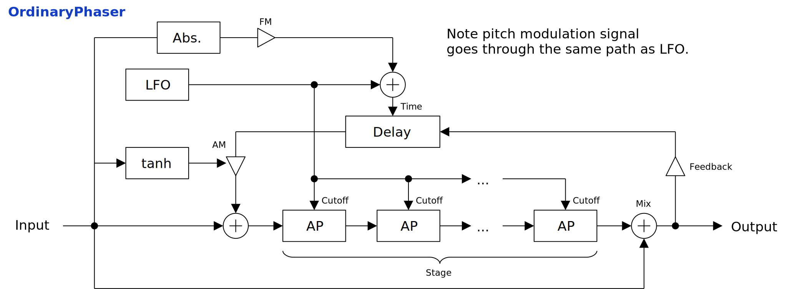

---
lang: en
...

# OrdinaryPhaser


OrdinaryPhaser is an ordinary phaser with a delay on feedback path. Note events can be used to control all-pass cutoff frequencies and delay time.


- [Download OrdinaryPhaser {{ latest_version["OrdinaryPhaser"] }} `{{ target }}` - VST 3 (github.com)]({{ download_url }}) 


- [Download Presets (github.com)]({{ preset_download_url["OrdinaryPhaser"] }})


{{ section["package"] }}

{{ section["contact_installation_guiconfig"] }}

## Controls
{{ section["gui_common"] }}

{{ section["gui_knob"] }}

{{ section["gui_barbox"] }}

## Block Diagram
If the image is small, use <kbd>Ctrl</kbd> + <kbd>Mouse Wheel</kbd> or "View Image" on right click menu to scale.

Diagram only shows overview. It's not exact implementation.



## Note Event Input
OrdinaryPhaser can receive note events to control following values.

- Allpass filter cutoff frequencies.
- Feedback delay time.

Make sure to change `Note>Cut` or `Note>Time` to non-0, to enable note event modulation. They are both set to 0 on newly launched instance.

## Parameters
Characters inside of square brackets \[\] represents unit. Following is a list of units used in OrdinaryPhaser.

- \[s\]: Second.
- \[Hz\]: Herz.

### Allpass
Output

:   Output gain.

Mix

:   Mixing ratio of input signal and distorted signal.

    When set to leftmost, input signal will be bypassed. When the value approaches to rightmost, the effect of `Feedback` becomes stronger.

Feedback

:   Feedback gain.

Delay

:   Delay time of feedback signal.

LFO>Time

:   LFO modulation amount to delay time of feedback.

    Modulation scaling can be changed by `Delay Tuning`.

Cut Spread

:   `Cut Spread` gradually changes multipliers to allpass cutoff frequencies between `[1, 1, 1, ...]` and `[1/1, 1/2, 1/3, ...]`.

    Phaser is an effector with serially connected allpass filters. When `Cut Spread` is set to leftmost, all the cutoff frequencies are set to the same value. When `Cut Spread` is set to rightmost, cutoff frequencies are set to 1/1, 1/2, 1/3, and so on, in order from the front.

Min \[Hz\]

:   Lower bound of cutoff frequency modulation by LFO.

Max \[Hz\]

:   Upper bound of cutoff frequency modulation by LFO.

    When `Max` is less than `Mix`, they are swapped internally. This means that those 2 parameters are interchangeable.

AM

:   The amount of amplitude modulation applied to feedback signal.

    To avoid blow up, `tanh` is used to limit the amplitude of modulation signal. This means that the character of sound may differ depending on the amplitude of input signal.

FM

:   The amount of delay time modulation applied to feedback signal.

    To avoid setting negative delay time, `abs` is applied to modulation signal.

Delay Tuning

:   Scaling options of delay time modulation.

    - `Exp Mul.`: Multiples modualtion signal after applying `exp2`. Probably the most natural sounding option to human perception.
    - `Linear Mul.`: Multiples modulation signal directly to delay time.
    - `Add`: Adds modulation signal to delay time. Suitable to make glitch beat.
    - `Fill Lower`: Adds modulation signal to delay time, but the range is contained under the value of `Delay`.
    - `Fill Higher`: Adds modulation signal to delay time, but the range is contained over the value of `Delay`.

Stage

:   Number of allpass filters in the serial section.

### LFO
L-R Offset

:   LFO phase offset between stereo channels.

Phase

:   A value that is added to LFO phase.

    To manually control LFO phase, set `Rate` to leftmost to stop LFO, then change the value of `Phase`. Also, the value of `Smoothing` affects the response time when `Phase` is changed.

Sync.

:   When checked, it enables tempo synchronization (tempo sync). LFO phase also synchronize to the exact position derived from sync interval, and time passed from the start of playback.

    When not checked, LFO behaves as same as if synchronizing to 120 BPM. It also disables LFO phase sync.

Tempo Upper

:   Numerator of sync interval.

    LFO synchronizes to 1 bar when `(Tempo Upper) / (Tempo Lower)` is `1/1`. `1/4` synchronizes to 1 beat when time signature of `4/4`. Note that `Rate` multiplies the sync interval.

    Following is the equation to calculate sync interval.

    ```
    syncInterval = (Rate) * (Tempo Upper) / (Tempo Lower);
    ```

Tempo Lower

:   Denominator of sync interval.

    Note that `Rate` multiplies the sync interval.

Rate

:   Multiplier to sync interval.

    `Rate` is convenient when changing sync interval while keeping the values of `Tempo Upper` and `Tempo Lower`.

Wave Interp.

:   LFO wave form interpolation method.

    - `Step`: Holding.
    - `Linear`: Linear interpolation.
    - `PCHIP`: Monotonic cubic interpolation.

    `Step` makes LFO to act like a sequencer. `Linear` sounds similar to `PCHIP`, and the computation cost is lower. `PCHIP` is the most smooth among all 3.

LFO Wave

:   LFO waveform.

### Misc.
Note Origin

:   Origin of MIDI note number.

    Note event with this note number doesn't change the sound.

Note>Cut

:   Scaling of note event modulation to allpass cutoff frequencies.

    When set to rightmost, the modulation amount perfectly follows the note pitch. When set to leftmost, the pitch will be inverted.

Note>Time

:   Scaling of note event modulation to feedback delay time.

    When set to rightmost, the modulation amount perfectly follows the note pitch. When set to leftmost, the pitch will be inverted.

Smoothing \[s\]

:   Paramter smoothing time in seconds.

    For example, if the value of `Smoothing` is set to `0.01` or something short, the change of parameter almost immediately applies. So it sounds more snappy, but may introduce audible pop noise. On the other hand, if the value of `Smoothing` is set to `1.0` for example, the change of parameter is only slowly followed.

2x Sampling

:   When checked, 2-fold oversampling is enabled.

## Change Log

- {{version}}
  
  - {{ log }}
  


## Old Versions

N/A.

  
- [OrdinaryPhaser {{ x["version"] }} - VST 3 (github.com)]({{ x["url"] }})
  


## License
OrdinaryPhaser is licensed under GPLv3. Complete licenses are linked below.

- [https://github.com/ryukau/VSTPlugins/tree/master/License](https://github.com/ryukau/VSTPlugins/tree/master/License)

If the link above doesn't work, please send email to `ryukau@gmail.com`.

### About VST
VST is a trademark of Steinberg Media Technologies GmbH, registered in Europe and other countries.
