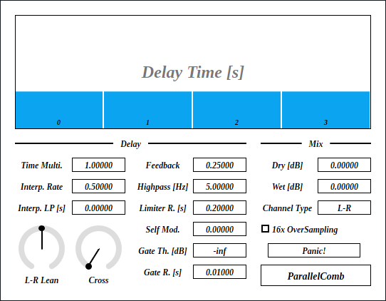

---
lang: en
...

# ParallelComb


ParallelComb is a comb filter which has 4 different delay time and 1 shared buffer. A limiter is inserted on feedback path to make the output somewhat clean. Weird distorsion can be added by modulating delay time using feedback signal amplitude.

- [Download ParallelComb {{ latest_version["ParallelComb"] }} - VST® 3 (github.com)]({{ latest_download_url["ParallelComb"] }}) 

- [Download Presets (github.com)]({{ preset_download_url["ParallelComb"] }})


The package includes following builds:

- Windows 64bit
- Linux 64bit
- macOS universal binary

Linux build is built on Ubuntu 20.04. If you are using distribution other than Ubuntu 20.04, plugin will not likely to run. In this case, please take a look at [build instruction](https://github.com/ryukau/VSTPlugins/blob/master/build_instruction.md).

{{ section["contact_installation_guiconfig"] }}

## Controls
{{ section["gui_common"] }}

{{ section["gui_knob"] }}

{{ section["gui_barbox"] }}

## Caution
When `Feedback` is greater than 0.25, output may diverge, depending on `Delay Time`. In this case, even dithering noise can saturate feedback. To ensure to stop feedback, insert gate before ParallelComb. Make sure that the gate do not output dithering noise.

To stop the feedback, set `Feedback` to 0. `Panic!` button on bottom right can be used to immediately set `Feedback` to 0.

## Block Diagram
If the image is small, use <kbd>Ctrl</kbd> + <kbd>Mouse Wheel</kbd> or "View Image" on right click menu to scale.

Diagram only shows overview. It's not exact implementation.


## Parameters
### Delay
Delay Time \[s\]

:   Delay times in seconds. Following is the equation to calculate delay time.

    ```
    leanL = (L-R Lean) < 0 ? 1 + (L-R Lean) : 1;
    leanR = (L-R Lean) < 0 ? 1              : 1 - (L-R Lean);

    upRate = (16x OverSampling) ? 16 : 1;
    time = (Time Multi.) * upRate * (Delay Time);

    delayTimeL = time * leanL;
    delayTimeR = time * leanR;
    ```

Time Multi.

:   A multiplier to `Delay Time`. Useful to change all the delay time at once.

Interp. Rate

:   Rate limiting value of `Delay Time` interpolation. In other words, `Interp. Rate` represents absolute maximum increment of delay time for each samples. For example, when `Interp. Rate` is set to 0.1, maximum change of delay time in 10 sample is ±0.1 * 10 = ±1 sample.

    `Interp. Rate` affects the character of `Self Mod.`.

Interp. LP \[s\]

:   Smoothing time of lowpass fitler applied to `Delay Time` interplation.

    `Interp. LP` affects the character of `Self Mod.`.

L-R Lean

:   The ratio of `Delay Time` between left and right channels. `L-R Lean` also works when `Channel Type` is `M-S`.

Cross

:   Stereo crossing amount. ParallelComb becomes ping-pong delay when `Cross` knob is turned to rightmost.

Feedback

:   Feedback gain in amplitude.

    When `Feedback` is less than `0.25`, the output will decay and stop at some point. Otherwise, output will most likely not stop. Depending on the combination of `Feedback` and `Delay Time`, there's a situation that output will stop even if `Feedback` exceeds `0.25`.

Highpass \[Hz\]

:   Cutoff frequency of a highpass filter inserted in feedback path.

Limiter R. \[s\]

:   Release time of limiter inserted in feedback path.

    Setting `Limiter R.` to 0 applies soft clipping to output. Feedback signal sounds more clean with longer release time.

Self Mod.

:   Amount of Feedback amplitude to delay time modulation.

    ParallelComb can be used as a distortion or fuzz by setting `Self Mod.` to somewhere between 1 to 10, and setting `Feedback` to 0.

    The character of distortion is affected by the value of `Interp. Rate` and `Interp. LP`.

Gate Th. \[dB\]

:   Gate threshold amplitude.

    Gate closes when the input signal amplitude is below `Gate Th.`

Gate R. \[s\]

:   Release time of gate.

    This can be useful when using ParallelComb as a ordinary effector, to control decay time of wet signal.

### Mix

Dry \[dB\]

:   Input bypass gain.

Wet \[dB\]

:   Output gain of the signal that go through ParallelComb.

Channel Type

:   Select input channel type from left-right (`L-R`) or mid-side (`M-S`).

16x OverSampling

:   When checked, 16 fold over-sampling is enabled. Note that over-sampling increases CPU load for 16 times, and adds resampler computation on top of it.

Panic!

:   When clicked, set `Feedback` to 0 .

## Change Log

- {{version}}
  
  - {{ log }}
  


## Old Versions

N/A.

  
- [ParallelComb {{ x["version"] }} - VST 3 (github.com)]({{ x["url"] }})
  


## License
ParallelComb is licensed under GPLv3. Complete licenses are linked below.

- [https://github.com/ryukau/VSTPlugins/tree/master/License](https://github.com/ryukau/VSTPlugins/tree/master/License)

If the link above doesn't work, please send email to `ryukau@gmail.com`.

### About VST
VST is a trademark of Steinberg Media Technologies GmbH, registered in Europe and other countries.
