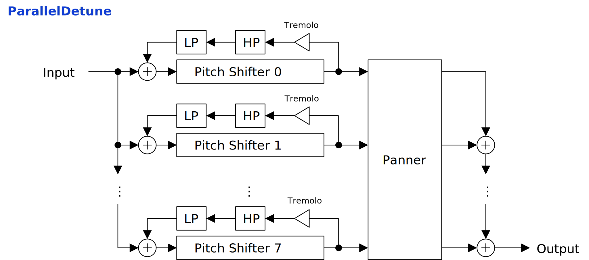

---
lang: ja
...

# ParallelDetune


<ruby>ParallelDetune<rt>パラレル デチューン</rt></ruby> は 8 つのピッチシフタを並列につないだエフェクタです。モノラルの音に薄くかけてコーラスのようにパンを左右に広げることもできます。


- [ParallelDetune {{ latest_version["ParallelDetune"] }} `{{ target }}` - VST 3 をダウンロード (github.com)]({{ download_url }}) 


- [プリセットをダウンロード (github.com)]({{ preset_download_url["ParallelDetune"] }})


{{ section["package"] }}

{{ section["contact_installation_guiconfig"] }}

## 操作
{{ section["gui_common"] }}

{{ section["gui_knob"] }}

{{ section["gui_barbox"] }}

## ブロック線図
図が小さいときはブラウザのショートカット <kbd>Ctrl</kbd> + <kbd>マウスホイール</kbd> や、右クリックから「画像だけを表示」などで拡大できます。

図で示されているのは大まかな信号の流れです。実装と厳密に対応しているわけではないので注意してください。



## ノートイベントの入力
ParallelDetune はノートイベントによってピッチシフトの量を制御することができます。

## パラメータ
角かっこ \[\] で囲まれているのは単位です。以下は ParallelDetune のパラメータで使われている単位の一覧です。

- \[s\]: 秒 (second) 。
- \[oct.\]: オクターブ (octave) 。
- \[st.\]: 半音 (semitone) 。
- \[cent\]: 1/100 半音。

### Shifter
Dry

:   バイパスした入力信号のゲインです。

Wet

:   ParallelDetune を通過した信号のゲインです。

Feedback

:   ピッチシフタの出力をフィードバックするときのゲインです。

HP, LP

:   フィードバック経路のハイパスあるいはローパスフィルタのカットオフ周波数です。

Delay Time \[s\]

:   ピッチシフタのバッファの長さです。表示されている値は大まかな目安です。

    `Delay Time` の値はピッチシフトがかかっていないときだけ正確です。ピッチが変更されるとバッファを読み取る速度が変わるので、表示されている値とディレイ時間が一致しなくなります。

    数値スライダの右のつまみで LFO をかけることができます。

Transpose \[st.\]

:   すべてのピッチシフタで共通して使われるシフト量です。

    すべてのピッチをまとめて変更するときに便利です。

    数値スライダの右のつまみで LFO をかけることができます。

Pan. Spread

:   ピッチシフタの出力を左右に広げて配置する割合です。

    `Pan. Spread` が 0.0 のとき、左右のチャネルは独立して処理されます。 `Pan. Spread` が 1.0 のときはピッチシフタのインデックスごとに左右の信号を加算した上で、インデックスの低いほうから高いほうに向かって、左から右にパンを振ります。

    数値スライダの右のつまみで LFO をかけると音を回すことができます。ただし `Pan. Spread` の LFO の波形はサイン波に固定されています。

    トレモロと組み合わせることで左右の広がり方に変化をつけることができます。

Tremolo Mix, Tremolo Lean

:   各ピッチシフタの出力にトレモロをかけるパラメータです。

    `Tremolo Lean` が 12 時を指しているか、 `Tremolo Mix` が左いっぱいのときにトレモロは無効となります。

    `Tremolo Lean` を左いっぱいか右いっぱいに設定した上で、 `Tremolo Mix` を右いっぱいにするとトレモロをかけた出力のみになります。

    `Pan. Spread` が 0.0 でないときは `Tremolo Lean` の値によって左あるいは右に音が偏ります。

Pitch Shift \[st.\], Fine Tuning \[cent\]

:   ピッチシフトの量です。

    大きく音を変えるときは `Pitch Shift` 、少しだけデチューンを行うときは `Fine Tuning` が使えます。 `Pitch Shift` は ± 1 オクターブ、 `Fine Tuning` は ± 10 セントの幅で調節できます。

Gain

:   各ピッチシフタのゲインです。

Time Multiplier

:   各ピッチシフタのバッファの長さを `Delay Time` から相対的に変更する量です。

HP Offset \[oct.\], LP Offset \[oct.\]

:   各ピッチシフタのハイパスあるいはローパスフィルタのカットオフ周波数を `HP` あるいは `LP` の値から相対的に変更する量です。

### LFO
L-R Offset

:   ステレオチャンネル間で LFO の位相をずらす量です。

Phase

:   LFO の位相に加算される値です。

    `Rate` を左いっぱいに回して LFO の位相を止めているときに `Phase` の値を変更することで、 LFO の位相を制御することができます。また `Smoothing` の値によって `Phase` を動かしたときの応答速度を変えることができます。

Sync.

:   チェックを入れるとテンポ同期を有効にします。また同期間隔が変わったときに再生開始時点から導かれる位相へと同期します。

    チェックが外れているときは 120 BPM に同期した状態と同じになります。ただし、同期間隔が変わったときに位相を調整しなくなります。

Tempo Upper

:   テンポ同期が有効な時の同期間隔を表す分数の分子です。

    `1/1` のときに 1 小節、 4/4拍子であれば `1/4` のときに 1 拍で LFO が 1 周します。 `Rate` が乗算されて周期が変わる点に注意してください。

    以下は同期間隔の計算式です。

    ```
    syncInterval = (Rate) * (Tempo Upper) / (Tempo Lower);
    ```

Tempo Lower

:   テンポ同期が有効な時の同期間隔を表す分数の分母です。

    `Rate` が乗算されて周期が変わる点に注意してください。

Rate

:   同期間隔に乗算される係数です。

    `Tempo Upper` と `Tempo Lower` を変えずに LFO の同期間隔を変えたいときに使えます。

Wave Interp.

:   LFO の波形の補間方法です。

    - `Step`: ホールド。
    - `Linear`: 線形補間。
    - `PCHIP`: 単調な 3 次補間。

    `Step` を選ぶと LFO をシーケンサのように使えます。 `Linear` は `PCHIP` と似たような音になりますが、計算がすこし速いです。デフォルトの `PCHIP` はサンプル間をだいたい滑らかに補間します。

LFO Wave

:   LFO の波形です。

Smoothing \[s\]

:   パラメータのスムーシング時間です。

    例えば `Smoothing` の値を `0.01` と短くするとパラメータの変更がほぼ瞬時に適用されます。ただし `Smoothing` の値を小さくするとパラメータ変更時のポップノイズが目立つようになります。逆に `Smoothing` の値を `1.0` などと長くするとパラメータの値がゆっくりと切り替わるようになります。

## チェンジログ

- {{version}}
  
  - {{ log }}
  


## 旧バージョン
### ParallelDetune

旧バージョンはありません。

  
- [ParallelDetune {{ x["version"] }} - VST 3 (github.com)]({{ x["url"] }})
  


## ライセンス
ParallelDetune のライセンスは GPLv3 です。 GPLv3 の詳細と、利用したライブラリのライセンスは次のリンクにまとめています。

- [https://github.com/ryukau/VSTPlugins/tree/master/License](https://github.com/ryukau/VSTPlugins/tree/master/License)

リンクが切れているときは `ryukau@gmail.com` にメールを送ってください。

### VST® について
VST is a trademark of Steinberg Media Technologies GmbH, registered in Europe and other countries.
