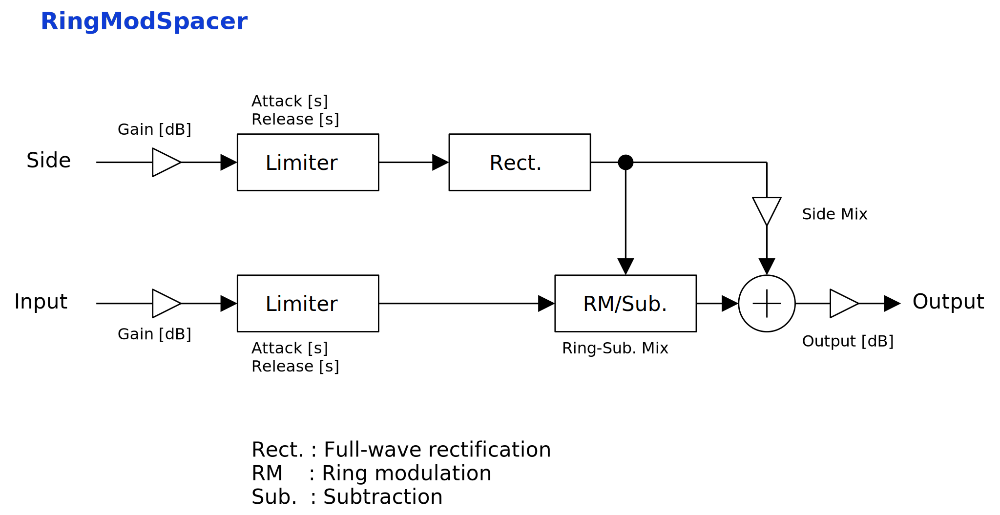

---
lang: en
...

# RingModSpacer

RingModSpacer is a sidechain limiter that adds severe distortion. First, full-wave rectification is applied to sidechain input. Then rectified signal modulates amplitude of main input. The sum of modulated main signal and raw sidechain signal won't clip, when both peak amplitudes are under 0 dB. That's the theory. The hard part is to figure out when to use this effect.


- [Download RingModSpacer {{ latest_version["RingModSpacer"] }} `{{ target }}` - VST 3 (github.com)]({{ download_url }}) 


- [Download Presets (github.com)]({{ preset_download_url["RingModSpacer"] }})


{{ section["package"] }}

{{ section["contact_installation_guiconfig"] }}

## Controls
{{ section["gui_common"] }}

{{ section["gui_knob"] }}

## Usage
First, prepare the main input and the sidechain input. Feed the signal you want to keep clean into the sidechain. Main will be distorted. Please refer to your DAW manual for instructions on how to route to sidechain.

Next, increase `Gain` in Input and Gain section to set peak amplitude of both inputs to 0 dB. This step ensures maximum effect, but can be skipped.

Finally, change `Ring-Sub. Mix`, `Attack`, and `Release` to adjust the texture. Setting is complete after that.

RingModSpacer is a kind of distortion effect. If distortion is undesirable, typical sidechain limiter with threshold set to -∞ dB is a better fit.

## Block Diagram
If the image is small, use <kbd>Ctrl</kbd> + <kbd>Mouse Wheel</kbd> or "View Image" on right click menu to scale.

Diagram only shows overview. It's not exact implementation.

## Parameters
Characters inside of square brackets \[\] represents unit. Following is a list of units used in RingModSpacer.

- \[dB\] : Decibel.
- \[s\] : Second.

### Gain
Output \[dB\]

:   Output gain.

Side Mix

:   Amount to mix sidechain input into output.

Ring-Sub. Mix

:   Mixing amount between ring modulation and differential methods of creating gaps in the waveform.

    When `Ring-Sub. Mix` is 0, ring modulation method is used. When `Ring-Sub. Mix` is 1, difference method is used.

### Misc.
Smoothing \[s\]

:   Time to reach new value after change of parameter.

### Input, Side
Gain\[dB\]

:   Limiter make up gain.

Attack \[s\]

:   Limiter attack time.

Release \[s\]

:   Limiter release time.

## Change Log

- {{version}}
  
  - {{ log }}
  


## Old Versions

N/A.

  
- [RingModSpacer {{ x["version"] }} - VST 3 (github.com)]({{ x["url"] }})
  


## License
RingModSpacer is licensed under GPLv3. Complete licenses are linked below.

- [https://github.com/ryukau/VSTPlugins/tree/master/License](https://github.com/ryukau/VSTPlugins/tree/master/License)

If the link above doesn't work, please send email to `ryukau@gmail.com`.

### About VST
VST is a trademark of Steinberg Media Technologies GmbH, registered in Europe and other countries.
