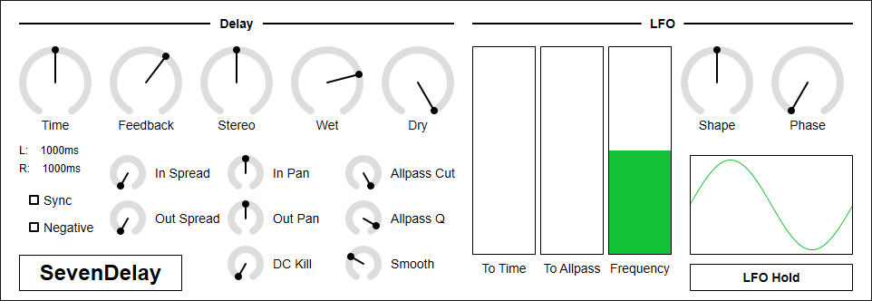

# SevenDelay


SevenDelay is a stereo delay with 7th order lagrange interpolated fractional delay and 7x oversampling.

- [Download SevenDelay 0.1.4 - VST® 3 (github.com)](https://github.com/ryukau/VSTPlugins/releases/download/IterativeSinCluster0.1.0/SevenDelay0.1.4.zip) 

The package includes following builds:

- Windows 64bit
- Linux 64bit
- macOS 64bit

macOS build isn't tested because I don't have Mac. If you found a bug, please file a issue to [GitHub repository](https://github.com/ryukau/VSTPlugins) or send email to `ryukau@gmail.com`.

Linux build is built on Ubuntu 18.0.4 and tested on Bitwig 3.0.3 and Reaper 5.983. Both seems to have problem to display GUI, therefore GUI is currently disabled for Linux build.

## Installation
Place `SevenDelay.vst3` directory to:

- `/Program Files/Common Files/VST3/` for Windows.
- `$HOME/.vst3/` for Linux.
- `/Users/$USERNAME/Library/Audio/Plug-ins/VST3/` for macOS.

DAW may provides additional VST3 directory. For more information, please refer to the manual of the DAW.

### Linux Specific
On Ubuntu 18.0.4, those packages are required.

```bash
sudo apt install libxcb-cursor0  libxkbcommon-x11-0
```

If DAW doesn't recognize the plugin, take a look at `Package Requirements` section of the link below and make sure all the VST3 related package is installed.

- [VST 3 Interfaces: Setup Linux for building VST 3 Plug-ins](https://steinbergmedia.github.io/vst3_doc/vstinterfaces/linuxSetup.html)

REAPER 5.983 on Linux may not recognize SevenDelay. A workaround is to delete a file `~/.config/REAPER/reaper-vstplugins64.ini` and restart REAPER.

## Controls
Knob and slider can do:

- Ctrl + Left Click: Reset value.
- Shift + Left Drag: Fine adjustment.

## Caution
When the value of `Smooth` is near zero and change the value of `Allpass Cut` too fast, SevenDelay may output very loud click noise. This is caused by the filter which becomes unstable when cutoff frequency moves too fast. Recommendation is not to set `Smooth` parameter too low unless you have some specific purpose.

When the value of `Time` is set to minimum and the value of `Feedback` is set to maximum, SevenDelay outputs direct current (DC). To remove DC, Set `DC Kill` to be greater than 1.0.

## Parameters
### Delay
#### Time
Delay time. Range is 0.0001 to 8.0.

- If `Sync` is on and `Time` is less than 1.0, then delay time is set to `Time / 16` beats.
- If `Sync` is on and `Time` is greater or equal to 1.0, then delay time is set to `floor(2 * Time) / 32` beats.
- Otherwise, delay time is set to `Time` seconds.

#### Feedback
Delay feedback. Range is 0.0 to 1.0.

#### Stereo
L/R stereo offset. Range is -1.0 to 1.0.

- If `Stereo` is less than 0.0, then left channel delay time is modified to `timeL * (1.0 + Stereo)`.
- Otherwise, right channel delay time is modified to `timeR * (1.0 + Stereo)`.

#### Wet
Output volume of delayed signal. Range is 0.0 to 1.0.

#### Dry
Output volume of input signal. Range is 0.0 to 1.0.

#### Sync
Toggle tempo sync.

#### Negative
Toggle negative feedback. This may be useful when delay time is very short.

#### In/Out Spread/Pan
Panning controls. Range is 0.0 to 1.0.

`In/Out Spread` controls stereo spread. `In/Out Pan` controls stereo panning.

These parameter can be used for inverse panning, ping-pong delay etc.

- For inverse panning, set `[InSpread, InPan, OutSpread, OutPan]` to `[0.0, 0.5, 1.0, 0.5]`.
- For ping-pong delay, set `[InSpread, InPan, OutSpread, OutPan]` to `[1.0, 0.5, 0.0, 0.5]`.

```
panL = clamp(2 * pan + spread - 1.0, 0.0, 1.0)
panR = clamp(2 * pan - spread, 0.0, 1.0)

signalL = incomingL + panL * (incomingR - incomingL)
signalR = incomingL + panR * (incomingR - incomingL)
```

#### Allpass Cut
SFV allpass filter cutoff frequency. Range is 90.0 to 20000.0.

If `Allpass Cut` is 20000.0, filter will be bypassed.

#### Allpass Q
SFV allpass filter resonance. Range is 0.00001 to 1.0.

#### DC Kill
Cutoff frequency of biquad highpass filter. Range is 1.0 to 120.0.

`DC Kill` removes direct current from delay feedback when the value is set to be greater than 1.0.

#### Smooth
Parameter smoothing. Range is 0.0 to 1.0. Unit is seconds.

Some parameter may produce noise when the value is changed too fast. Increasing `Smooth` reduces those noise.

### LFO
#### To Time
LFO modulation amount to delay time. Range is 0.0 to 1.0.

#### To Allpass
LFO modulation amount to allpass cutoff frequency. Range is 0.0 to 1.0.

#### Freq
LFO frequency. Range is 0.01 to 100.0.

#### Shape
LFO waveform shape. Range is 0.01 to 10.0.

```
sign = 1 if (phase > π),
      -1 if (phase < π),
       0 if (phase == π)
lfo = sign * abs(sin(phase))^shape
```

#### Phase
LFO initial phase. Range is 0.0 to 2π.

LFO phase is reset to `Phase` for each time host starts playing.

#### Hold
Toggle LFO phase hold. This may be useful for live performance.

## Change Log
- 0.1.4
  - Added support for synchronization between multiple GUI instances.
  - Fixed a bug that opening splash screen causes crash.
  - Fixed a bug that crash plugin when reloading.
  - Fixed GUI to follow host automation.
- 0.1.3
  - Fixed smoothing algorithm to prevent blow up.
  - Fixed a bug that LFO Hold on/off was inverted.
  - Removed a modulation from LFO to allpass mixing.
- 0.1.2
  - Changed internal parameter structure.
  - Changed UI looks.
- 0.1.1
  - Disabled GUI for Linux build. This is a makeshift change while tracking down a bug related to VSTGUI.
  - Changed tuning of `To Allpass` of LFO.
  - Changed minimal value of `DC Kill` to 5.0 Hz.
- 0.1.0
  - Initial release.

## License
SevenDelay is licensed under GPLv3. Complete licenses are linked below.

- [https://github.com/ryukau/VSTPlugins/tree/master/License](https://github.com/ryukau/VSTPlugins/tree/master/License)

If the link above doesn't work, please send email to `ryukau@gmail.com`.

### About VST
VST is a trademark of Steinberg Media Technologies GmbH, registered in Europe and other countries.
