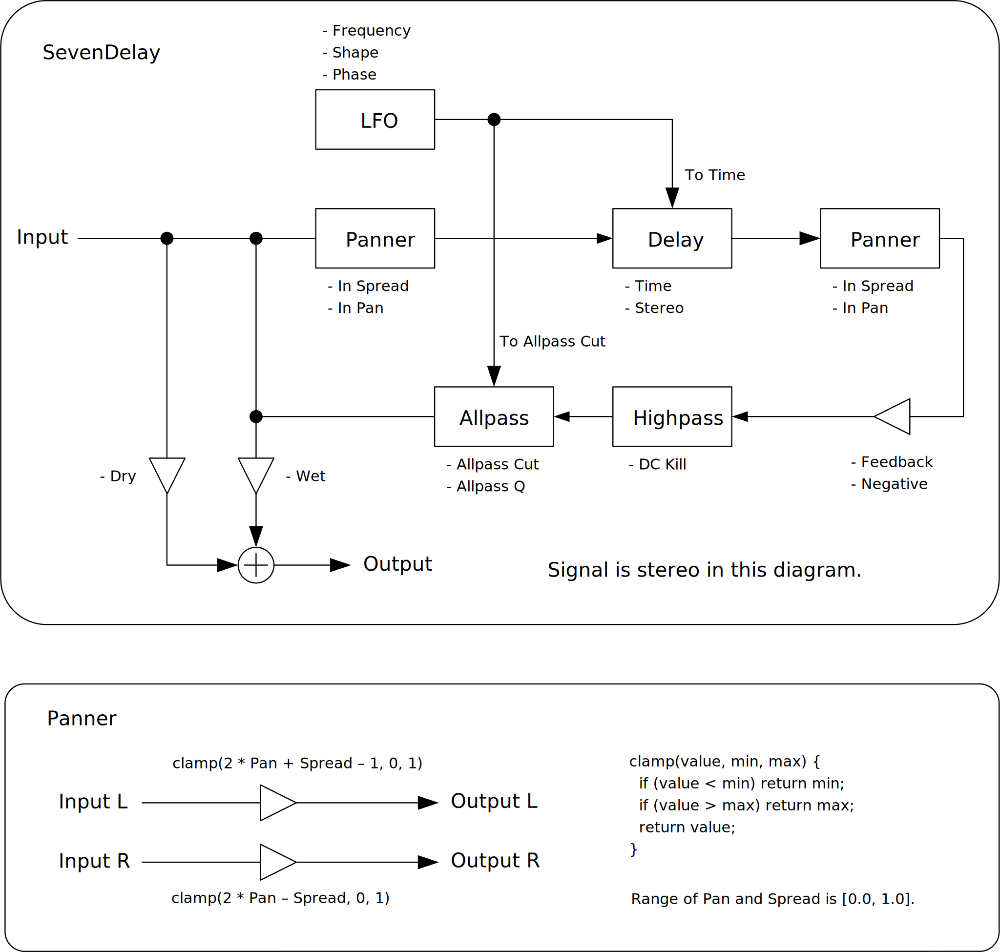

---
lang: ja
...

# SevenDelay


<ruby>SevenDelay<rt>セブン ディレイ</rt></ruby> は7次のラグランジュ補間による分数ディレイと7倍のオーバーサンプリングを使ったステレオディレイです。

- [SevenDelay 0.1.18 をダウンロード - VST® 3 (github.com)](https://github.com/ryukau/VSTPlugins/releases/download/CustomFontOptions/SevenDelay_0.1.18.zip) 
- [プリセットをダウンロード (github.com)](https://github.com/ryukau/VSTPlugins/releases/download/EsPhaser0.1.0/SevenDelayPresets.zip)

パッケージには次のビルドが含まれています。

- Windows 64bit
- Linux 64bit

2022-05-14 の時点ではユニバーサルバイナリのビルドに失敗するので、 macOS ビルドはパッケージに含まれていません。将来的に対応したいですが、お財布の問題で M1 mac 入手のめどが立たないので時期は未定です。

Linux ビルドは Ubuntu 20.04 でビルドしています。もし Ubuntu 20.04 以外のディストリビューションを使っているときは、プラグインが読み込まれないなどの不具合が起こることがあります。この場合は[ビルド手順](https://github.com/ryukau/VSTPlugins/blob/master/build_instruction.md)に沿ってソースコードからビルドしてください。

## 連絡先
何かあれば [GitHub のリポジトリ](https://github.com/ryukau/VSTPlugins)に issue を作るか `ryukau@gmail.com` までお気軽にどうぞ。

[paypal.me/ryukau](https://www.paypal.com/paypalme/ryukau) から開発資金を投げ銭することもできます。現在の目標は macOS と ARM ポートのための M1 mac の購入資金を作ることです。 💸💻

## インストール
### プラグイン
名前が `.vst3` で終わるディレクトリを OS ごとに決められた位置に配置してください。

- Windows では `/Program Files/Common Files/VST3/` に配置します。
- Linux では `$HOME/.vst3/` に配置します。
- macOS では `/Users/$USERNAME/Library/Audio/Plug-ins/VST3/` に配置します。

DAW によっては上記とは別に VST3 をインストールできるディレクトリを提供していることがあります。詳しくは利用している DAW のマニュアルを参照してください。

### プリセット
解凍して出てきたディレクトリを OS ごとに決められた位置に配置すると使えるようになります。

- Windows : `/Users/$USERNAME/Documents/VST3 Presets/Uhhyou`
- Linux : `$HOME/.vst3/presets/Uhhyou`
- macOS : `/Users/$USERNAME/Library/Audio/Presets/Uhhyou`

プリセットディレクトリの名前はプラグインと同じである必要があります。 `Uhhyou` ディレクトリが無いときは作成してください。

### Windows
プラグインが DAW に認識されないときは C++ redistributable をインストールしてみてください。インストーラは次のリンクからダウンロードできます。ファイル名は `vc_redist.x64.exe` です。

- [The latest supported Visual C++ downloads](https://support.microsoft.com/en-us/help/2977003/the-latest-supported-visual-c-downloads)

### Linux
Ubuntu 18.0.4 では次のパッケージのインストールが必要です。

```bash
sudo apt install libxcb-cursor0  libxkbcommon-x11-0
```

もし DAW がプラグインを認識しないときは、下のリンクの `Package Requirements` を参考にして VST3 に必要なパッケージがすべてインストールされているか確認してみてください。

- [VSTGUI: Setup](https://steinbergmedia.github.io/vst3_doc/vstgui/html/page_setup.html)

REAPER の Linux 版がプラグインを認識しないときは `~/.config/REAPER/reaper-vstplugins64.ini` を削除して REAPER を再起動してみてください。

### macOS
**重要**: 現バージョンのパッケージは macOS 未対応です。

**注意**: この節は英語で macOS を使用しているユーザからの報告によって作成されました。日本語でのエラーメッセージが分からなかったので曖昧な書き方になっています。

プラグインの初回起動時に「破損している」という趣旨のメッセージが表示されることがあります。この場合は、ターミナルを開いて、解凍した `.vst3` ディレクトリに次のコマンドを適用してみてください。

```sh
xattr -rc /path/to/PluginName.vst3
```

プラグインは署名されていない (unsigned) 、または公証されていない (un-notarized) アプリケーションとして認識されることがあります。この場合は以下の手順を試してみてください。

1. ターミナルを開いて `sudo spctl --master-disable` を実行。
2. システム環境設定 → セキュリティとプライバシー → 一般 → ダウンロードしたアプリケーションの実行許可、を開いて 「全てのアプリケーションを許可」 を選択。

上記の手順を実行するとシステムのセキュリティが弱くなるので注意してください。元に戻すには以下の手順を実行してください。

1. システム環境設定 → セキュリティとプライバシー → 一般 → ダウンロードしたアプリケーションの実行許可、を開いて 「App Store と認証済みの開発元からのアプリケーションを許可」 を選択。
2. ターミナルを開いて `sudo spctl --master-enable` を実行。

#### 参考リンク
- [How to Fix App “is damaged and can’t be opened. You should move it to the Trash” Error on Mac](https://osxdaily.com/2019/02/13/fix-app-damaged-cant-be-opened-trash-error-mac/)
- [Allowing unsigned/un-notarized applications/plugins in Mac OS | Venn Audio](https://www.vennaudio.com/allowing-unsigned-un-notarized-applications-plugins-in-mac-os/)
- [Safely open apps on your Mac - Apple Support](https://support.apple.com/en-us/HT202491)

## GUI の見た目の設定
初回設定時は手動で次のファイルを作成してください。

- Windows では `/Users/ユーザ名/AppData/Roaming/UhhyouPlugins/style/style.json` 。
- Linux では `$XDG_CONFIG_HOME/UhhyouPlugins/style/style.json` 。
  - `$XDG_CONFIG_HOME` が空のときは `$HOME/.config/UhhyouPlugins/style/style.json` 。
- macOS では `/Users/$USERNAME/Library/Preferences/UhhyouPlugins/style/style.json` 。

既存の色のテーマを次のリンクに掲載しています。 `style.json` にコピペして使ってください。

- [LV2Plugins/style/themes at master · ryukau/LV2Plugins · GitHub](https://github.com/ryukau/LV2Plugins/tree/master/style/themes)

`style.json` の設定例です。

```json
{
  "fontFamily": "Tinos",
  "fontBold": true,
  "fontItalic": true,
  "foreground": "#000000",
  "foregroundButtonOn": "#000000",
  "foregroundInactive": "#8a8a8a",
  "background": "#ffffff",
  "boxBackground": "#ffffff",
  "border": "#000000",
  "borderCheckbox": "#000000",
  "borderLabel": "#000000",
  "unfocused": "#dddddd",
  "highlightMain": "#0ba4f1",
  "highlightAccent": "#13c136",
  "highlightButton": "#fcc04f",
  "highlightWarning": "#fc8080",
  "overlay": "#00000088",
  "overlayHighlight": "#00ff0033"
}
```

### フォントオプション
以下はフォントオプションの一覧です。

- `fontFamily`: フォントファミリ名。
- `fontBold`: ボールドスタイル (太字) を `true` で有効、 `false` で無効。
- `fontItalic`: イタリックスタイル (斜体) を `true` で有効、 `false` で無効。

カスタムフォントを使用するには、プラグインディレクトリの `*.vst3/Contents/Resources/Fonts` に `*.ttf` ファイルを配置します。

**重要**: `fontFamily` 、 `fontBold` 、 `fontItalic` で設定したフォントファミリ名とスタイルの組み合わせが `*.vst3/Contents/Resources/Fonts` 以下のいずれかの `*.ttf` ファイルに含まれていないときは VSTGUI が指定するデフォルトフォントが使用されます。

`fontFamily` が長さ 0 の文字列 `""` のときはフォールバックとして [`"Tinos"`](https://fonts.google.com/specimen/Tinos) に設定されます。長さが 1 以上かつ、存在しないフォントファミリ名が指定されると VSTGUI が指定するデフォルトフォントが使用されます。

ボールドあるいはイタリック以外のスタイルは VSTGUI がサポートしていないので動作確認していません。該当する例としては Noto フォントの Demi Light や、 Roboto フォントの Thin や Black などがあります。

### 色のオプション
16 進数カラーコードを使っています。

- 6 桁の色は RGB 。
- 8 桁の色は RGBA 。

プラグインはカラーコードの 1 文字目を無視します。よって `?102938` や `\n11335577` も有効なカラーコードです。

2 文字目以降のカラーコードの値に `0-9a-f` 以外の文字を使わないでください。

以下は設定できる色の一覧です。設定に抜けがあるとデフォルトの色が使われます。

- `foreground`: 文字の色。
- `foregroundButtonOn`: オンになっているボタンの文字の色。 `foreground` か `boxBackground` のいずれかと同じ値にすることを推奨します。
- `foregroundInactive`: 非アクティブなタブの文字の色。
- `background`: 背景色。
- `boxBackground`: 矩形の UI 部品の内側の背景色。
- `border`: <ruby>縁<rt>ふち</rt></ruby>の色。
- `borderCheckbox`: チェックボックスの縁の色。
- `borderLabel`: パラメータセクションのラベルの左右の直線の色。
- `unfocused`: つまみがフォーカスされていないときの色。
- `highlightMain`: フォーカスされたときの色。スライダの値の表示にも使用されます。
- `highlightAccent`: フォーカスされたときの色。一部のプラグインをカラフルにするために使用されます。
- `highlightButton`: ボタンがフォーカスされたときの色。
- `highlightWarning`: 変更に注意を要する UI がフォーカスされたときの色。
- `overlay`: オーバーレイの色。
- `overlayHighlight`: フォーカスを示すオーバーレイの色。

## 操作
つまみとスライダーでは次の操作ができます。

- Ctrl + 左クリック : 値のリセット。
- Shift + 左ドラッグ : 細かい値の変更。

## 注意
`Smooth` の値が 0 に近く、 `Allpass Cut` の値を速く動かしすぎたときに、非常に大きな音量のクリックノイズが出力されることがあります。これは `Allpass Cut` で使われているフィルタのカットオフ周波数が、速く、大きく、動きすぎると出力が発散する場合があることが原因です。特別な目的がない限り、`Smooth` パラメータを低く設定しすぎないことを推奨します。

`Time` の値が最小かつ `Feedback` の値が最大に設定されると直流信号が出ることがあります。 `DC Kill` を 1.0 より大きな値に設定することで直流信号を除去できます。

## ブロック線図
図が小さいときはブラウザのショートカット <kbd>Ctrl</kbd> + <kbd>マウスホイール</kbd> や、右クリックから「画像だけを表示」などで拡大できます。

図で示されているのは大まかな信号の流れです。実装と厳密に対応しているわけではないので注意してください。



## パラメータ
### Delay
Time

:   ディレイ時間。範囲は 0.0001 から 8.0 です。

    - もし `Sync` が有効で `Time` が 1.0 より小さいときは、ディレイ時間が `Time / 16` 拍に設定されます。
    - もし `Sync` が有効で `Time` が 1.0 以上のときは、ディレイ時間が `floor(2 * Time) / 32` 拍に設定されます。
    - それ以外のときは、ディレイ時間が `time` 秒に設定されます。

Feedback

:   ディレイのフィードバック。範囲は 0.0 から 1.0 です。

Stereo

:   左右のディレイ時間のオフセット。範囲は -1.0 から 1.0 です。

    - もし `Stereo` が 0.0 より小さいときは、左チャンネルのディレイ時間が `timeL * (1.0 + Stereo)` に変更されます。
    - それ以外のときは、右チャンネルのディレイ時間が `timeR * (1.0 - Stereo)` に変更されます。

Wet

:   ディレイ信号の出力音量。範囲は 0.0 から 1.0 。

Dry

:   入力信号の出力音量。範囲は 0.0 から 1.0 。

Sync

:   テンポシンクの切り替え。

Negative

:   負のフィードバックの切り替え。ディレイ時間がとても短いときに役立つかもしれません。

Spread/Pan

:   入力の広がり (In Spread) 、入力のパン (In Pan) 、出力の広がり (Out Spread) 、出力のパン (Out Pan) 。範囲は 0.0 から 1.0 です。

    `In Spread` 、 `Out Spread` はステレオの広がりを制御します。 `In Pan` 、 `Out Pan` はステレオのパンニングを制御します。

    これらのパラメータはパンニングの逆転やピンポンディレイを作るときに使えます。

    - パンニングの逆転を行うには `[InSpread, InPan, OutSpread, OutPan]` を `[0.0, 0.5, 1.0, 0.5]` に設定します。
    - ピンポンディレイにするには `[InSpread, InPan, OutSpread, OutPan]` を `[1.0, 0.5, 0.0, 0.5]` に設定します。

    ```
    signalL = inL + spread * (inR - inL)
    signalR = inL + (1.0f - spread) * (inR - inL)

    if (pan < 0.5f) {
      outL = (0.5f + pan) * signalL + (0.5f - pan) * signalR,
      outR = signalR * 2.0f * pan,
    }
    else {
      outL = signalL * (2.0f - 2.0f * pan)
      outR = (pan - 0.5f) * signalL + (1.5f - pan) * signalR
    }
    ```

Allpass Cut

:   SVF オールパスフィルタのカットオフ周波素。範囲は 90.0 から 20000.0 です。

    `tone` が 20000.0 のとき、フィルタはバイパスされます。

Allpass Q

:   SVF オールパスフィルタのレゾナンス。範囲は 0.00001 から 1.0 です。

    値が大きいほどレゾナンスが強くなります。

DC Kill

:   ハイパスフィルタのカットオフ周波数。範囲は 5.0 から 120.0 です。

    `DC Kill` を 5.0 より大きく設定すればディレイのフィードバックから直流信号を取り除くことができます。

Smooth

:   パラメータ平滑化の度合い。範囲は 0.0 から 1.0 で、単位は秒です。

    パラメータによっては値が急激に変化するとノイズが出ることがあります。 `Smooth` の値を大きめにすることで、値の変化を緩やかにしてノイズを減らすことができます。

### LFO
To Time

:   LFO によるディレイ時間の変調量。範囲は 0.0 から 1.0 です。

To Allpass

:   LFO によるオールパスフィルタのカットオフ周波数の変調量。範囲は 0.0 から 1.0 です。

Frequency

:   LFO の周波数。範囲は 0.01 から 100.0 。

Shape

:   LFO の波形。範囲は 0.01 から 10.0 。

    ```
    sign = 1 if (phase > π),
          -1 if (phase < π),
           0 if (phase == π)
    lfo = sign * abs(sin(phase))^shape
    ```

Phase

:   LFO の位相の初期値。範囲は 0.0 から 2π 。

    LFO の位相はホストが演奏を開始するたびに `Phase` の値にリセットされます。

Hold

:   LFO の位相のホールドの切り替え。ライブ演奏などで役に立つかもしれません。

## チェンジログ
- 0.1.18
  - `style.json` でカスタムフォントを設定するオプションを追加。
- 0.1.17
  - VSTGUI を 4.10 から 4.11 にアップデート。
- 0.1.16
  - フォントを Tinos に変更。
  - GUI のつまみが正しくレンダリングされるように修正。
- 0.1.15
  - リセットが正しく行われるように修正。
  - `bypass` パラメータの挙動を修正。この修正によって、ホストがミュート中のプラグインにノートを送り続けても、ミュート解除とともにそれまでに送られたノートがすべて再生されなくなった。このバグは VST 3 の `bypass` パラメータを正しく実装しているホストでのみ発生していた。
- 0.1.14
  - `In Pan` と `Out Pan` をステレオバランスからステレオパンニングに変更。
  - 時間の値の表示を追加。
- 0.1.13
  - Process context requirements を実装。
- 0.1.12
  - DSP が初期化されているかどうかのチェックを追加。
- 0.1.11
  - カラーコンフィグを追加。
- 0.1.10
  - パラメータの補間を可変サイズのオーディオバッファでも機能する以前の手法に巻き戻した。
- 0.1.9
  - 文字列の描画でクラッシュするバグを修正。
- 0.1.8
  - プラグインタイトルをクリックすると表示されるポップアップの表示方法の変更。
- 0.1.7
  - 非アクティブ化で音が止まるように修正。
- 0.1.6
  - Linux ビルドの GUI を有効化。
- 0.1.5
  - Ableton Live 10.1.6 で特定のノブが揺れ戻るバグを修正。
- 0.1.4
  - 複数の GUI インスタンス間で表示を同期するように変更。
  - スプラッシュスクリーンを開くとクラッシュするバグを修正。
  - リロード時にクラッシュするバグを修正。
  - GUI がホストのオートメーションに応じて更新されるように修正。
- 0.1.3
  - スムーシングのアルゴリズムの値が決められた範囲を超えるバグを修正。
  - LFO Hold のオン・オフが逆転していたバグを修正。
  - オールパスのミキシングにかかっていた LFO による変調を除去。
- 0.1.2
  - 内部のパラメータの構造を変更。
  - UI の見た目を変更。
- 0.1.1
  - Linux ビルドの GUI を無効化。VSTGUI に関するバグが治るまでの応急処置。
  - LFO の `To Allpass` のチューニングを変更。
  - `DC Kill` の最小値を 5.0 Hz に変更。
- 0.1.0
  - 初期リリース。

### 旧バージョン
- [SevenDelay 0.1.16 - VST 3 (github.com)](https://github.com/ryukau/VSTPlugins/releases/download/BasicLimiterAndFDN64Reverb/SevenDelay_0.1.16.zip)
- [SevenDelay 0.1.15 - VST 3 (github.com)](https://github.com/ryukau/VSTPlugins/releases/download/ResetAndMuteFix/SevenDelay_0.1.15.zip)
- [SevenDelay 0.1.14 - VST 3 (github.com)](https://github.com/ryukau/VSTPlugins/releases/download/SevenDelay0.1.14/SevenDelay0.1.14.zip)
- [SevenDelay 0.1.13 - VST 3 (github.com)](https://github.com/ryukau/VSTPlugins/releases/download/CollidingCombSynth0.1.0/SevenDelay0.1.13.zip)
- [SevenDelay 0.1.12 - VST 3 (github.com)](https://github.com/ryukau/VSTPlugins/releases/download/L3Reverb0.1.0/SevenDelay0.1.12.zip)
- [SevenDelay 0.1.11 - VST 3 (github.com)](https://github.com/ryukau/VSTPlugins/releases/download/ColorConfig/SevenDelay0.1.11.zip)
- [SevenDelay 0.1.10 - VST 3 (github.com)](https://github.com/ryukau/VSTPlugins/releases/download/LatticeReverb0.1.0/SevenDelay0.1.10.zip)
- [SevenDelay 0.1.9 - VST 3 (github.com)](https://github.com/ryukau/VSTPlugins/releases/download/DrawStringFix/SevenDelay0.1.9.zip)
- [SevenDelay 0.1.7 - VST 3 (github.com)](https://github.com/ryukau/VSTPlugins/releases/download/EsPhaser0.1.0/SevenDelay0.1.7.zip)
- [SevenDelay 0.1.6 - VST 3 (github.com)](https://github.com/ryukau/VSTPlugins/releases/download/LinuxGUIFix/SevenDelay0.1.6.zip)
- [SevenDelay 0.1.5 - VST 3 (github.com)](https://github.com/ryukau/VSTPlugins/releases/download/EnvelopedSine0.1.0/SevenDelay0.1.5.zip)
- [SevenDelay 0.1.4 - VST 3 (github.com)](https://github.com/ryukau/VSTPlugins/releases/download/IterativeSinCluster0.1.0/SevenDelay0.1.4.zip)

## ライセンス
SevenDelay のライセンスは GPLv3 です。 GPLv3 の詳細と、利用したライブラリのライセンスは次のリンクにまとめています。

- [https://github.com/ryukau/VSTPlugins/tree/master/License](https://github.com/ryukau/VSTPlugins/tree/master/License)

リンクが切れているときは `ryukau@gmail.com` にメールを送ってください。

### VST® について
VST is a trademark of Steinberg Media Technologies GmbH, registered in Europe and other countries.
