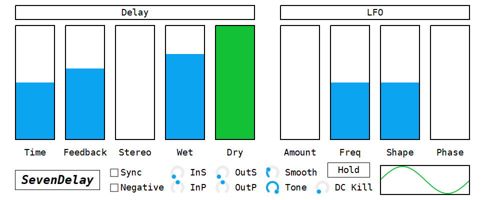

# SevenDelay



SevenDelay (セブンディレイ) は7次のラグランジュ補間による分数ディレイと7倍のオーバーサンプリングを使ったステレオディレイです。

## フォント
SevenDelay は DejaVu フォントを利用しています。 DejaVu フォントは次のページからダウンロードできます。

- [DejaVu Fonts](https://dejavu-fonts.github.io/)

## 注意
`smooth` の値が 0 に近く、 `tone` の値を速く動かしすぎたときに、非常に大きな音量のクリックノイズが出力されることがあります。これは `tone` で使われているフィルタのカットオフ周波数が、速く、大きく、動きすぎると出力が発散する場合があることが原因です。特別な目的がない限り、`smooth` パラメータを低く設定しすぎないことを推奨します。

## パラメータ
### Delay
#### Time
ディレイ時間。範囲は 0.0001 は 8.0 です。

- もし `sync` が有効で `time` が 1.0 より小さいときは、ディレイ時間が `time / 16` 拍に設定されます。
- もし `sync` が有効で `time` が 1.0 以上のときは、ディレイ時間が `floor(2 * time) / 32` 拍に設定されます。
- それ以外のときは、ディレイ時間が `time` 秒に設定されます。

#### Feedback
ディレイのフィードバック。範囲は 0.0 から 1.0 です。

#### Stereo
左右のディレイ時間のオフセット。範囲は -1.0 から 1.0 です。

- もし `stereo` が 0.0 より小さいときは、左チャンネルのディレイ時間が `timeL * (1.0 + stereo)` に変更されます。
- それ以外のときは、右チャンネルのディレイ時間が `timeR * (1.0 + stereo)` に変更されます。

#### Wet
ディレイ信号の出力音量。範囲は 0.0 から 1.0 。

#### Dry
入力信号の出力音量。範囲は 0.0 から 1.0 。

#### Sync
テンポシンクの切り替え。

#### Negative
負のフィードバックの切り替え。ディレイ時間がとても短いときに役立つかもしれません。

#### InS/InP and OutS/OutP
入力の広がり (InS) 、入力のパン (InP) 、出力の広がり (OutS) 、出力のパン (OutP) 。範囲は 0.0 から 1.0 です。

`InS` 、 `OutS` はステレオの広がりを制御します。 `InP` 、 `OutP` はステレオのパンニングを制御します。

これらのパラメータはパンニングの逆転やピンポンディレイを作るときに使えます。

- パンニングの逆転を行うには `[InS, InP, OutS, OutP]` を `[0.0, 0.5, 1.0, 0.5]` に設定します。
- ピンポンディレイにするには `[InS, InP, OutS, OutP]` を `[1.0, 0.5, 0.0, 0.5]` に設定します。

```
panL = clamp(2 * pan + spread - 1.0, 0.0, 1.0)
panR = clamp(2 * pan - spread, 0.0, 1.0)

signalL = incomingL + panL * (incomingR - incomingL)
signalR = incomingL + panR * (incomingR - incomingL)
```

#### Tone
SVF オールパスフィルタのカットオフ周波素。範囲は 90.0 から 20000.0 です。

`tone` が 20000.0 のとき、フィルタはバイパスされます。

### LFO
#### Amount
LFO による変調量。範囲は 0.0 から 1.0 です。

#### Freq
LFO の周波数。範囲は 0.01 から 100.0 。

#### Shape
LFO の波形。範囲は 0.01 から 10.0 。

```
sign = 1 if (phase > π),
      -1 if (phase < π),
       0 if (phase == π)
lfo = sign * abs(sin(phase))^shape
```

#### Phase
LFO の位相の初期値。範囲は 0.0 から 2π 。

LFO の位相はホストが演奏を開始するたびに `phase` の値にリセットされます。

#### Hold
LFO の位相のホールドの切り替え。ライブ演奏などで役に立つかもしれません。

### Misc.
#### Smooth
パラメータ平滑化の度合い。範囲は 0.0 から 1.0 で、単位は秒です。

## ライセンス
SevenDelay のライセンスは GPLv3 です。なのでユーザはソースコードを自由に入手することができて、どんな目的にでも使うことができます。 VST3 SDK を開発して GPLv3 の下で公開された Steinberg と関係者の方々に多大な感謝の意を表します。

## VST compatible logo
この節は VST compatible logo の表示義務を満たすために設けられています。


