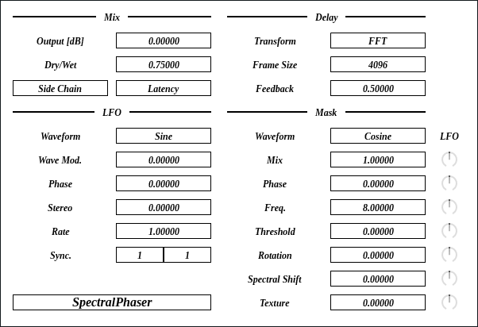
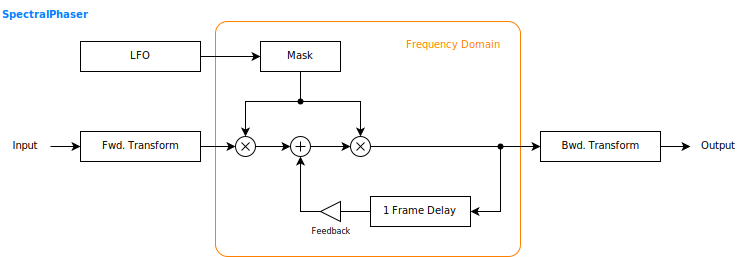

---
lang: ja
...

# SpectralPhaser

<ruby>SpectralPhaser<rt>スペクトラル フェイザ</rt></ruby> は周波数領域でマスクをかけることでフェイザのような音が出るエフェクタです。 FFT に加えて、高速 Walsh-Hadamard 変換 (FWHT) 、 Haar 変換といった直行変換が使えます。


- [SpectralPhaser {{ latest_version["SpectralPhaser"] }} `{{ target }}` - VST 3 をダウンロード (github.com)]({{ download_url }}) 


- [プリセットをダウンロード (github.com)]({{ preset_download_url["SpectralPhaser"] }})


**注意**: プリセットはサンプリング周波数が 48000 Hz でなければ想定された音が出ません。

{{ section["package"] }}

{{ section["contact_installation_guiconfig"] }}

## 操作
{{ section["gui_common"] }}

{{ section["gui_knob"] }}

## ブロック線図
図が小さいときはブラウザのショートカット <kbd>Ctrl</kbd> + <kbd>マウスホイール</kbd> や、右クリックから「画像だけを表示」などで拡大できます。

図で示されているのは大まかな信号の流れです。実装と厳密に対応しているわけではないので注意してください。

## パラメータ
角かっこ \[\] で囲まれているのは単位です。以下は単位の一覧です。

- \[dB\] : デシベル (decibel) 。

### Mix
Output \[dB\]

:   出力ゲインです。

Dry/Wet

:   入力と、エフェクトのかかった出力の比率です。

    0 のとき入力のみ、 1 のときエフェクト出力のみになります。

Side Chain

:   有効にするとサイドチェイン入力を周波数マスクに使います。

    `Latency` と同時に有効にすることでボコーダーになります。このとき `Frame Size` は 2048 あたりに設定してください。 `Frame Size` が小さいと効果が薄くなります。

    ボコーダーとしての使用は大きなレイテンシが出るため、リアルタイム向けではありません。

Latency

:   有効にすると `Frame Size` で設定したサンプル数をレイテンシとして DAW に伝えます。

### LFO
Waveform

:   LFO の波形です。

Wave Mod.

:   LFO の波形を変えるパラメータです。

Phase

:   LFO の初期位相です。

Stereo

:   LFO の位相を左右でずらす量です。

Rate

:   LFO の周波数の倍率です。

    テンポシンクを少しずらしたいときなどに使えます。

Sync.

:   LFO の周波数の同期間隔です。

    左右の数は、それぞれ拍子記号の上下の数字と対応しています。 (`左 / 右` = `上 / 下`)

    プラグインは音楽的な経過時間を拍数として受け取ります。そして 1 拍は拍子記号によって長さが相対的に変わります。以下に例をいくつか挙げます。

    - 1 / 1 のとき 1 小節に同期。
    - 拍子が N / 4 であれば `Sync.` が 1 / 4 のとき 1 拍 (4 分音符) に同期。
    - 拍子が N / 6 であれば `Sync.` が 1 / 6 のとき 1 拍に同期。
    - 拍子が N / 4 であれば `Sync.` が 3 / 16 のとき 3 / 4 拍 (付点 8 分音符) に同期。

    曲中で拍子記号が変わると、変わった直後に一時的に同期がずれることがあります。

### Delay
Transform

:   直行変換の種類です。

    通常は FFT を選んでください。 FWHT と Haar はざらざらとした音になります。

    **注意**: `Transform` を変更すると `Frame Size` の長さだけ音が止まります。爆発的に大きい音を避けるためにバッファがリセットされることが原因です。

Frame Size

:   直行変換を行うフレームの長さで、単位はサンプル数です。

    この値がそのままディレイ時間になります。

    `Latency` を有効にしたときは `Frame Size` と同じサンプル数のレイテンシを DAW に伝えます。

    `Frame Size` が大きく、 DAW のバッファサイズが小さいとき、音がぶつぶつと途切れるようになることがあるかもしれません。このときは計算が間に合っていないので `Frame Size` を小さくしてください。

Feedback

:   ディレイのフィードバックです。

### Mask
パラメータの右側の小さいつまみで LFO による変調量を変えられます。

Waveform

:   周波数マスクの波形です。

Mix

:   周波数マスクをかける割合です。

    0 のときマスクなし、 1 のとき完全にマスクします。

Phase

:   周波数マスクの波形の位相です。

    `Phase` を LFO で変調するとフェイザと似たような音が出ます。

Freq.

:   周波数マスクの波形の周波数です。

    `Freq.` が高くなるほど、ノッチの数が多くなります。

    `Freq.` を 0 にすると周波数マスクが無効になります。

Threshold

:   周波数マスクの値が `Threshold` よりも小さいとき、その周波数を 0 にします。

Rotation

:   周波数領域で位相を回転する量です。

    というのは `Transform` が FFT のときだけで、他の直行変換が選択されているときは `Rotation` に応じて周波数成分の入れ替えが行われます。

Spectral Shift

:   フィードバックごとに周波数成分をシフトする量です。

Octave Down

:   フィードバックごとに周波数成分を約 1 オクターブ下に移す割合です。

    設定によっては効果があまり出ません。 `Feedback` を 1 、 `Octave Down` を 0.1 あたりに設定すると効果が出ます。

## チェンジログ

- {{version}}
  
  - {{ log }}
  


## 旧バージョン

旧バージョンはありません。

  
- [SpectralPhaser {{ x["version"] }} - VST 3 (github.com)]({{ x["url"] }})
  


## ライセンス
SpectralPhaser のライセンスは GPLv3 です。 GPLv3 の詳細と、利用したライブラリのライセンスは次のリンクにまとめています。

- [https://github.com/ryukau/VSTPlugins/tree/master/License](https://github.com/ryukau/VSTPlugins/tree/master/License)

リンクが切れているときは `ryukau@gmail.com` にメールを送ってください。

### VST® について
VST is a trademark of Steinberg Media Technologies GmbH, registered in Europe and other countries.
