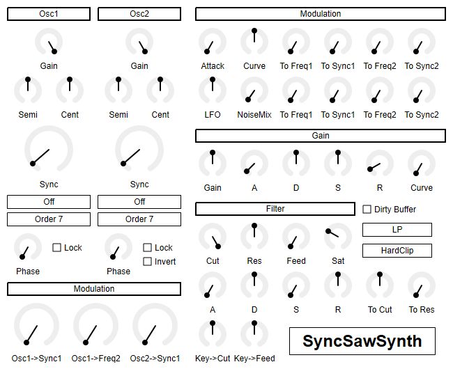
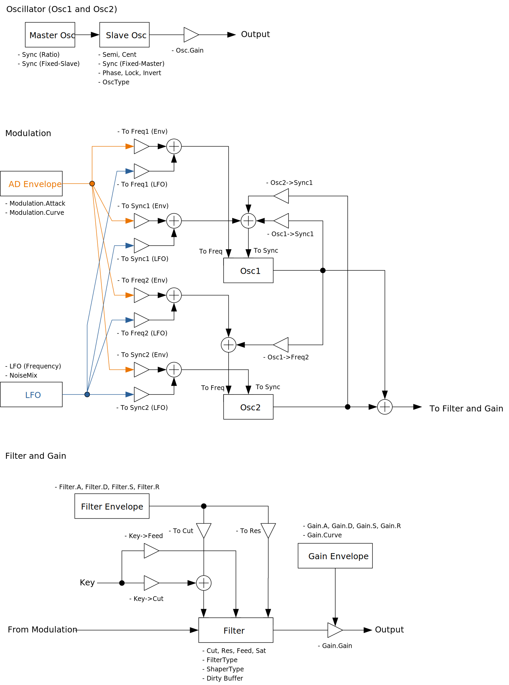

# SyncSawSynth


SyncSawSynth is a 32 voice polyphonic synthesizer using up to 10th order PTR sawtooth oscillator. Just a basic synthesizer but very easy to make a noise similar to low battery sound of some toys.

- [Download SyncSawSynth 0.1.11 - VST® 3 (github.com)](https://github.com/ryukau/VSTPlugins/releases/download/DrawStringFix/SyncSawSynth0.1.11.zip) 
- [Download Presets (github.com)](https://github.com/ryukau/VSTPlugins/releases/download/EnvelopedSine0.1.0/SyncSawSynthPresets.zip)

The package includes following builds:

- Windows 64bit
- Linux 64bit
- macOS 64bit

macOS build isn't tested because I don't have Mac. If you found a bug, please file a issue to [GitHub repository](https://github.com/ryukau/VSTPlugins) or send email to `ryukau@gmail.com`.

Linux build is built on Ubuntu 18.0.4 and tested on Bitwig 3.1.2 and Reaper 6.03. Bitwig 3.1.2 seems to have a bug that occasionally blackouts GUI.

## Installation
### Plugin
Place `*.vst3` directory to:

- `/Program Files/Common Files/VST3/` for Windows.
- `$HOME/.vst3/` for Linux.
- `/Users/$USERNAME/Library/Audio/Plug-ins/VST3/` for macOS.

DAW may provides additional VST3 directory. For more information, please refer to the manual of the DAW.

### Presets
Extract preset zip, then place preset directory to the OS specific path:

- Windows : `/Users/$USERNAME/Documents/VST3 Presets/Uhhyou`
- Linux : `$HOME/.vst3/presets/Uhhyou`
- macOS : `/Users/$USERNAME/Library/Audio/Presets/Uhhyou`

Preset directory name must be the same as the plugin. Make `Uhhyou` directory if it does not exist.

### Windows Specific
If DAW doesn't recognize the plugin, try installing C++ redistributable (`vc_redist.x64.exe`). Installer can be found in the link below.

- [The latest supported Visual C++ downloads](https://support.microsoft.com/en-us/help/2977003/the-latest-supported-visual-c-downloads)

### Linux Specific
On Ubuntu 18.0.4, those packages are required.

```bash
sudo apt install libxcb-cursor0  libxkbcommon-x11-0
```

If DAW doesn't recognize the plugin, take a look at `Package Requirements` section of the link below and make sure all the VST3 related package is installed.

- [VST 3 Interfaces: Setup Linux for building VST 3 Plug-ins](https://steinbergmedia.github.io/vst3_doc/vstinterfaces/linuxSetup.html)

REAPER on Linux may not recognize the plugin. A workaround is to delete a file `~/.config/REAPER/reaper-vstplugins64.ini` and restart REAPER.

## Controls
Knob and slider can do:

- Ctrl + Left Click: Reset value.
- Shift + Left Drag: Fine adjustment.

Right clicking on controllable object popups a context menu provided by DAW.

## Caution
The peak value of gain envelope is determined by the length of attack. When gain envelope attack is small, the peak may be a bit higher than usual.

When turning `Dirty Filter` on, a glitch may pops at the timing of note on.

Some parameter configuration leads to massive DC offset. To be stay safe, it's better to insert high-pass filter after SyncSawSynth. Monitoring output with oscilloscope is recommended.

## Terms
An oscillator of SyncSawSynth internally have 2 separate oscillators. One is for generating waveform, and other is to trigger hardsync. In term of hardsync, waveform generator is called slave and oscillator used to trigger is called master.

## Block Diagram
If the image is small, use <kbd>Ctrl</kbd> + <kbd>Mouse Wheel</kbd> or "View Image" on right click menu to scale.

Diagram only shows overview. It's not exact implementation.



## Parameters
### Osc
#### Gain
Oscillator gain. Range is 0.0 to 1.0.

#### Semi
Oscillator pitch. Range is -24.0 to 24.0. Unit is semitone.

The value will be floored. For example 6.3 becomes to 6 and -11.5 becomes to -12.

#### Cent
Oscillator pitch. Range is -100.0 to 100.0. Unit is cent.

#### Sync and SyncType
Meaning of the value of `Sync` will be changed by `SyncType`. Range of `Sync` is 0.01 to 16.0.

`SyncType` has 4 options.

- `Off`
- `Ratio`
- `Fixed-Master`
- `Fixed-Slave`

Option `Off` turns off hardsync by setting master frequency to 0 Hz. However, if the value of `Osc*->Sync1` is greater than 0, phase of master will be moved and possibly triggers hardsync. When `SyncType` is `Off`, the value of `Sync` won't be used.

Option `Ratio` sets note frequency to master frequency. Slave frequency will be the value of `Sync` multiplied by master frequency. Also the destinations of modulation from `To Freq/Sync` will be swapped.

Option `Fixed-Master` sets note frequency to slave frequency. Master frequency will be only determined by the value of `Sync`.

Option `Fixed-Slave` sets note frequency to master frequency. Slave frequency will be only determined by the value of `Sync`.

Below is equation of conversion of the value `Sync` to freqeuncy used for `Fixed-Master` and `Fixed-Slave`.

```
frequency = 2 * Sync^3
```

#### OscType
Oscillator waveform.

0 to 10th order PTR sawtooth oscillator and sine wave are available.

#### Phase
Oscillator phase. Range is 0.0 to 1.0.

If `Lock` is checked, phase will be reset for each note on.

If `Invert` on `Osc2` is checked, phase will be inverted by changing sign of the output of `Osc2`.

#### Unison
When checked, add same tone with different phase for each note. CPU load will also be doubled.

#### Number of Voice
Maximum polyphony. Lowering the number of this option reduces CPU load.

### Modulation
#### Osc1->Sync1
Modulation from `Osc1` output to `Osc1` master frequency. Range is 0.0 to 1.0.

#### Osc1->Freq2
Modulation from `Osc1` output to `Osc2` slave frequency. Range is 0.0 to 1.0.

#### Osc2->Sync1
Modulation from `Osc2` output to `Osc1` master frequency. Range is 0.0 to 1.0.

#### Attack
Attack of modulation AD envelope. Range is 0.0 to 4.0. Unit is seconds.

Equation of AD envelope.

```
env(t) := t^a * exp(-b * t)

t: time.
a, b: some constants.
```

#### Curve
Curve of modulation AD envelope. Range is 1.0 to 96.0.

The length of decay is depends on the value of Curve.

#### To Freq1 (AD Envelope)
Modulation from AD envelope to `Osc1` slave frequency. Range is 0.0 to 16.0.

#### To Sync1 (AD Envelope)
Modulation from AD envelope to `Osc1` master frequency. Range is 0.0 to 16.0.

#### To Freq2 (AD Envelope)
Modulation from AD envelope to `Osc２` slave frequency. Range is 0.0 to 16.0.

#### To Sync2 (AD Envelope)
Modulation from AD envelope to `Osc２` master frequency. Range is 0.0 to 16.0.

#### LFO
LFO Frequency. Range is 0.01 to 20.0. Unit is Hz.

#### NoiseMix
Ratio of LFO and pink noise. Range is 0.0 to 1.0.

If the value is 0.0, the output becomes LFO only. If the value is 1.0, the output becomes pink noise only.

Note that modulation of pink noise causes some nasty spikes. To avoid spikes, set the value of `To Freq/Sync` to lower than 1.0. Spike is clipped to avoid exceeding 0dB.

#### To Freq1 (LFO/Noise)
Modulation from LFO/Noise to `Osc1` slave frequency. Range is 0.0 to 16.0.

#### To Sync1 (LFO/Noise)
Modulation from LFO/Noise to `Osc1` master frequency. Range is 0.0 to 16.0.

#### To Freq2 (LFO/Noise)
Modulation from LFO/Noise to `Osc２` slave frequency. Range is 0.0 to 16.0.

#### To Sync2 (LFO/Noise)
Modulation from LFO/Noise to `Osc２` master frequency. Range is 0.0 to 16.0.

### Gain
#### Gain
Gain of the synthesizer output. Range is 0.0 to 1.0.

#### A
Length of gain envelope attack. Range is 0.0001 to 16.0. Unit is seconds.

#### D
Length of gain envelope decay. Range is 0.0001 to 16.0. Unit is seconds.

#### S
Value of gain envelope sustain. Range is 0.0 to 1.0.

#### R
Length of gain envelope release. Range is 0.0001 to 16.0. Unit is seconds.

#### Curve
Curve of gain envelope. Range is 0.0 to 1.0.

This curve is linear interpolation between direct output and saturated output.

```
gainEnv(t) := expEnv(t) * (tanh(3 * Curve * expEnv(t)) - expEnv(t))
```

### Filter
#### Cut
Filter cutoff frequency. Range is 20.0 to 20000.0. Unit is Hz.

#### Res
Biquad filter resonance. Range is 0.001 to 1.0.

When the value is set to minimum, the output volume will be very small.

#### Feed
Feedback of serial filter section. Range is 0.0 to 1.0.

Internally, 4 biquad filters are serially connected. Feedback send the last output of the filter to first biquad filter in serial section.

#### Sat
Saturation of filter. Range is 0.01 to 8.0.

This value is multiplied to the sum of input signal and feedback before going into wave shaper.

```
filterIn = shaper(Sat * (input - Feed * filterOut))
```

#### Dirty Buffer
If `Dirty Buffer` is not checked, the buffer of filter will be cleared for each note on.

Note that while `Dirty Filter` is turned on, sometimes a glitch pops up at note on.

#### FilterType
Type of filter.

- `LP` : Low-pass
- `HP` : High-pass
- `BP` : Band-pass
- `Notch` : Also called as band-stop
- `Bypass`

#### ShaperType
Type of wave shaper used for filter saturation.

```
HardClip(x) := clamp(x, -1.0, 1.0)
Tanh(x)     := tanh(x)
ShaperA(x)  := sin(2 * pi * x) / (1 + 10 * x * x)
ShaperB(x)  := 0.7439087749328765 * x^3 * exp(-abs(x))
```

#### A
Lenght of filter envelope attack. Range is 0.0001 to 16.0 。単位は.

#### D
Lenght of filter envelope decay. Range is 0.0001 to 16.0 。単位は.

#### S
Value of filter envelope sustain. Range is 0.0 to 1.0.

#### R
Lenght of filter envelope release. Range is 0.0001 to 16.0 。単位は.

#### To Cut
Modulation from filter envelope to cutoff frequency. Range is -1.0 to 1.0.

#### To Res
Modulation from filter envelope to resonance. Range is 0.0 to 1.0.

#### Key->Cut
Modulation from MIDI note number to cutoff frequency. Range is -1.0 to 1.0.

#### Key->Feed
Modulation from MIDI note number to feedback. Range is -1.0 to 1.0.

## Change Log
- 0.1.11
  - Fixed a bug that cause crash when drawing string.
- 0.1.10
  - Changed display method for pop-up which shows up by clicking plugin title.
- 0.1.9
  - Fixed a bug that was causing noise on PreSonus Studio One 4.6.1.
- 0.1.8
  - Enabled GUI for Linux build.
- 0.1.7
  - Added support for synchronization between multiple GUI instances.
  - Fixed a bug that opening splash screen causes crash.
  - Fixed GUI to follow host automation.
- 0.1.6
  - Fixed note on/off event to be triggered at exact timing.
- 0.1.5
  - Fixed smoothing algorithm to prevent blow up.
- 0.1.4
  - Changed semitone control to NumberKnob.
- 0.1.3
  - Added unison parameter.
  - Added number of voice parameter.
  - Changed internal parameter structure.
  - Changed UI looks.
  - Made filter and math function faster.
- 0.1.1
  - Added pitchbend support.
  - Added double precision PTR options.
  - Fix a bug that releasing gain envelope while attacking jumps the output value of gain envelope to sustain level.
- 0.1.0
  - Initial release.

### Old Versions
- [SyncSawSynth 0.1.9 - VST 3 (github.com)](https://github.com/ryukau/VSTPlugins/releases/download/EsPhaser0.1.0/SyncSawSynth0.1.9.zip)
- [SyncSawSynth 0.1.8 - VST 3 (github.com)](https://github.com/ryukau/VSTPlugins/releases/download/LinuxGUIFix/SyncSawSynth0.1.8.zip)
- [SyncSawSynth 0.1.7 - VST 3 (github.com)](https://github.com/ryukau/VSTPlugins/releases/download/IterativeSinCluster0.1.0/SyncSawSynth0.1.7.zip)

## License
SyncSawSynth is licensed under GPLv3. Complete licenses are linked below.

- [https://github.com/ryukau/VSTPlugins/tree/master/License](https://github.com/ryukau/VSTPlugins/tree/master/License)

If the link above doesn't work, please send email to `ryukau@gmail.com`.

### About VST
VST is a trademark of Steinberg Media Technologies GmbH, registered in Europe and other countries.
