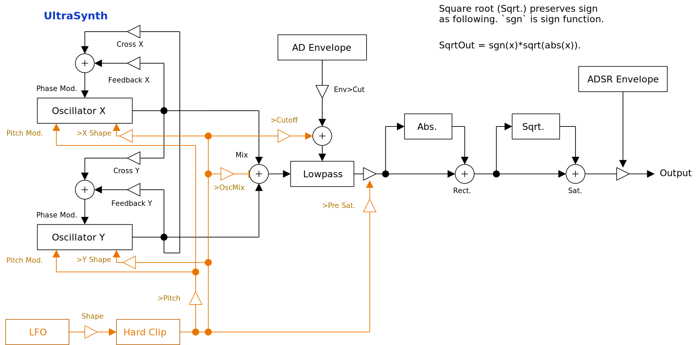

---
lang: en
...

# UltraSynth


UltraSynth is an ordinary synthesizer except 64-fold oversampling that is the same one used in UltrasonicRingMod. Because of the high oversampling ratio, modulation sound is okay. However CPU load is high.

- [Download UltraSynth {{ latest_version["UltraSynth"] }} - VST® 3 (github.com)]({{ latest_download_url["UltraSynth"] }}) 

- [Download Presets (github.com)]({{ preset_download_url["UltraSynth"] }})


The package includes following builds:

- Windows 64bit
- Linux 64bit
- macOS universal binary

Linux build is built on Ubuntu 20.04. If you are using distribution other than Ubuntu 20.04, plugin will not likely to run. In this case, please take a look at [build instruction](https://github.com/ryukau/VSTPlugins/blob/master/build_instruction.md).

{{ section["contact_installation_guiconfig"] }}

## Controls
{{ section["gui_common"] }}

{{ section["gui_knob"] }}

## Block Diagram
If the image is small, use <kbd>Ctrl</kbd> + <kbd>Mouse Wheel</kbd> or "View Image" on right click menu to scale.

Diagram only shows overview. It's not exact implementation.



## Parameters
### Gain
Gain

:   Output gain.

Rect.

:   Mixing ratio of full wave rectified signal.

Sat.

:   Mixing ratio of the signal distorted by square root.

A, D, S, R

:   Gain envelope parameters.

    - `A`: Attack time.
    - `D`: Decay time.
    - `S`: Sustain amplitude.
    - `R`: Release time after note-off.

### Oscillator
UltraSynth has 2 oscillators. The parameters of each oscillator matchs to X or Y axis of X-Y pad.

Pitch

:   Oscillator pitch.

    The value is not visible on GUI, but the unit is cent, which is 1/100 of a semitone.

Wave Shape

:   Oscillator wave shape.

    When `Saw-Pulse` is 0, the value [0, 0.5, 1] matches to [Upward Sawtooth, Triangle, Downward Sawtooth]. When `Saw-Pulse` is 1, the value becomes the duty ratio of pulse wave.

Saw-Pulse

:   Mixing ratio of sawtooth and pulse wave in a oscillator.

    When `Saw-Pulse` is 0, oscillator outputs sawtooth wave. When `Saw-Pulse` is 1, oscillator outputs pulse wave.

X Oct., Y Oct.

:   Pitch of oscillator in octave.

Mix

:   Mixing ratio of 2 oscillators.

    When `Mix` is 0, you can only hear oscillator X output. When `Mix` is 1, you can only hear oscillator Y output.

LP\>Osc.X

:   Modulation gain of filter output to oscillator X.

Cross PM

:   Cross phase modulation amount.

    Horizontal (X) axis constrols Y to X modulation, and vertical (Y) axis controls X to Y modulation.

Feedback PM

:   Feedback phase modulation amount.

    Horizontal (X) axis constrols X to X modulation, and vertical (Y) axis controls Y to Y modulation.

### Filter
Lowpass filter parameters.

Cut

:   Cutoff frequency of lowpass filter.

Q

:   Q factor of lowpass filter.

A, D

:   Cutoff envelope parameters.

    - `A`: Attack time.
    - `D`: Decay time.

Env\>Cut

:   Modulation amount from envelope to cutoff frequency.

Key

:   Cutoff tuning ratio depending on the pitch of note.

    When set to leftmost, cutoff frequency doesn't change regardless of the pitch of note. When set to rightmost, cutoff frequency precisely follows the pitch of note.

### Tuning
Semitone, Cent

:   Pitch in semitone or cent. 1 semitone equals to 100 cents.

Equal Temp., A4 \[Hz\]

:  `Equal Temp.` is abbreviation of equal temperament (ET). When `Equal Temp.` is 12, then the tuning becomes standard 12 ET. Setting `Equal Temp.` to less than 12 might increase the range of note that doesn't change sound, or doesn't output sound. This is due to the internal pitch becomes too high or too low.

    `A4 [Hz]` is freqeuncy of note A4.

P.Bend Range \[st.\]

:   Range of pitch bend in semitone.

### LFO
Rate

:   Rate of LFO.

    When `Sync.` is turned off, `Rate` becomes the frequency of LFO. When `Sync.` is turned on, `Rate` becomes the multiplier to the interval of synchronization. For example, if `Rate` is 2 and `Sync.` is turned off, LFO cycles at 2 Hz. If `Rate` is 2 and `Sync.` is turned on, the interval of synchronization becomes half (1/2).

Shape

:   LFO distortion amount.

    The wave shape becomes close to square wave when `Shape` is set to rightmost.

Retrigger

:   When checked, it resets LFO phase to 0 for each note-on.

Sync.

:   When checked, it enables tempo synchronization.

Sync. Upper, Sync. Lower

:   These are the numbers on the right side of `Sync.` checkbox. They indicates the interval of synchronization in beats.

    Note that `Sync. Upper` and `Sync. Lower` are not time signature, but beats in fractional number. For example, if time signature is set to 3/4, and `Sync. Upper` and `Sync. Lower` are both set to 1, LFO cycles 3 time in a bar.

    Following is the calculation of the interval of synchronization.

    ```
    syncIntervalInBeats = (Sync. Upper) / (Sync. Lower).
    ```

\>Pitch

:   LFO modulation amount for oscillator pitch.

\>OscMix

:   LFO modulation amount for `Oscillator -> Mix`.

\>Cutoff

:   LFO modulation amount for filter cutoff frequency.

\>Pre Sat.

:   LFO modulation amount for the amplitude of signal right before passing `Sat.`.

\>X Shape, \>Y Shape

:   LFO modulation amount for `Wave Shape`.

### Misc.
Phase Reset

:   When checked, it resets oscillator phase at note-on, only if gain envelope is resting.

    Gain envelope rests when the output value after release becomes sufficiently small. Therefore, if note-on is given when you are still perceiving release of the previous note, the oscillator phase won't reset because gain envelope is not resting. Also note that when release time is long, it's hard to determine if gain envelope is resting or not by using hearing.

Slide

:   Time to slide the pitch of latest note.

## Change Log

- {{version}}
  
  - {{ log }}
  


## Old Versions

N/A.

  
- [UltraSynth {{ x["version"] }} - VST 3 (github.com)]({{ x["url"] }})
  


## License
UltraSynth is licensed under GPLv3. Complete licenses are linked below.

- [https://github.com/ryukau/VSTPlugins/tree/master/License](https://github.com/ryukau/VSTPlugins/tree/master/License)

If the link above doesn't work, please send email to `ryukau@gmail.com`.

### About VST
VST is a trademark of Steinberg Media Technologies GmbH, registered in Europe and other countries.
