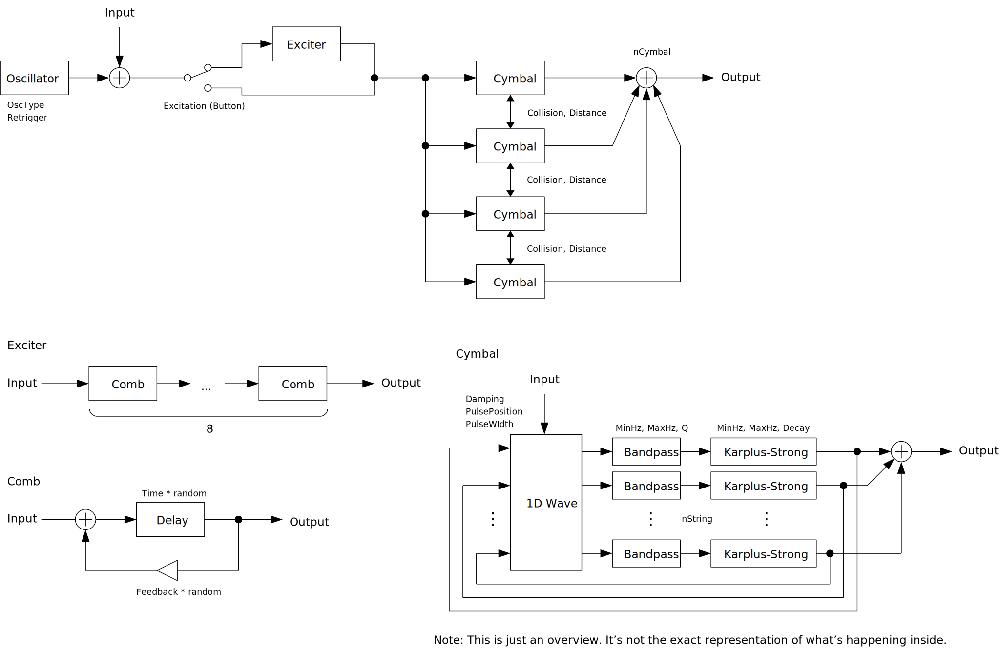

---
lang: ja
...

# WaveCymbal

<ruby>WaveCymbal<rt>ウェイブ シンバル</rt></ruby> は banded wave-guide という手法を用いてシンバルの音が鳴るはずだったシンセサイザです。実際のところはシンバルというよりも、アスファルトの上でトタン板や紐につないだ空き缶を引きずったときのような音が出ます。

- [WaveCymbal {{ latest_version["WaveCymbal"] }} をダウンロード - VST® 3 (github.com)]({{ latest_download_url["WaveCymbal"] }}) 

- [プリセットをダウンロード (github.com)]({{ preset_download_url["WaveCymbal"] }})


パッケージには次のビルドが含まれています。

- Windows 64bit
- Linux 64bit
- macOS universal binary

Linux ビルドは Ubuntu 20.04 でビルドしています。もし Ubuntu 20.04 以外のディストリビューションを使っているときは、プラグインが読み込まれないなどの不具合が起こることがあります。この場合は[ビルド手順](https://github.com/ryukau/VSTPlugins/blob/master/build_instruction.md)に沿ってソースコードからビルドしてください。

{{ section["contact_installation_guiconfig"] }}

## 操作
{{ section["gui_common"] }}

{{ section["gui_knob"] }}

## 注意
マウスカーソルを合わせたときに赤くハイライトされるパラメータは音量を大きく変えることができます。これらのパラメータは Shift + 左ドラッグを使ってゆっくりと変更することを推奨します。また突然の音割れを防ぐために、WaveCymbaの後には必ずリミッタをインサートすることを推奨します。

## ブロック線図
図が小さいときはブラウザのショートカット <kbd>Ctrl</kbd> + <kbd>マウスホイール</kbd> や、右クリックから「画像だけを表示」などで拡大できます。

図で示されているのは大まかな信号の流れです。実装と厳密に対応しているわけではないので注意してください。

## パラメータ
### Gain
出力音量です。

### Excitation
インパルスをトーンに変えるショートディレイです。

Feedback

:   エキサイタのショートディレイのフィードバックです。

Time

:   エキサイタのショートディレイのディレイ時間です。この値が大きくなると音量がとても大きくなるので注意してください。

### Objects
nCymbal

:   シンバルの枚数を表現するはずだった値です。シンバルとは程遠い何らかのシミュレーションのオブジェクトが増えます。

nString

:   シンバル1枚あたりのシミュレーションの解像度を表現するはずだった値です。 Karplus-Strong アルゴリズムによる弦の数を変更できます。

### Wave
1次元の波のシミュレーションです。

Damping

:   波のダンピングを変更します。この値が大きくなると音量がとても大きくなるので注意してください。

PulsePosition

:   オシレータの出力が波を起こす位置です。

PulseWidth

:   オシレータの出力によって起こされる波の幅です。

### Collision
シンバルを衝突させてハイハットのような音になるはずでした。オンにすると軽い金属が擦れるようなノイズが出ます。 `nCymbal` が 1 のときは効果がありません。

Distance

:   シンバルの間隔です。左に回すほど間隔が狭くなるので、衝突の可能性が増えます。

### Random
Seed

:   乱数のシード値です。 `Retrigger` にチェックを入れることで音を固定できます。

Amount

:   乱数の影響を調整します。この値が小さくなると音量がとても大きくなることがあるので注意してください。

### String
MinHz

:   Karplus-Strong アルゴリズムによる弦の周波数の範囲の下限です。

MaxHz

:   Karplus-Strong アルゴリズムによる弦の周波数の範囲の上限です。

Decay

:   Karplus-Strong アルゴリズムによる弦の減衰の速さを調整します。左に回すほど減衰が遅くなります。

Q

:   バンドパスフィルタの Q 値（レゾナンス）です。右に回すほど Q が大きくなります。

### Oscillator
Retrigger

:   チェックが入っているときはノートオンのたびに乱数シードをリセットします。

OscType

:   オシレータの種類です。

    - `Off` : ノートオンに反応しなくなります。エフェクトとして使うときに利用できます。
    - `Impulse` : ノートオンでインパルスを出力します。ばちで叩いたときのような音を想定しています。
    - `Sustain` : ノートに応じた高さのインパルス列を出力します。バイオリンの弓のようなもので擦ったときのような音を想定しています。
    - `Velvet Noise` : ノートに応じた密度のベルベットノイズを出力します。 `Sustain` よりも不均一にシンバルを擦ったときのような音を想定しています。
    - `Brown Noise` : ノートに応じた明るさのブラウンノイズを出力します。`Velvet Noise` よりも不均一に擦ったときのような音を想定しています。

Bandpass Cutoff Distribution

:   バンドパスフィルタのカットオフ周波数の分布を変更します。

    - `Log` : 低域寄りの比較的自然な音になります。
    - `Linear` : 高域寄りのとげとげしい音になります。

### Smoothness
`Gain`, `Excitation.Time`, `Random.Amount`, `Bandpass.MinCutoff`, `Bandpass.MaxCutoff` を変更したときに、変更前の値から変更後の値に移行する時間（秒）です。 `OscType.Sustain` のスライドの長さも `Smoothness` で調整できます。

## チェンジログ

- {{version}}
  
  - {{ log }}
  


## 旧バージョン

旧バージョンはありません。

  
- [WaveCymbal {{ x["version"] }} - VST 3 (github.com)]({{ x["url"] }})
  


## ライセンス
WaveCymbal のライセンスは GPLv3 です。 GPLv3 の詳細と、利用したライブラリのライセンスは次のリンクにまとめています。

- [https://github.com/ryukau/VSTPlugins/tree/master/License](https://github.com/ryukau/VSTPlugins/tree/master/License)

リンクが切れているときは `ryukau@gmail.com` にメールを送ってください。

### VST® について
VST is a trademark of Steinberg Media Technologies GmbH, registered in Europe and other countries.
